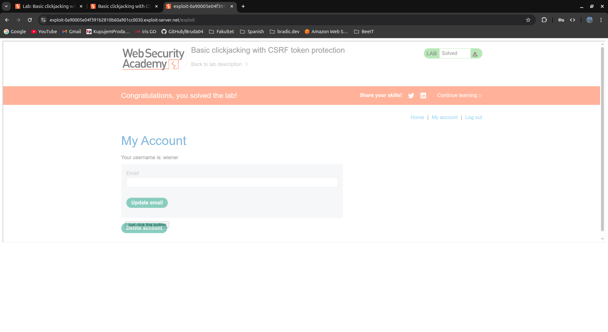

# [Basic clickjacking with CSRF token protection](https://portswigger.net/web-security/clickjacking/lab-basic-csrf-protected)

## Steps

- Opened the target web application and logged in with the provided credentials. Navigated to the account page and identified the "Delete Account" button as the target action to be triggered via clickjacking.

- Opened the exploit server and began constructing the clickjacking payload. Created a decoy page containing a harmless-looking button labeled "Just click this button!" and embedded the target account page inside a transparent `<iframe>` layered on top of it.

- Adjusted the CSS `top` and `left` position values of the decoy button iteratively until it was precisely aligned underneath the "Delete Account" button on the target website. The iframe was made fully transparent by setting `opacity` to a near-zero value (`0.00000001`) and placed on a higher stacking layer using `z-index: 2`, while the decoy button sat below it at `z-index: 1`.

  ```html
  <style>
    #target_website {
      position: relative;
      width: 1900px;
      height: 635px;
      opacity: 0.00000001;
      z-index: 2;
    }
  
    #decoy_website {
      position: absolute;
      top: 537px;
      left: 410px;
      z-index: 1;
    }
  </style>
  
  <div id="decoy_website">
    <button>Just click this button!</button>
  </div>
  
  <iframe
    id="target_website"
    src="https://0a7800330479911a8135614600a500db.web-security-academy.net/my-account"
  >
  </iframe>
  ```

- Delivered the exploit to the victim. From the victim's perspective, only the decoy button was visible, the transparent iframe was completely invisible. Clicking the decoy button actually triggered a click on the hidden "Delete Account" button within the iframe, submitting the CSRF-protected form on behalf of the authenticated victim session.


- The account deletion request was executed successfully.