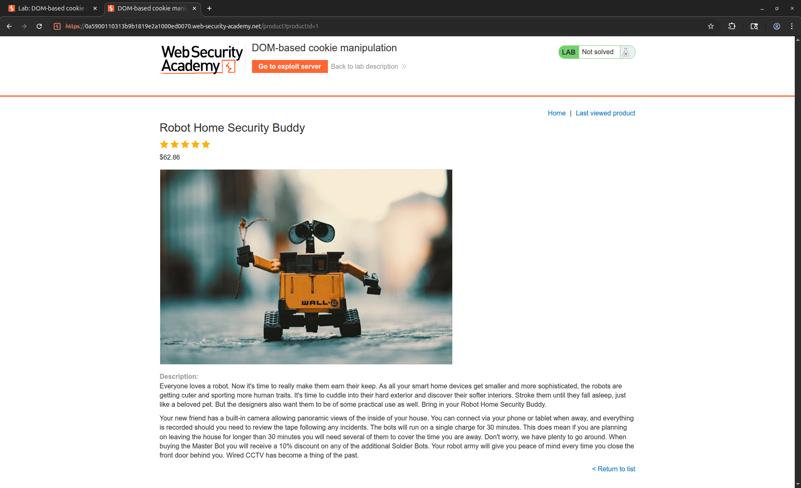
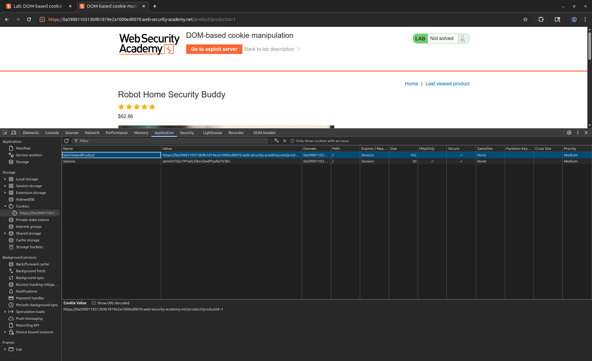
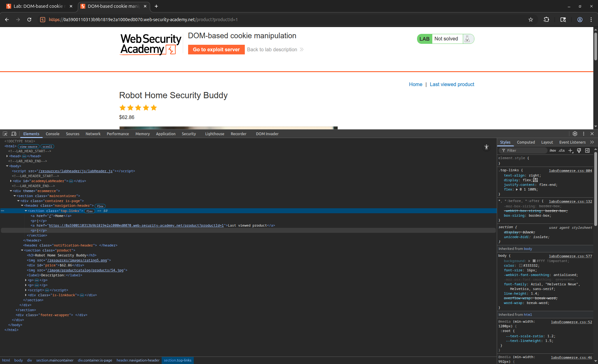
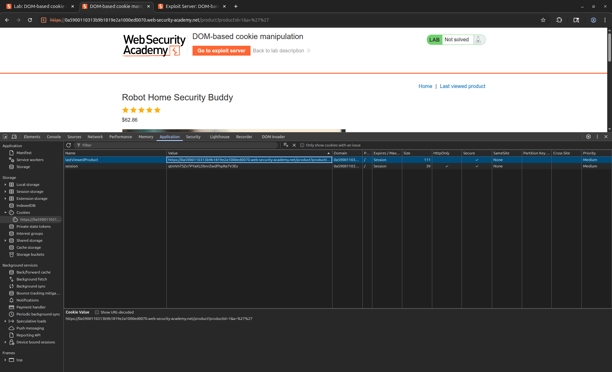

# [DOM-based cookie manipulation](https://portswigger.net/web-security/dom-based/cookie-manipulation/lab-dom-cookie-manipulation)

## Steps

- Opened the target web application and browsed the product pages to observe application behavior. Identified that navigating to a product page stored data in a cookie.


- Inspected the cookie contents and observed that the value stored was the URL of the last visited product page, meaning user-controlled input from the URL was being written directly into a cookie without sanitization.


- Inspected the page HTML source and identified that the cookie value was being read back by the DOM and injected into the `href` attribute of an `<a>` tag.


- Attempted to break out of the `href` attribute context by injecting a single quote (`'`) directly via the `productId` URL parameter. The payload was rejected or escaped, the tag termination was unsuccessful.


- Tested an alternative injection point using a secondary URL parameter (`&a=`). Supplying `&a='` successfully terminated the `href` attribute value, confirming that the second parameter was reflected into the cookie without encoding and could be used to escape the HTML attribute context.


- Constructed the full XSS payload by chaining tag termination with a `<script>` block appended after the closed `<a>` tag:

  ```html
  /product?productId=1&a='></a><script>print()</script>
  ```

- Embedded the payload URL inside an `<iframe>` and used the `onload` attribute to redirect the browser to the main site after the cookie was set. This two-step approach was necessary because the cookie had to be written first (by loading the product page with the payload URL) before the injected script could execute on a subsequent page load:

  ```html
  <iframe
    src="https://0a5900101313b9b1819e2a0100ed0070.web-security-academy.net/product?productId=1&a='></a><script>print()</script>"
    onload="this.src='https://0a5900101313b9b1819e2a0100ed0070.web-security-academy.net'"
  ></iframe>
  ```

- Delivered the exploit to the victim. The iframe first loaded the crafted product URL, writing the XSS payload into the cookie. The `onload` handler then redirected the iframe to the homepage, where the cookie value was read back and injected into the `<a>` tag's `href` attribute, causing the script to execute in the victim's browser and triggering `print()`.

- The DOM-based XSS executed successfully via cookie manipulation, completing the lab.