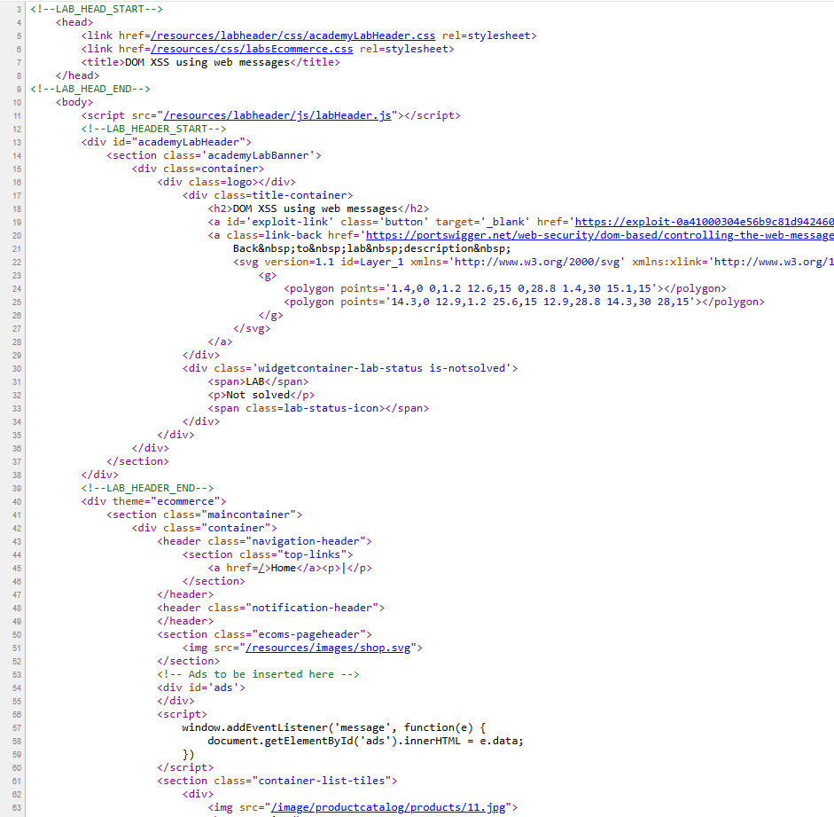
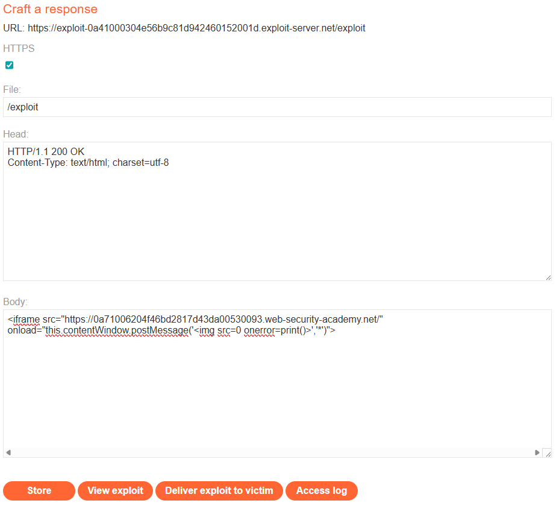
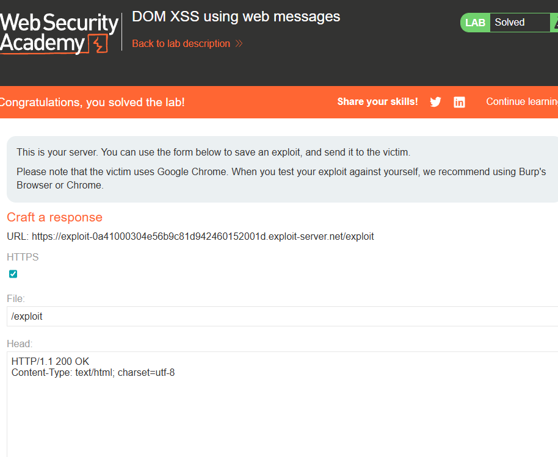

# [DOM XSS using web messages](https://portswigger.net/web-security/dom-based/controlling-the-web-message-source/lab-dom-xss-using-web-messages)

## Steps

- Opened the target web page and went to page source to look for js. Inside the script tag there is an event listener, it listens to messages and inserts them to the html of element ads. 

- Issue is that it just places whatever is given to the innerHTML, so I went to the exploit server and put in the body an iframe. the iframe points to a not existing image. when that causes an error, i instruct to handle it by calling print()

- Stored it and then delivered the exploit to the victim.

