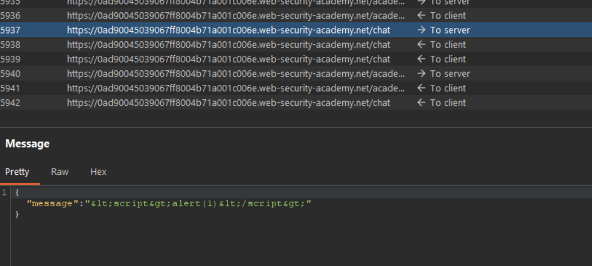
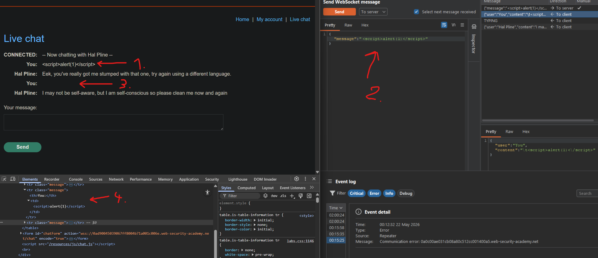
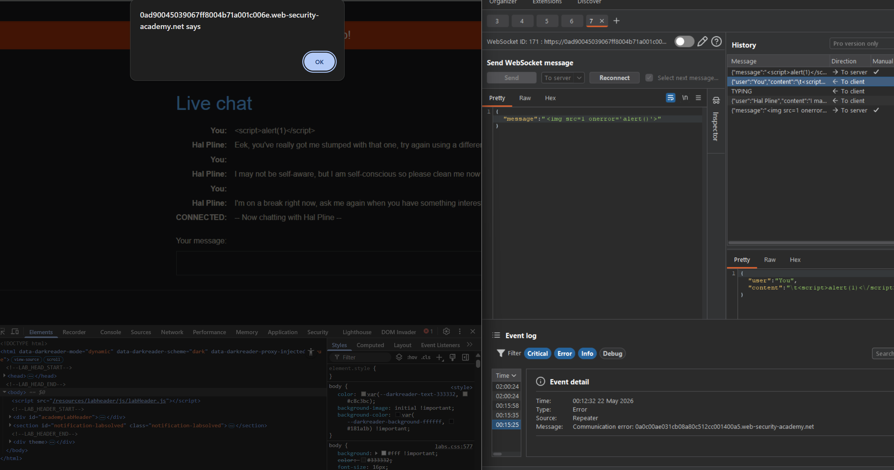

# [Manipulating WebSocket messages to exploit vulnerabilities](https://portswigger.net/web-security/websockets/lab-manipulating-messages-to-exploit-vulnerabilities)

## Steps

- Went to Live chat page and send test message:

```
<script>alert(1)</script>
```



- Burp proxy revealed that sanitisation is being done on the client side. So after using the repeater to send unescaped message it is being inserted into HTML as code instead as text.



- But since the message is being inserted via `innerHTML` browser doesn't execute `<script>` tag.

- To bypass this `` with `onerror` was used:



- This caused alert dialog to pop up both on client and support agent browser, thereby solving the task.
