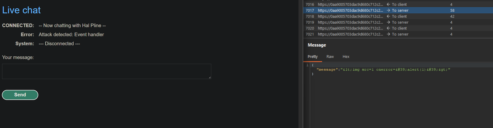
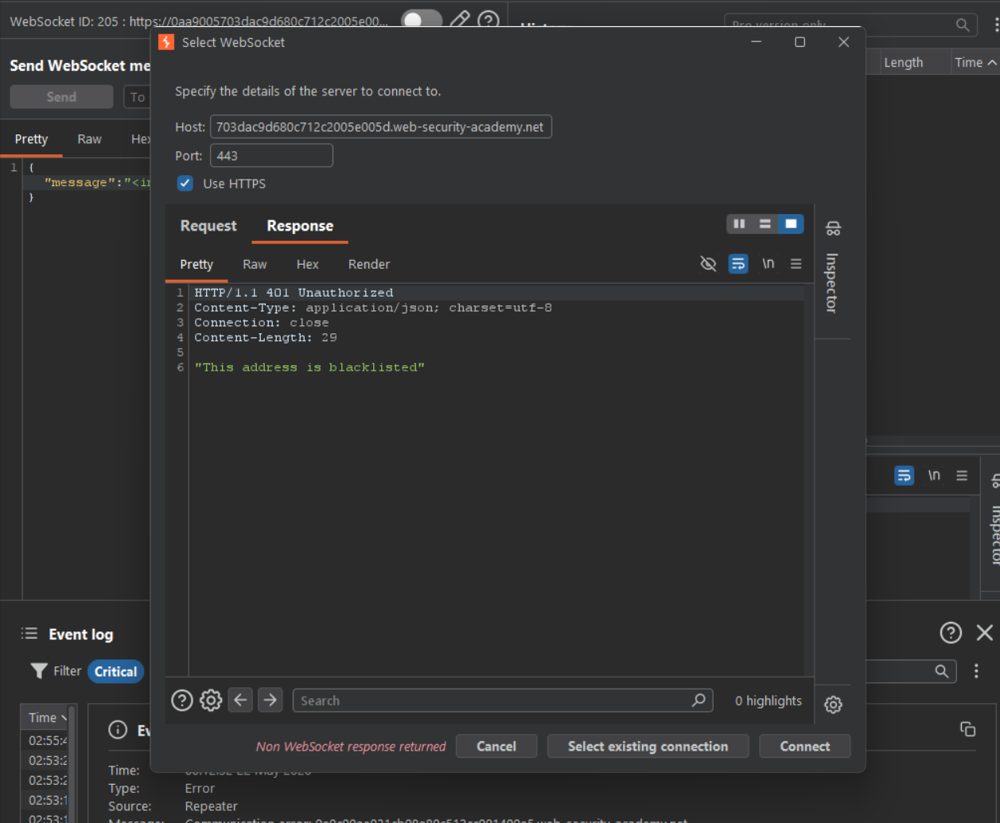
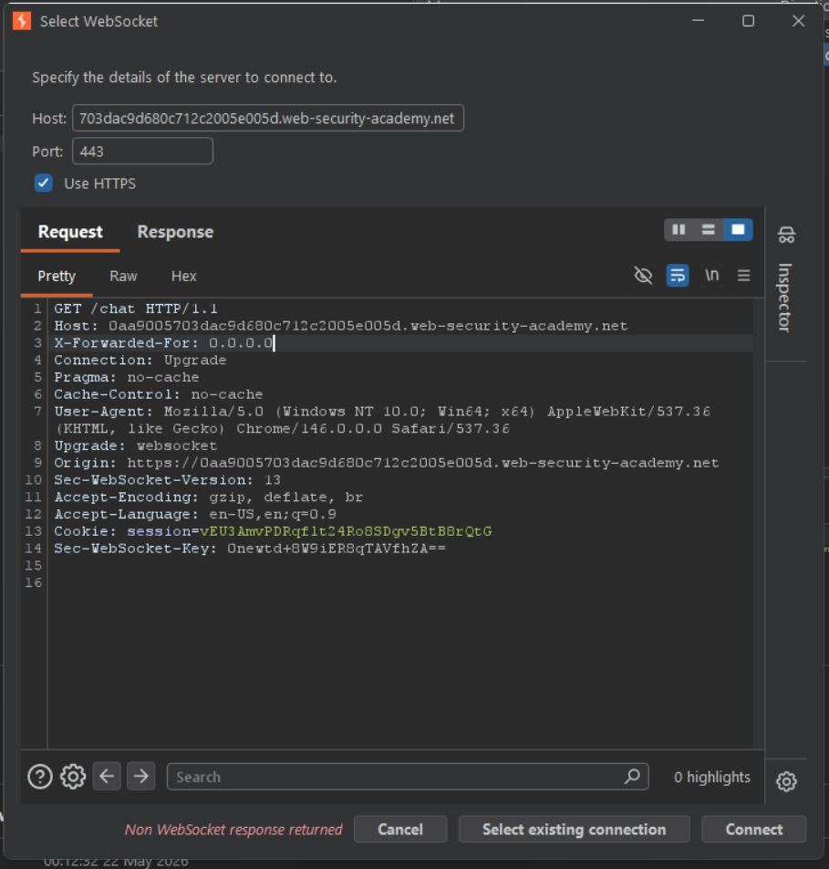

# [Manipulating WebSocket handshake to exploit vulnerabilities](https://portswigger.net/web-security/websockets/lab-manipulating-handshake-to-exploit-vulnerabilities)

## Steps

- Went to Live chat page and send test message:

```

```



- Burp proxy revealed that sanitisation is being done on the client side. Also server seems to have some kind of XSS detection. Trying to use repeater resulted in this response:



- To bypass ip block I tried to add custom `X-Forwarded-For` header:



- Now I was able to connect again and keep trying new variations of message that would bypass XSS filtering. After several failed attempts, one variant passed the filtering, causing alert dialog to pop up on victim's browser.

```json
{ "message": "" }
```
