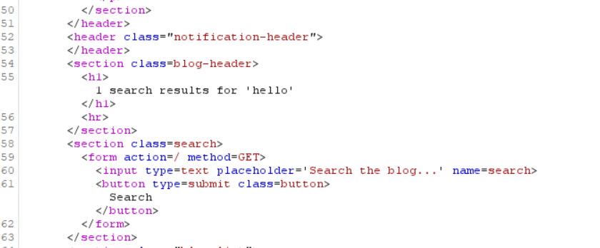
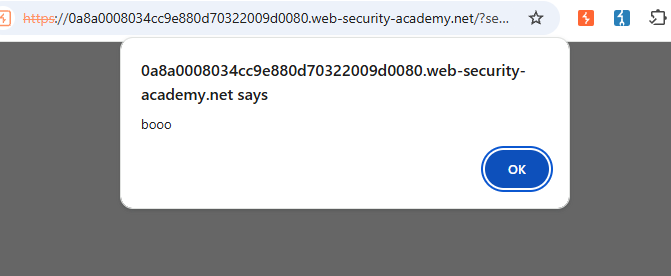

# [Reflected XSS into HTML context with nothing encodedn](https://portswigger.net/web-security/cross-site-scripting/reflected/lab-html-context-nothing-encoded)

## Steps

- I opened the website and saw there was a search field.
   
- I inputed hello to test it
  
- In burp suite I saw the response and saw that it displays the search term i gave it directly in the html
  


- I tried to see if it would do the same for inputed js code and I typed in:

  ```<script>alert("booo")</script>
  ```

It executed and showed the alert, followed by the completed lab message.




