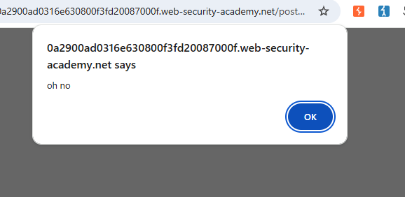

# [Stored XSS into HTML context with nothing encodedn](https://portswigger.net/web-security/cross-site-scripting/stored/lab-html-context-nothing-encoded)

## Steps

- I opened the page and saw no input fields, so I navigated to view a post. When i scrolled down I saw input fields for leaving a comment

- I assumed that whatever I leave will be displayed as I sent it, so for the comment body i put:
  
  ```
  <script>alert("oh no")</script>
  ```

For the name, email and website I just made sure that they were in the appropriate format. Upon clicking post comment the alert showed and lab was completed. 

When going to homepage and back to a blogpost the alert runs again because it now renders with the page as a part of its contents (the comment)



