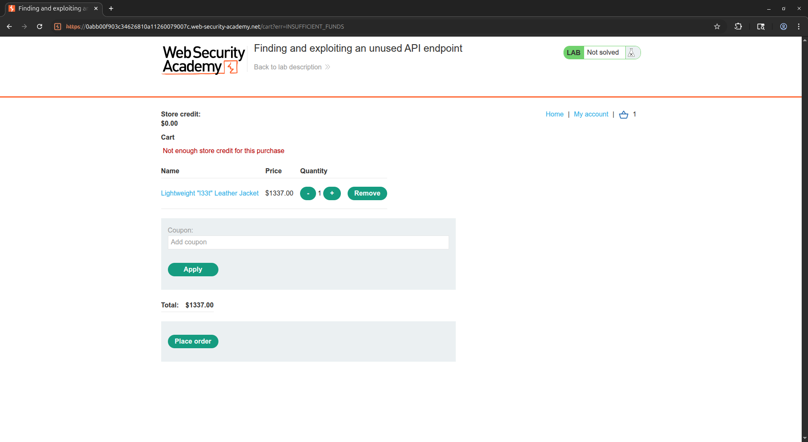
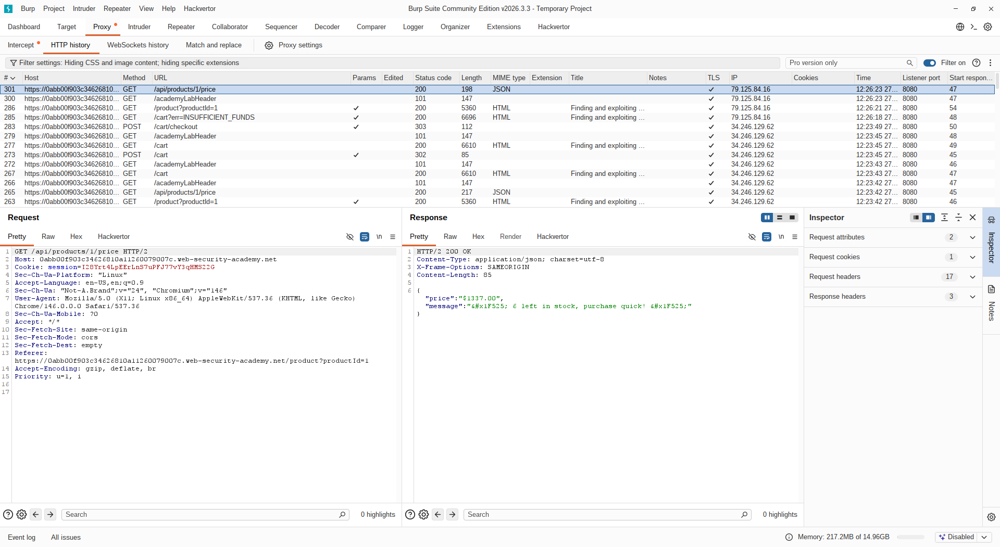
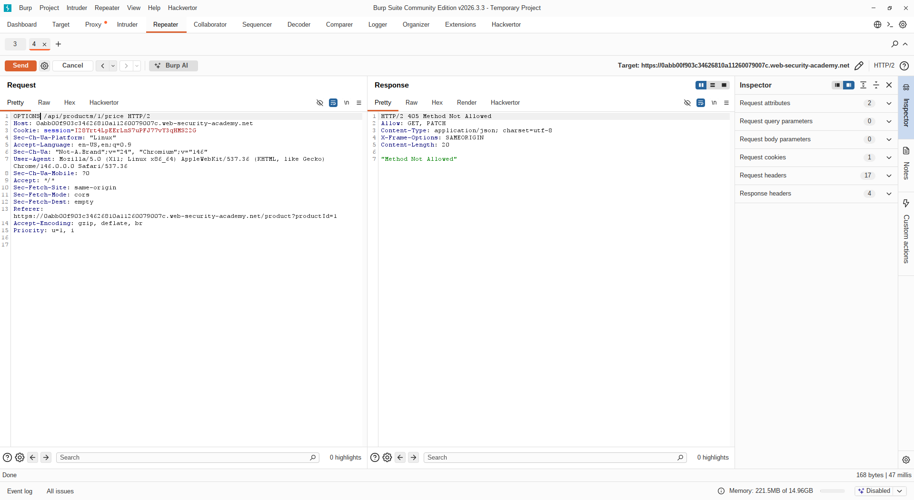
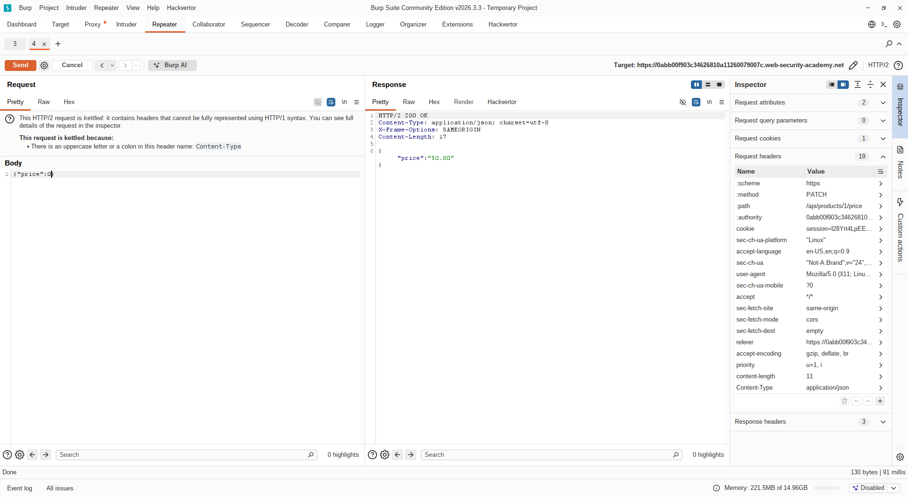
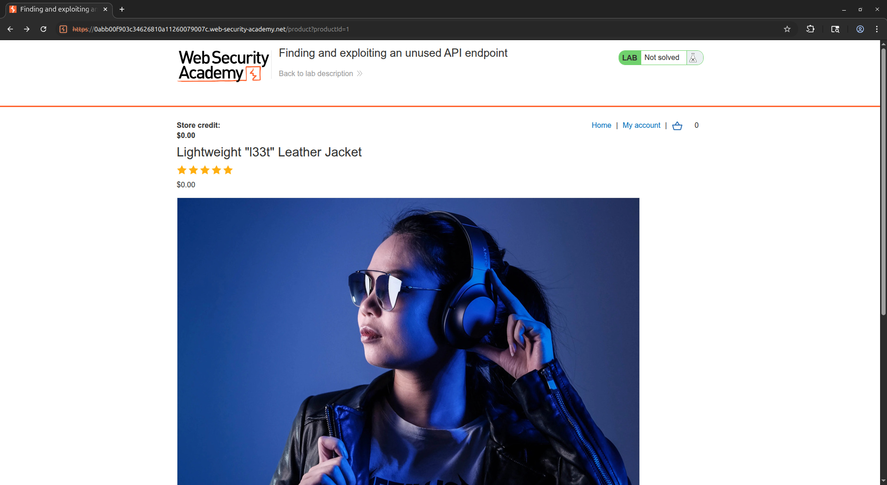
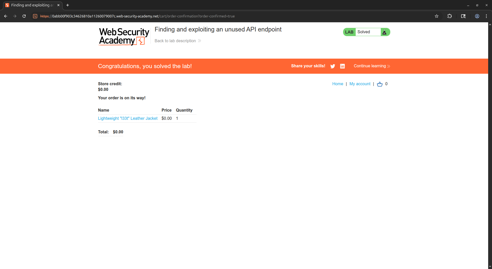

# [Finding and exploiting an unused API endpoint](https://portswigger.net/web-security/api-testing/lab-exploiting-unused-api-endpoint)

## Steps

- Opened the target web application and browsed the available products. Intercepted the traffic and reviewed all outgoing requests to map the application's API surface. I focused on analyzing the checkout process and the associated API endpoints.

- I found out that the application made a separate request to a price endpoint on product details pages. I tried to send `OPTIONS` request to the price endpoint to enumerate its accepted HTTP methods, and observed that it advertised support for the `PATCH` method.

- Sent a `PATCH` request to the price endpoint with a JSON body setting the product price to `0`. The server accepted the request and updated the price without performing any authorization or validation checks.

- Navigated to the product page and confirmed the price had been updated to `$0.00`. Proceeded to add the product to the cart and completed the checkout process, purchasing the product for $0 and completing the lab.

