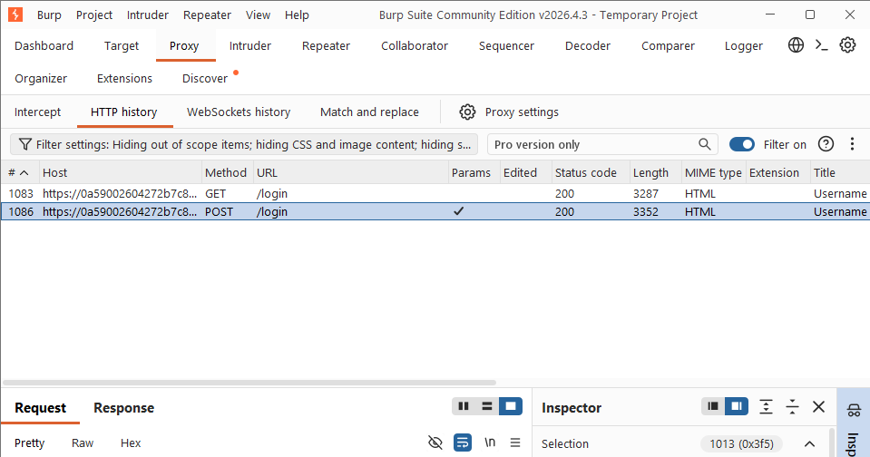
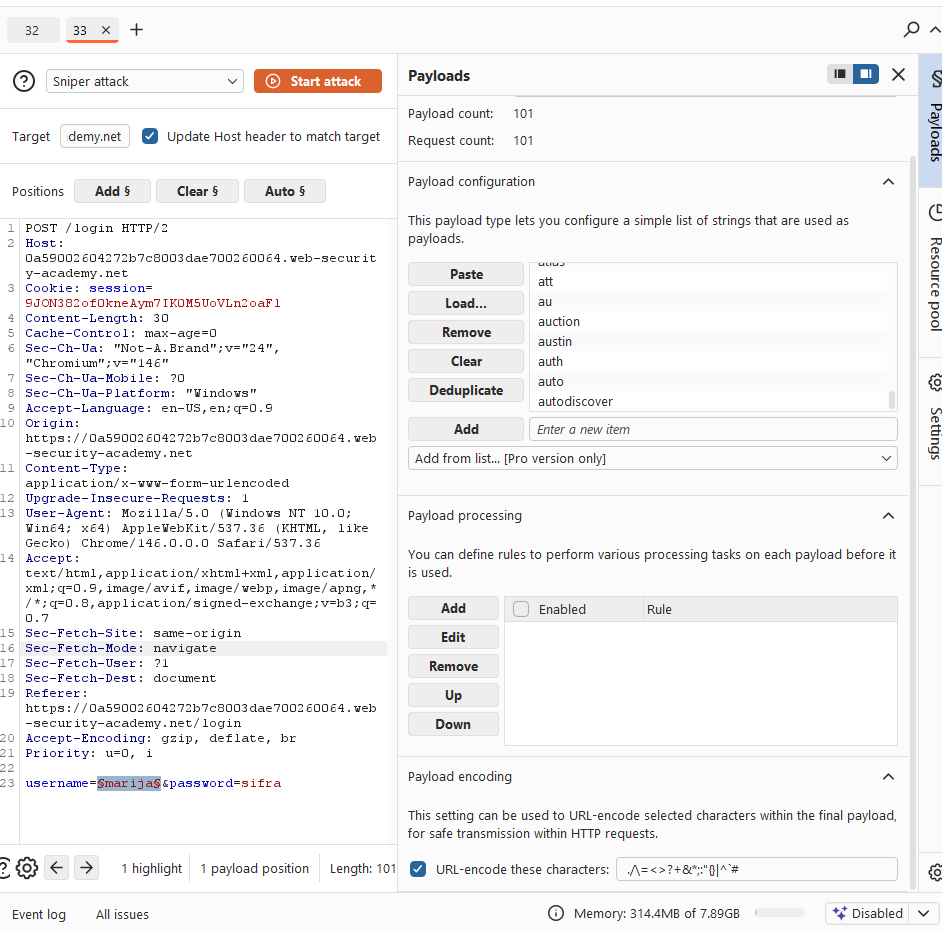
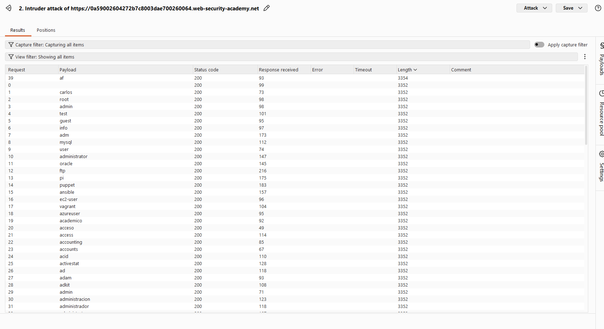
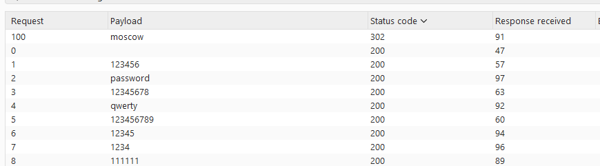
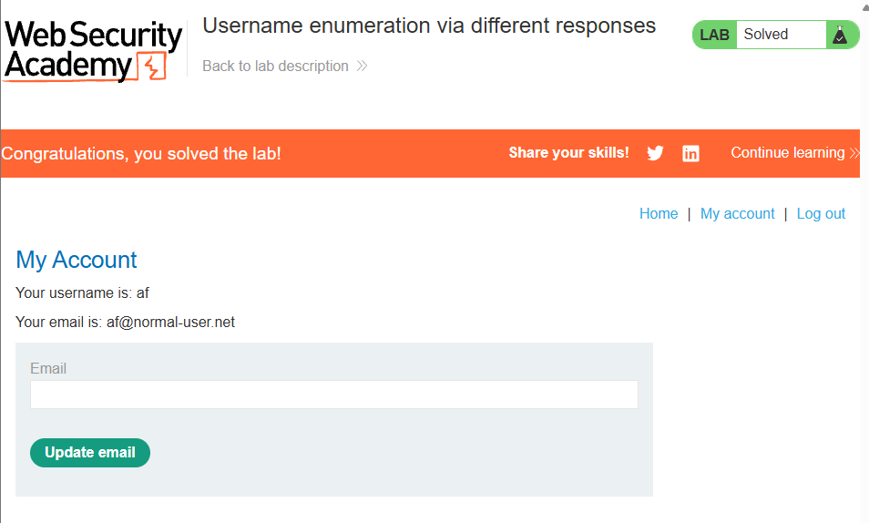

# [Username enumeration via different responses](https://portswigger.net/web-security/authentication/password-based/lab-username-enumeration-via-different-responses)

## Steps

- Opened the target web application and navigated to login. I sumbitted any login info and found the post login request in the proxy http hystory
  

- Sent the login request to the intruder, put $like signs over the username value. In the payload config I added the list of usernames provided by the lab, and ran the sniper attack
  

- Looked at the responses, they all seemes the same, with the "Invalid username" message. When looking at the response lengths, they are all 3352 except for one that is 3354. This one says "Incorrect password.". This is for payload af -> this username exists
  

- In the website i entered af as username and then did the same process in the intruder but with the password list and password payload. This time Im looking at status codes. One of them had status 302 - FOUND. Password was moscow
  

- Logged in with the final username and password
  

