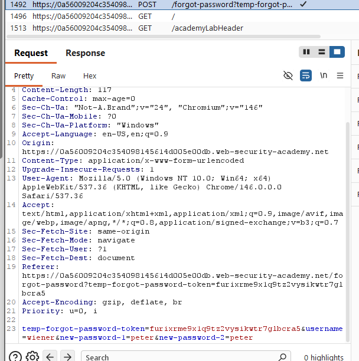
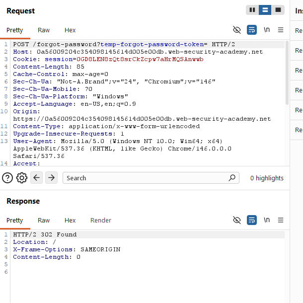
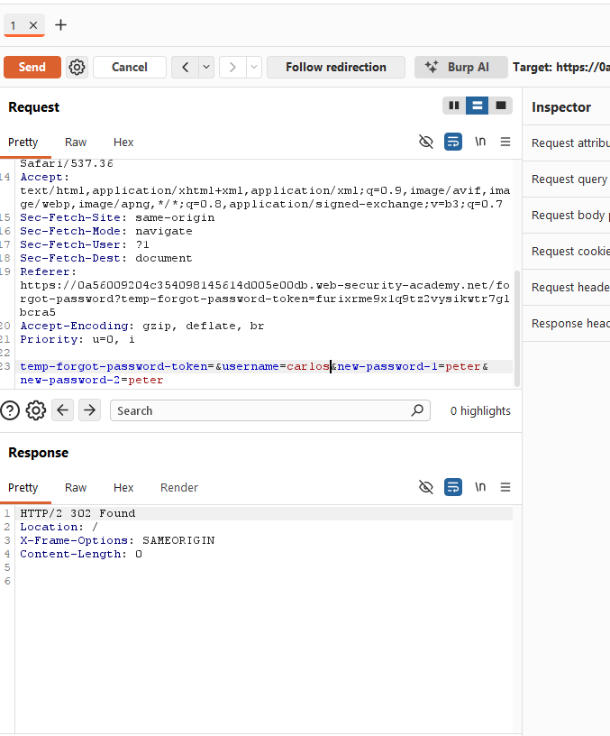
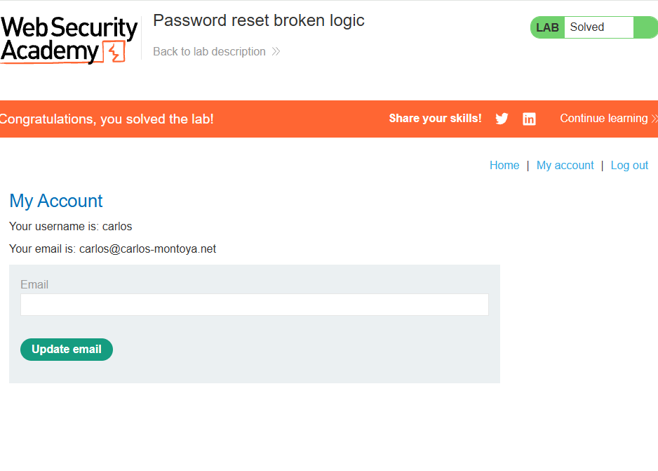

# [Password reset broken logic](https://portswigger.net/web-security/authentication/other-mechanisms/lab-password-reset-broken-logic)

## Steps

- Opened the target web application, went to login, clicked forgot passoword, requested new password under my username "wiener". Went to email client to check my email, set the new password and now observed this request

- I see that it is sending the username even though i didnt input it. So im suspecting it isnt checking the token, but just "taking my word for it" and editing the password of the username i sent

- I removed the token and it did not care, still considered it found.

- That means I can set any username and it will accept it, with any token. I reset the password then for username carlos.

- I can now login with carlos username and the password i set

