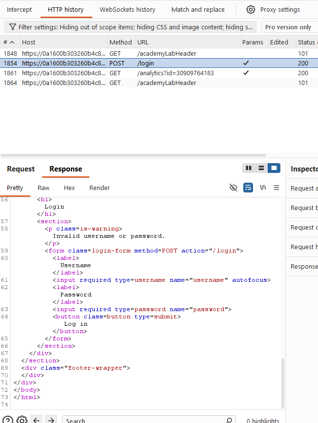
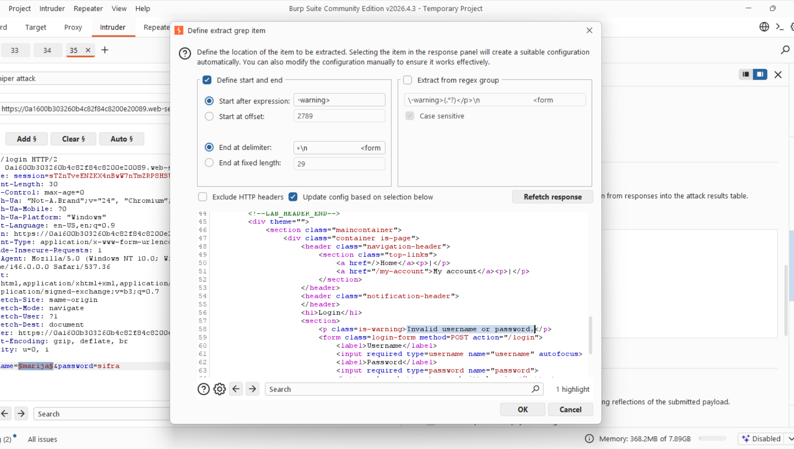
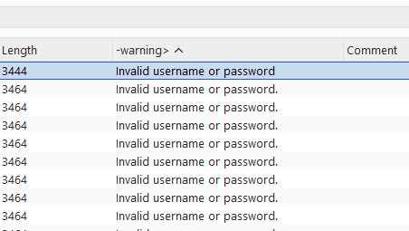
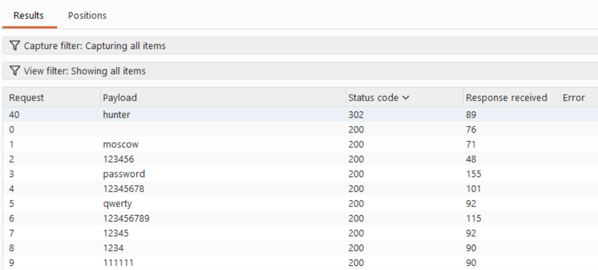
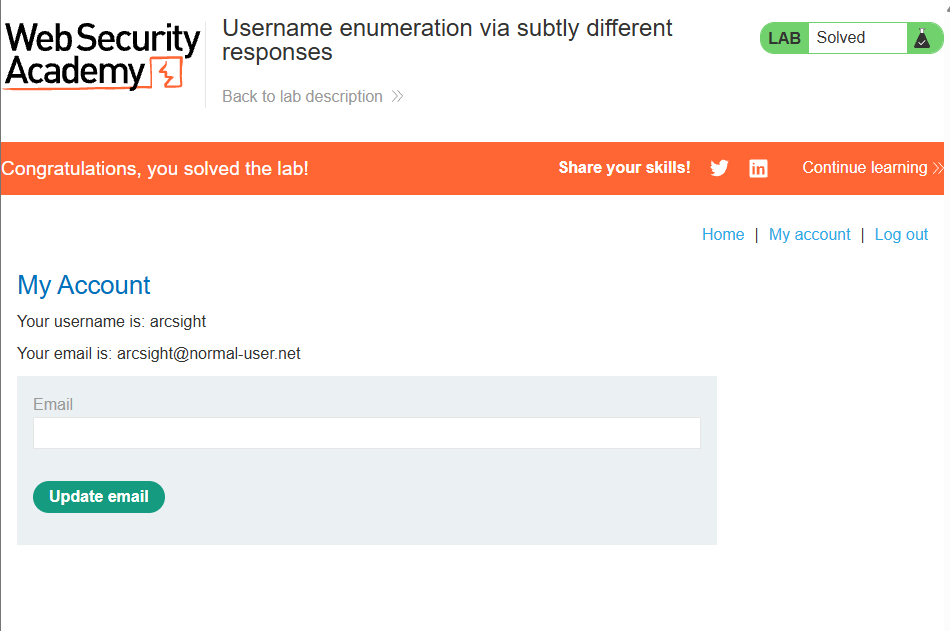

# [Username enumeration via subtly different responses](https://portswigger.net/web-security/authentication/password-based/lab-username-enumeration-via-subtly-different-responses)

## Steps

- Opened the target web application and navigated to login. I entered any set of credentials and looked at the response. It is only returning the Invalid username or password message.
  

- I did the same thing as in 01, in the intruder I added username to the payload and added the list of usernames. However last time I was relying that all the others will get the same length of the response, this time I want a more refined catching of the error message because I want to see the changes specifically in this area. I did this in settings -> grep extract. It says: These settings can be used to extract useful information from responses
  

- Looked at the responses, they were of various response lengths, but when i sorted based on the warning I saw that one of them didnt have a "." at the end, but a space. This means that it is a different error message, aka a different path on the backend. Username is "arcsight"
  

- Now that I have the username, I'll set that arcsight as the username and made the payload be for the password and be the list of the passwords provided. At this point since I know the username is correct, I am looking for a successful response code. Password hunter got 302 - FOUND
  

- I can login with arcsight: hunter
  

