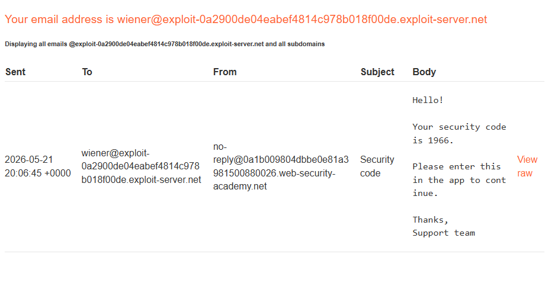
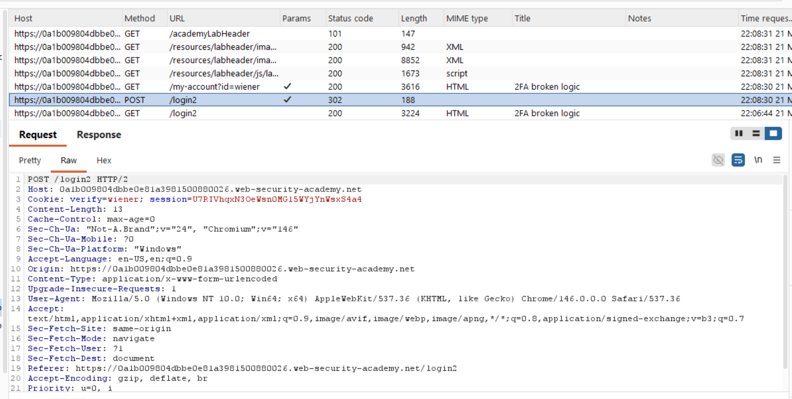
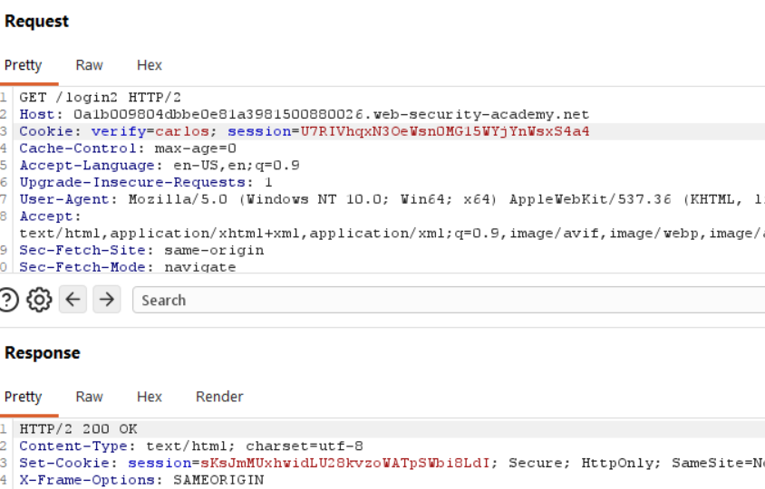
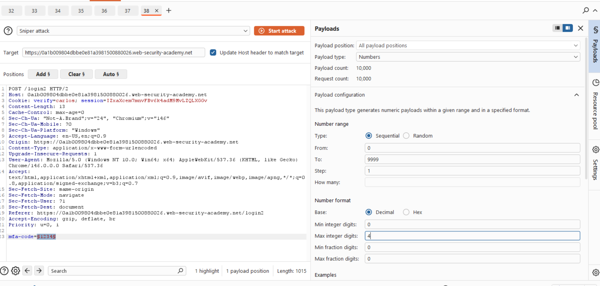

# [2FA broken logic](https://portswigger.net/web-security/authentication/multi-factor/lab-2fa-broken-logic)

## Steps

- I have my own username pass and the username of the victim. So first Im gonna login as myself to check out the process. I get the email code which is a simple 4 digit code

- I looked at the get login2, and it sends the mfa-code, and I look to see if it sending the username anywhere (if thats all its relying on for auth). In Cookie there is a field verify that has the value of the username.

- Im going to then repeat it with the victims username. I send the get login2 to the repeater. It returned with code 200 OK. Now i created the MFA code for carlos. I then enter any 4 digit code just so i can get the post request and edit it

- I edited the verify username to carlos, and set the mfa code as payload, numbers from 0-9999

- Running 10k requests takes forever.

