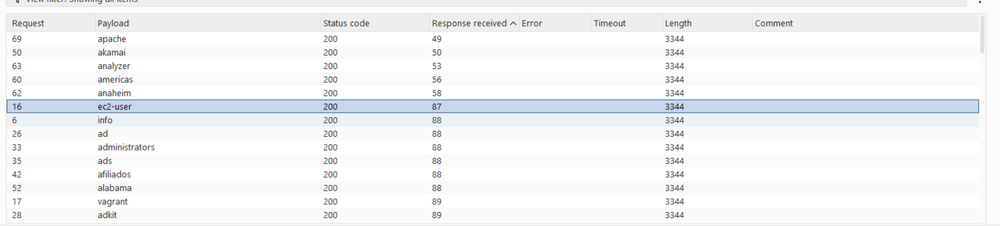
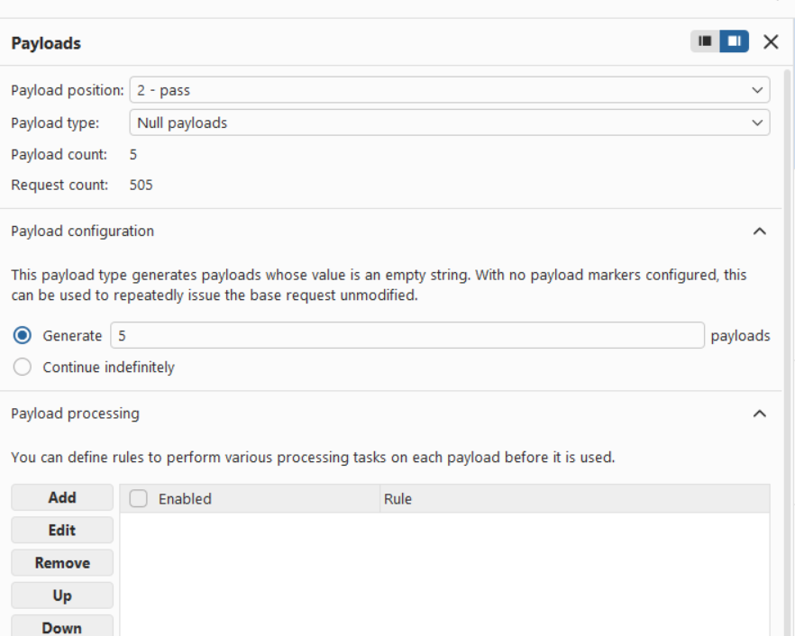
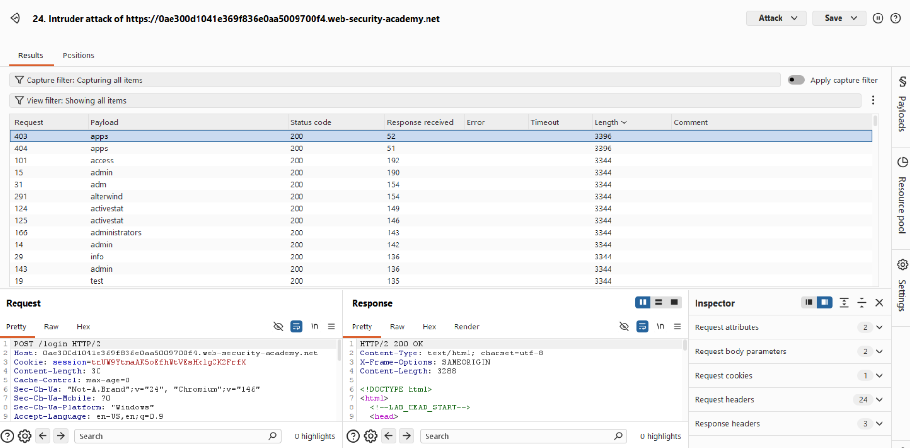
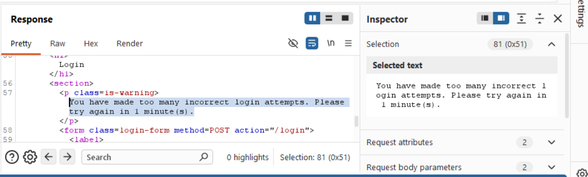
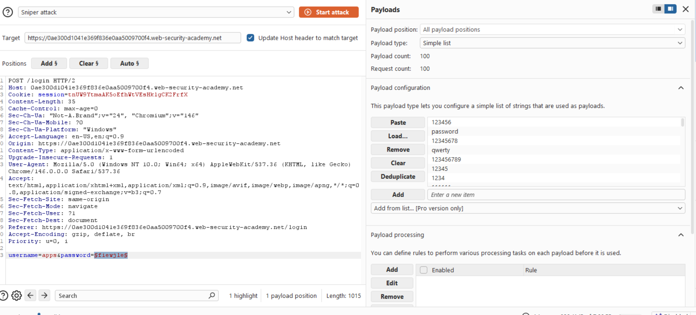
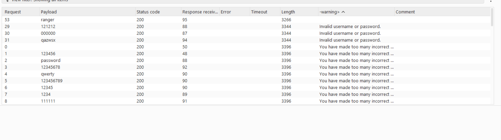
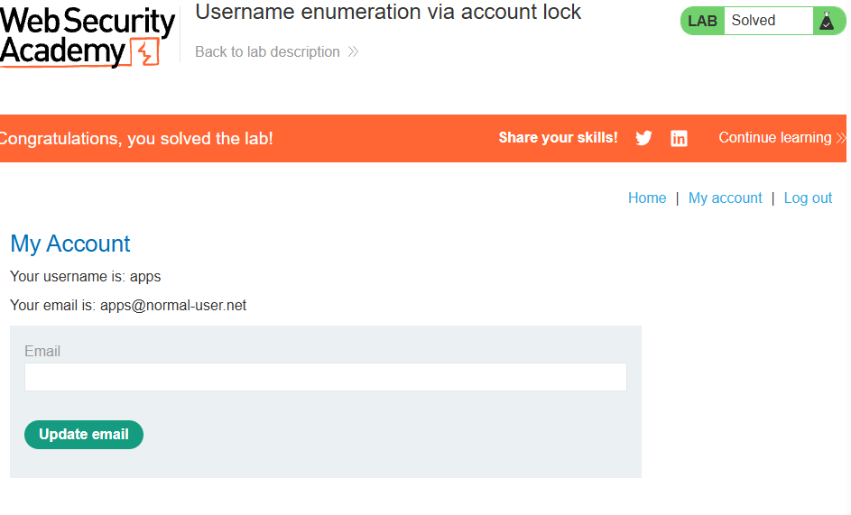

# [Username enumeration via account lock](https://portswigger.net/web-security/authentication/password-based/lab-username-enumeration-via-account-lock)

## Steps

- Opened the target web application and navigated to login. I entered any set of credentials and looked at the response. I first did the same thing as before and added the username as payload. However the length is the same, responses seem random lengths, and the status code is the same. I got no where 
  

- To figure out the username, since the task name is account lock - i figured that it will only lock me out of valid accounts (usernames). So i need to repeat all of these usernames with any passwords multiple times to try and get blocked. So I changed the  attack from sniper to cluster to do combinations. I just added an empty payload to have this repetition
  
I set the second payload type to null and generate to 5
  /Sniper changes one at a time, battering ram puts the same value into both, pitchfork matches the first username w first password etc, cluster bomb tries every combo/

- Issue is that 500 requests takes >30 minutes on my laptop. Because these requests arent being completed in a row, in the sence that username "admin" gets paired with null not on requests 1/2/3/4/5, but on 5/311/400/500. Because how long it takes on my laptop it never completed. As a solution i took the usernames to Notepad, duplicated all of them 5 times, then ran it pitchwork. So it was running admin admin, second second (also admin admin), so it would do 5 consequitive requests at a time. 
Finally I sorted by length and got one username that has a longer length then others. Upon inspection the warning read 
You have made too many incorrect login attempts. Please try again in 1 minute(s).
Username found.

- Now that I have the username I can run a sniper attack on passowords. I extracted the warning message to monitor it, because i am anticipating the issue with the account being locked out. As expected I get some saying Invalid username or password. These are the attempts after timeout. The rest all say You have made too many incorrect tries. The vurnability left open was the fact that the correct combination produced no error at all - exposing itself. The password was "ranger"
  

- Waited a minute to make sure the account isnt locked then put in the username and password via web.
  

