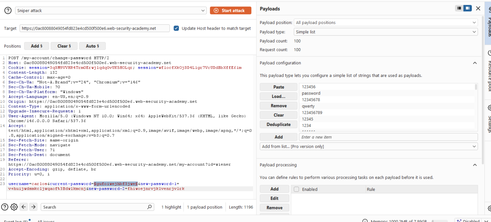
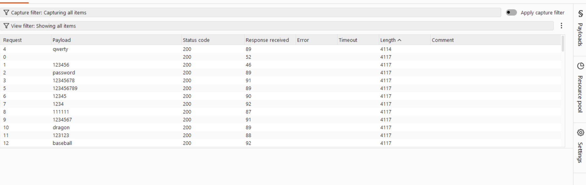
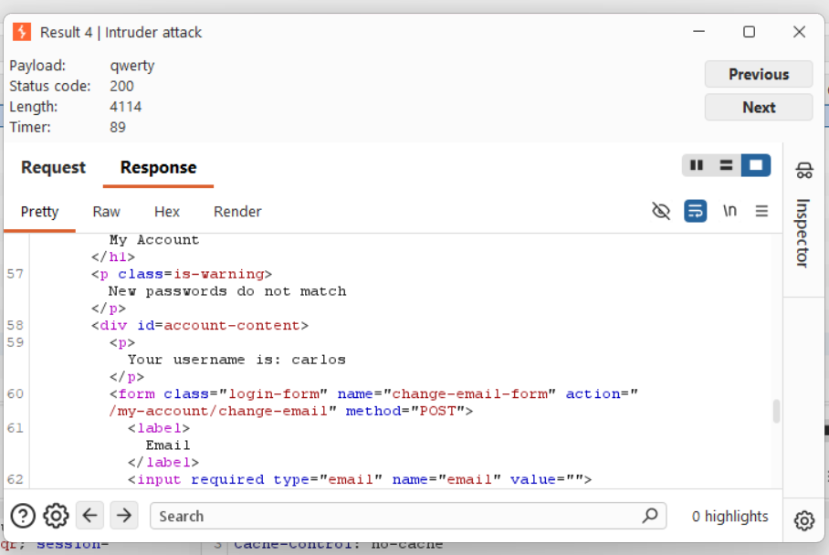

# [Password brute-force via password change](https://portswigger.net/web-security/authentication/other-mechanisms/lab-password-brute-force-via-password-change)

## Steps

- I logged in with my credentials and was redirected to changing my password. I am going to try what i did before, which is find the error messages corresponding to different paths. What i can test is:
- correct curr pass - matching new pass
- correct curr pass - mismatch new pass
- incorrect curr pass - matching new pass
- incorrect curr pass - mismatch new pass
  
1. Password changed successfully!
2. ```<p class=is-warning>New passwords do not match</p>```
At this point I notice that under it it says your username is weiner. I took a look at the request and see that it does send the username in the request. I will probably be able to use this to change it to carlos' username
3. 302 found - but im then logged out and locked for a minute
4. ```<p class=is-warning>Current password is incorrect</p>```

BINGO. The 4th reveals to me whether the current password is incorrect. So i will do the second part the same - I need a request with mismatched new passwords, change the username and test out the old passwords

- I sent the last request to the intruder and ran a sniper attack. Now the differences between the correct and incorrect old password but different new passes is that the correct password would give message number 2, and incorrect message number 4. 
  


- I could have added a flag for the warning message, but I instead relied on the response length.



-All of them had the same length, except for one, with the password qwerty which read "New passwords do not match" which confirms that it is the second scenario of a correct password.



-I then logged in as carlos:qwerty and the lab was solved. 