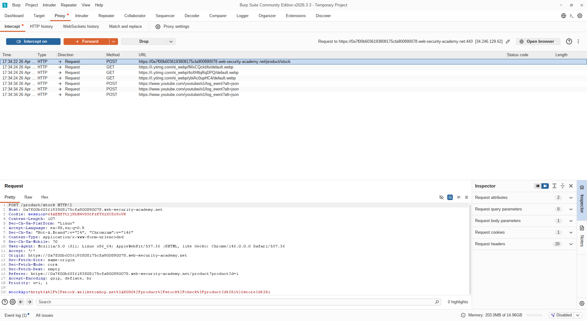
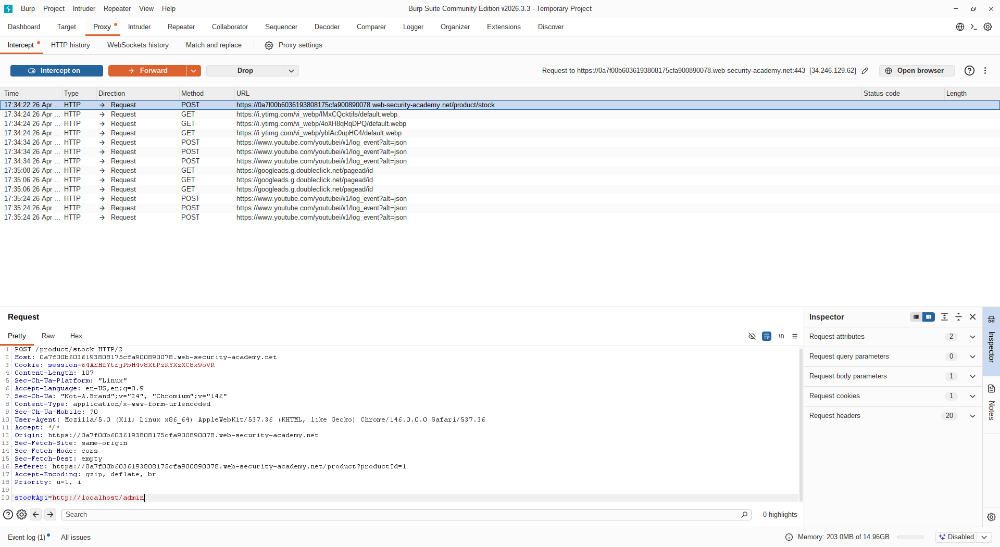
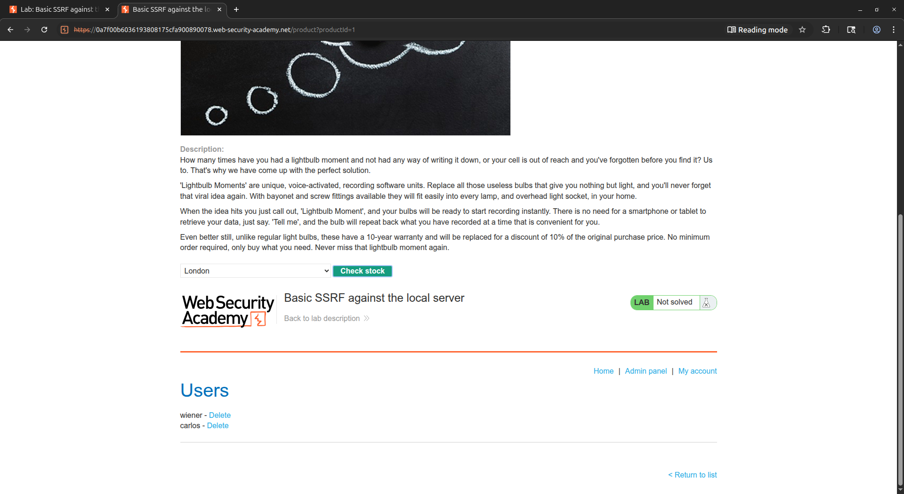
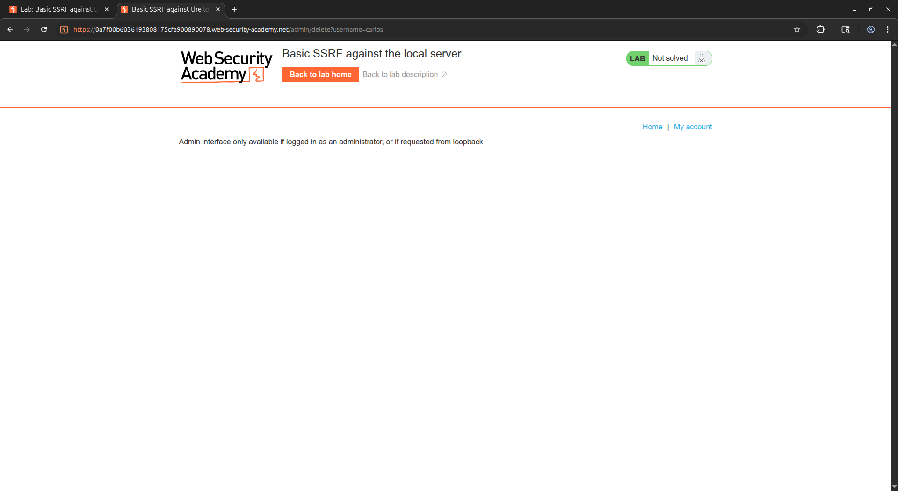
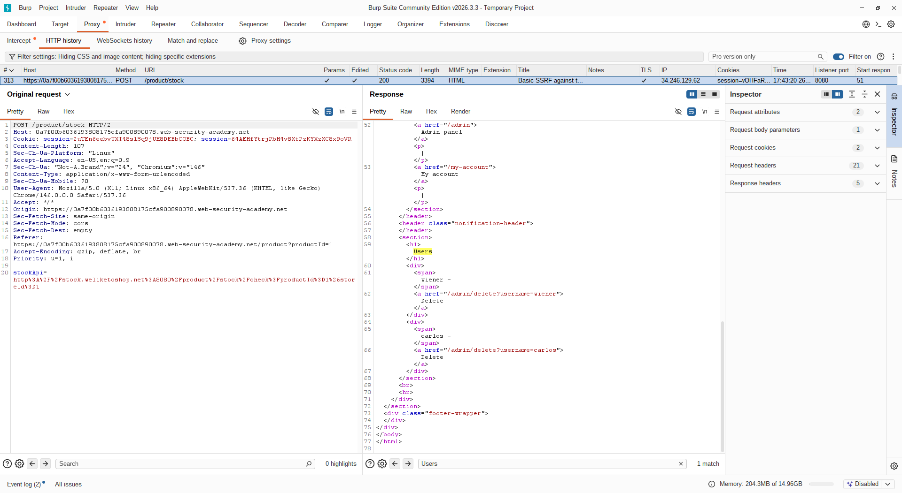
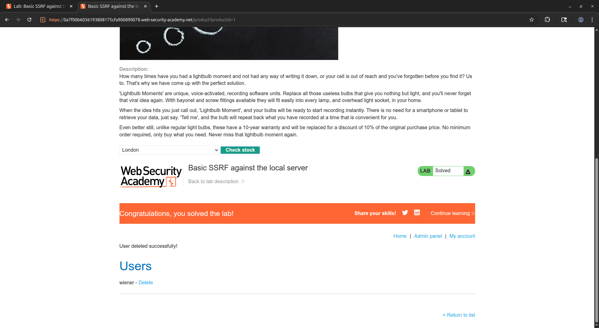

# [Basic SSRF against the local server](https://portswigger.net/web-security/ssrf/lab-basic-ssrf-against-localhost)

## Steps

- Opened the target web application and navigated to a product details page. Intercepted the request to the product details page and observed that the server made an outgoing request to fetch stock information for the product.

- Modified the intercepted request to include a custom `stockApi` parameter pointing to `http://localhost/admin` and forwarded the request. The server responded with the admin panel page, confirming that the SSRF vulnerability was present and exploitable.

- Tried to delete the user `carlos` by directly accessing the admin panel in the browser, but received a `403 Forbidden` error, indicating that direct access to the admin panel was blocked.

- Inspected the HTML of the admin panel response and identified the exact endpoint used for user deletion: `http://localhost/admin/delete?username=carlos`.

- Replaced the `stockApi` parameter value with the discovered delete endpoint (`http://localhost/admin/delete?username=carlos`) and forwarded the request through the proxy.

- The server executed the request internally as a trusted local request, successfully deleting the user `carlos` and completing the lab.

