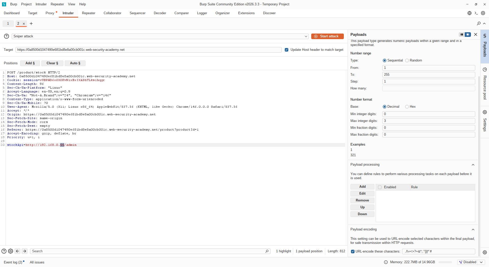
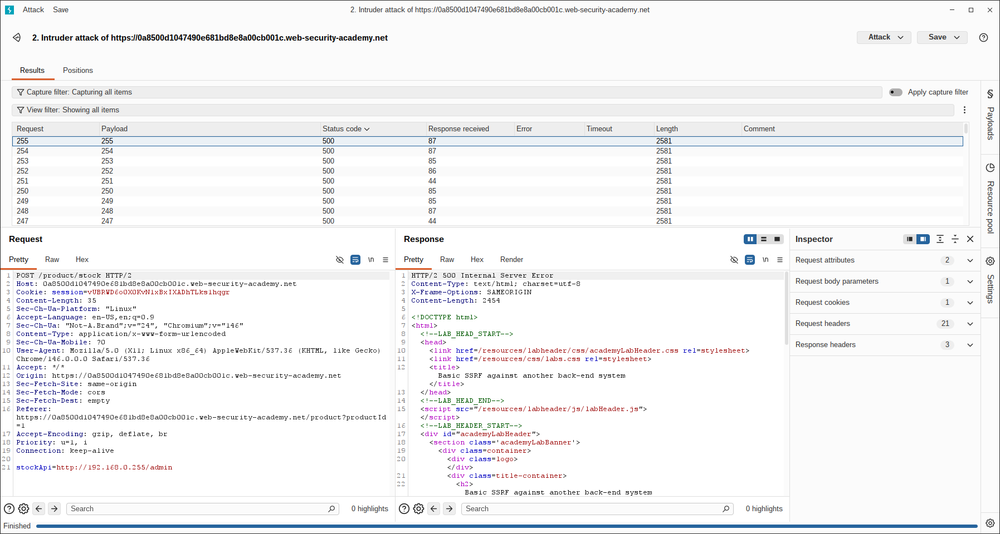
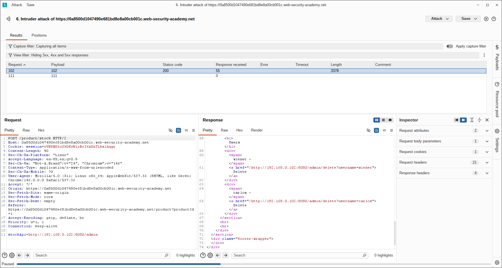
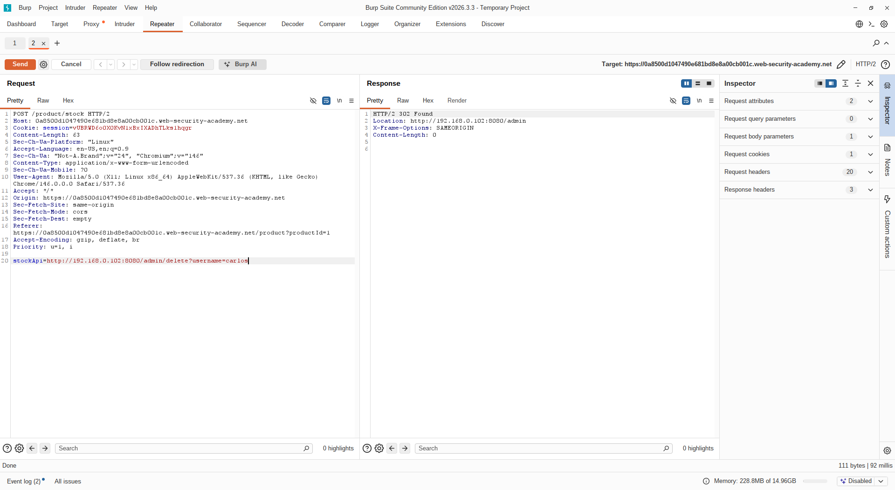
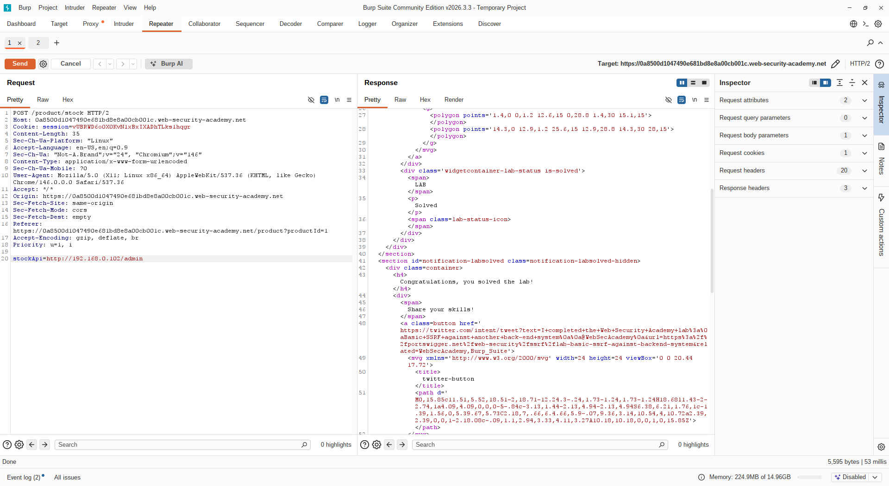

# [Basic SSRF against another back-end system](https://portswigger.net/web-security/ssrf/lab-basic-ssrf-against-backend-system)

## Steps

- Opened the target web application and navigated to a product details page. Intercepted the stock-check request and identified the `stockApi` parameter, just as in the previous lab.

- Sent the intercepted request to Burp Intruder in order to enumerate all possible IP addresses within the internal subnet (`192.168.0.0/24`). Configured the payload position on the last octet of the IP address and set the payload type to a numeric range from `1` to `255`.

- Launched the Intruder attack and observed the responses. Initially noticed that requests were not returning the expected admin panel. Then I realized the port was missing from the URL.

- Updated the `stockApi` value to include port `8080` (e.g., `http://192.168.0.§1§:8080/admin`) and re-ran the attack. Identified a response with a different status code and length, indicating the admin panel was present at `http://192.168.0.102:8080/admin`.

- Sent the confirmed request to Burp Repeater for precise control. Modified the `stockApi` parameter to target the delete endpoint: `http://192.168.0.102:8080/admin/delete?username=carlos`.

- Forwarded the modified request. The server executed it internally as a trusted back-end request, successfully deleting the user `carlos` and completing the lab.

