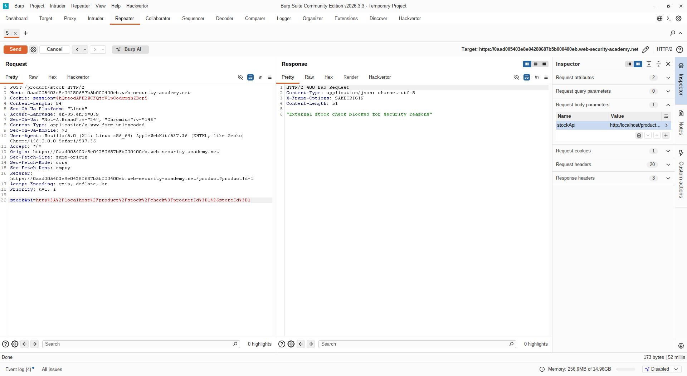
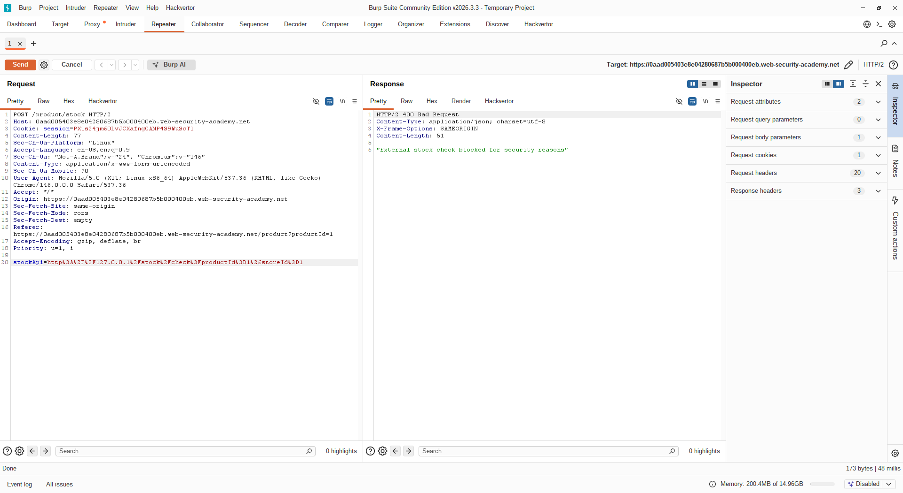
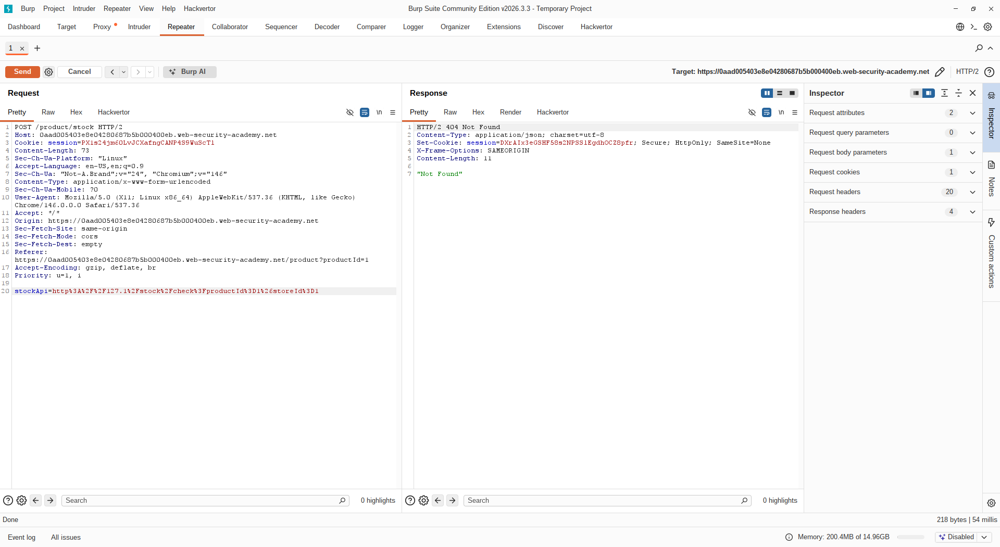
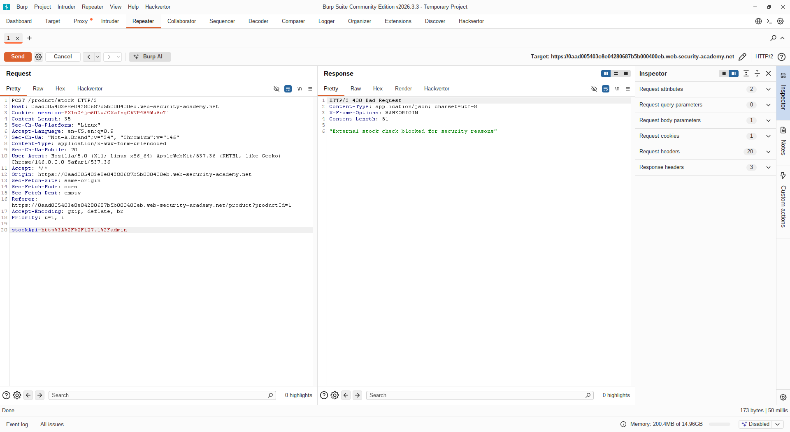
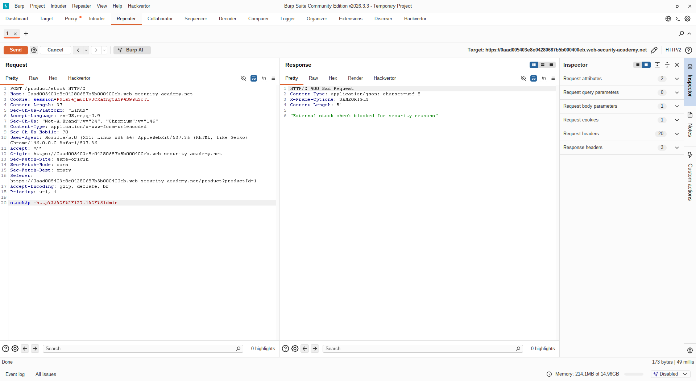
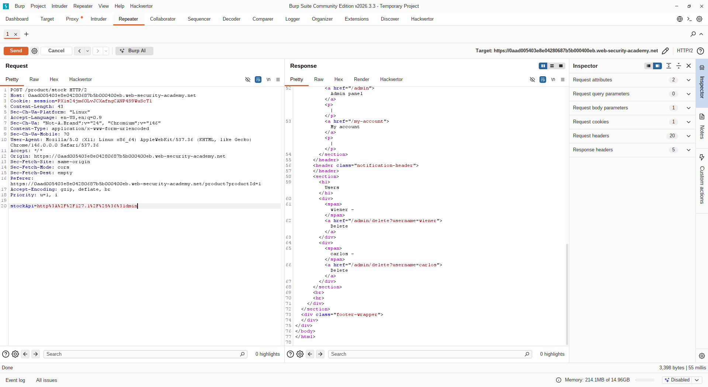
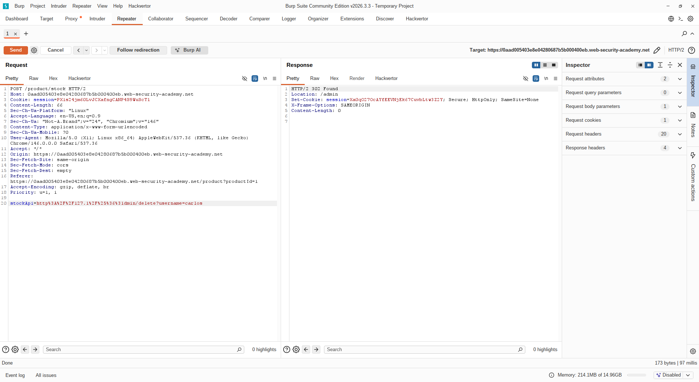

# [SSRF with blacklist-based input filter](https://portswigger.net/web-security/ssrf/lab-ssrf-with-blacklist-filter)

## Steps

- Opened the target web application and navigated to a product details page. Intercepted the stock-check request and identified the `stockApi` parameter.

- Attempted to access the admin panel by setting `stockApi` to `http://localhost/` and then `http://127.0.0.1/admin`. Both requests were blocked by the server's blacklist-based input filter.

- Tested the alternative loopback notation `http://127.1/` and observed that this bypassed the blacklist check for the hostname, as the filter did not account for shortened IP representations.

- The request with `http://127.1/admin` was still blocked due to the `/admin` path being included in the blacklist. - 

- Attempted URL encoding the path to `/%61dmin` — this was also blocked as the server decoded it before applying the filter.

- Applied double URL encoding to the path. This time filter evaluated as a non-matching string but the backend server decoded into `/admin`.

- Inspected the admin panel response and identified the delete endpoint for the user `carlos`. Constructed the final payload using the same bypass techniques.

- Forwarded the request. The server decoded the double-encoded path and executed the delete operation internally, successfully deleting the user `carlos` and completing the lab.

