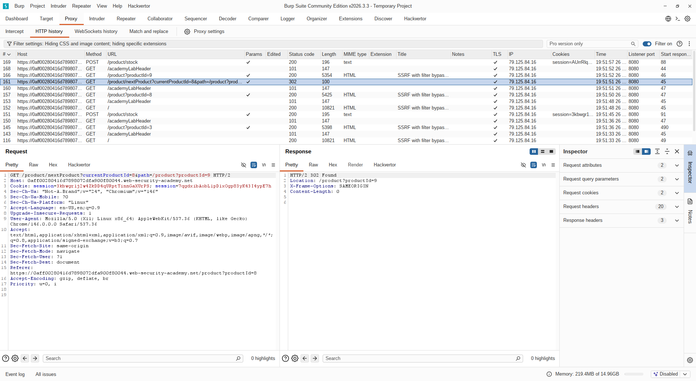
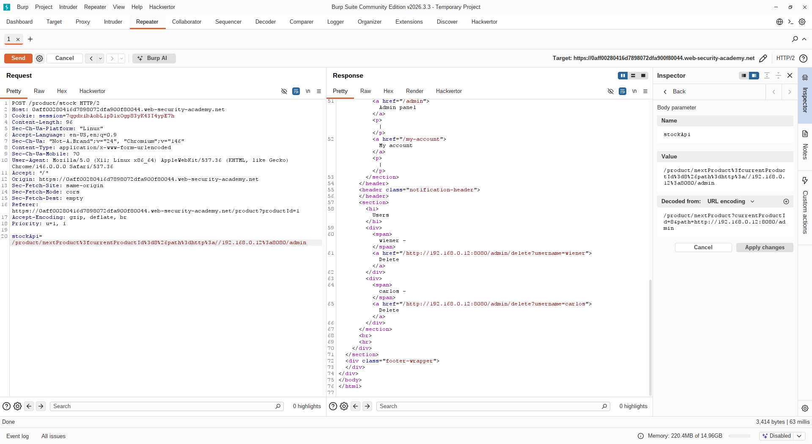
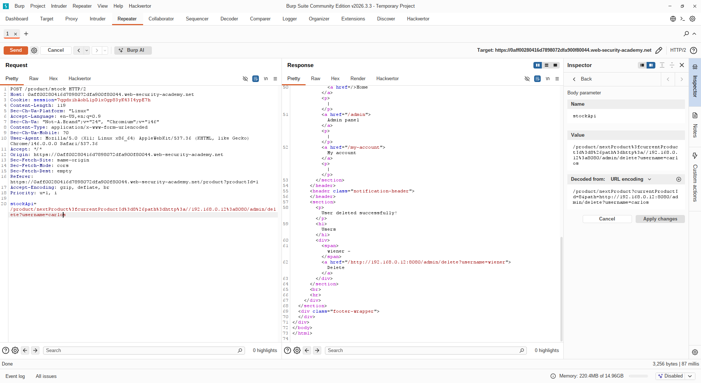

# [SSRF with filter bypass via open redirection vulnerability](https://portswigger.net/web-security/ssrf/lab-ssrf-filter-bypass-via-open-redirection)

## Steps

- Opened the target web application and navigated to a product details page. Intercepted the stock-check request and identified the `stockApi` parameter. Observed that the input filter now only accepted internal URLs belonging to the same application. Attempts to directly supply an external or loopback address were rejected.

- Explored the application's functionality to identify any endpoints that could be abused to redirect requests to an arbitrary URL. Discovered that the "Next Product" navigation feature used the following URL structure, where the `path` parameter controls the redirect destination: `/product/nextProduct?currentProductId=8&path=/product?productId=9`

- Constructed a payload that pointed the `path` parameter to the internal admin panel: `/product/nextProduct?currentProductId=8&path=http://192.168.0.12:8080/admin`

- Set the `stockApi` parameter to the above URL and forwarded the request. Because the URL belonged to the same application, it passed the input filter. The server followed the open redirect, which in turn issued a request to `http://192.168.0.12:8080/admin`, returning the admin panel in the response.

- Inspected the admin panel response and identified the delete endpoint for the user `carlos`. Updated the `path` parameter accordingly: `/product/nextProduct?currentProductId=8&path=http://192.168.0.12:8080/admin/delete?username=carlos`

- Forwarded the final request. The server followed the redirect chain and executed the delete operation against the internal back-end service, successfully deleting the user `carlos` and completing the lab.

