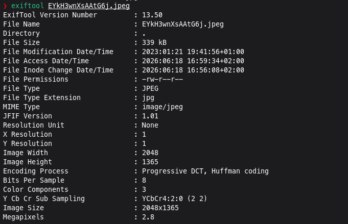
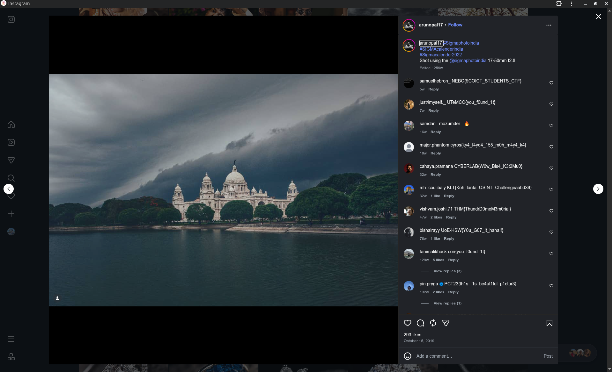

# PIRATES OF MEMORIAL

## Challenge Description

**Flag format:** csictf{}

The goal of this challenge was to find the original photographer of the provided image and locate the flag hidden in their post comments.


The hint was:

> The original photographer of this picture commented the flag on his post. Find the flag.

---

## Solution

### 1. Extracting information from the image

First, I checked the image metadata using exiftool to look for useful information such as:

- Author
- GPS coordinates
- Camera information
- Copyright metadata

However, the image did not contain any useful EXIF information.



---

### 2. Finding the original source

Since metadata did not reveal the source, I used reverse image searching to locate the original upload.

The image was traced back to the original photographer's social media post.


---

### 3. Identifying the original photographer

After finding the original post, I checked the comments and searched for any hidden information related to the challenge.

The photographer's post contained the required flag in the comments.


---

### 4. Finding the flag

The flag was located in the photographer's comment section on Instagram.



The comment contained:

```text
csictf{pl4g14r1sm_1s_b4d}
```


---

## Flag

```text
csictf{pl4g14r1sm_1s_b4d}
```

---

## Tools Used

- ExifTool
- Google/Yandex Reverse Image Search
- X/Twitter search
- Instagram search
