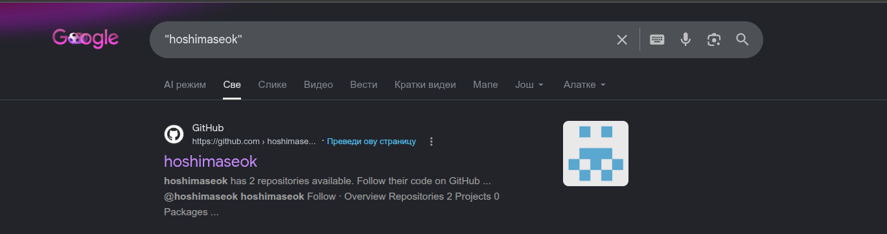
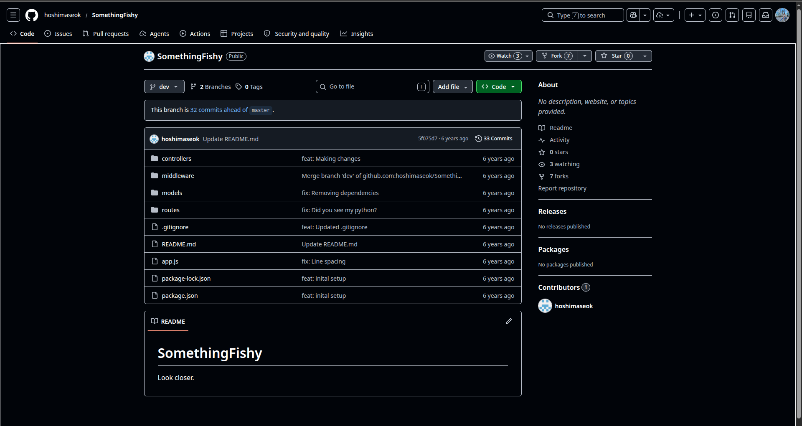
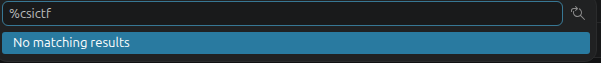
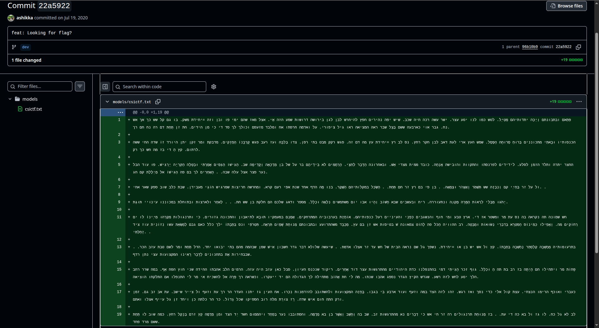
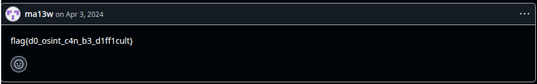
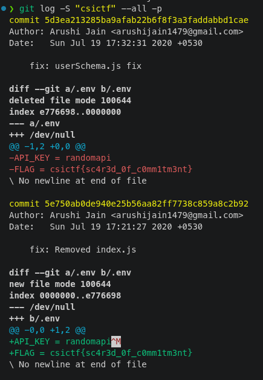

# COMMITMENT

## Challenge Description

**Flag format:** csictf{}

The goal of this challenge was to track down the user `hoshimaseok` and find the hidden flag.

The hint was:

> hoshimaseok is up to no good. Track him down.

---

## Solution

### 1. Finding the GitHub account

The first step was searching for the username `hoshimaseok`.

A GitHub profile and related repositories were discovered through the search results.



---

### 2. Finding the target repository

After inspecting the GitHub results, I found the repository named `SomethingFishy`.



---

### 3. Inspecting the repository

The repository was cloned locally and the available branches were checked.

The `dev` branch contained additional content, so it was pulled and searched.

I searched through the repository files for possible flag references.



---

### 4. Checking commit history

Since no obvious flag was found in the files, I inspected the commit history.

A suspicious commit named:

> feat: Looking for flag?

was discovered.

Opening that commit revealed a file named `csicrf.txt`.



---

### 5. Extracting the (false) flag

In the GitHub repository, the `csicrf.txt` file contained a comment:

```text
flag{d0_osint_c4n_b3_d1ff1cult}
```



---

### 6. Finding the real flag

The real flag was found in git history using the command:

```bash
git log -S "csictf" --all -p
```



Flag was found in .env file in the commit history.

```text
csictf{sc4r3d_0f_c0mm1tm3nt}
```

## Flag

```text
csictf{sc4r3d_0f_c0mm1tm3nt}
```

---

## Tools Used

- Google Search
- GitHub
- Git
- Git log / commit history
- Repository file search
