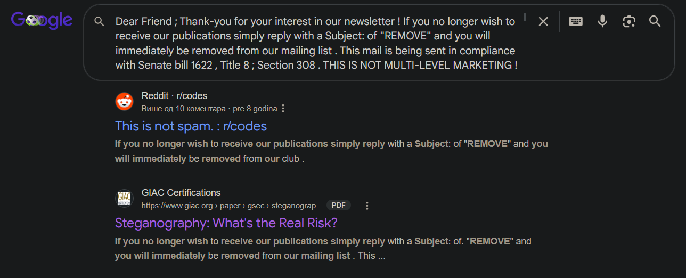
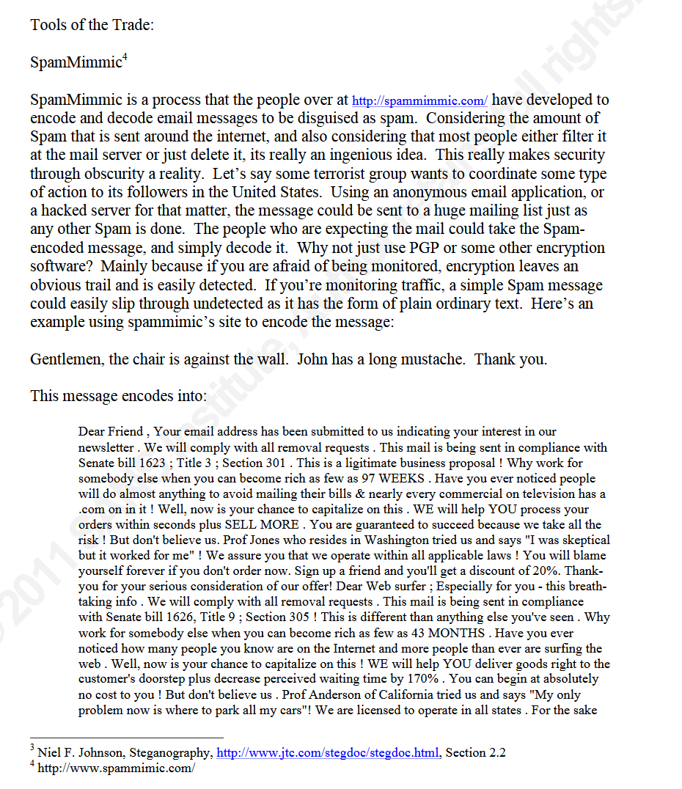
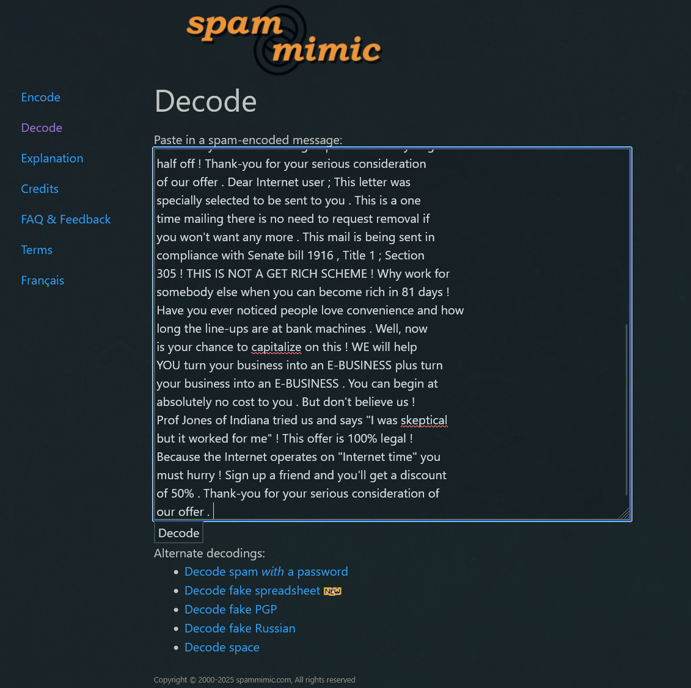
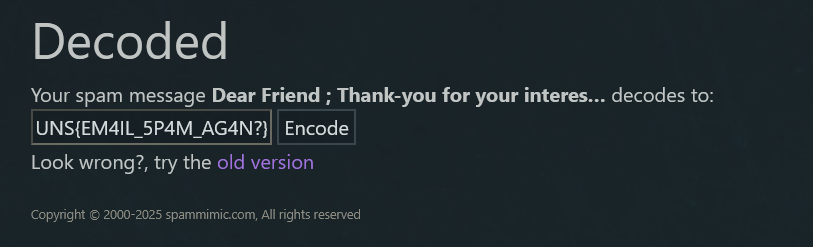

# Nigerian Prince

## Challenge Description

**Flag format:** UNS{}  
**Provided:** [`email.txt`](email.txt)  
**Hint:** Your friend received a very strange email. Since he knows you understand computers, he sent you the email's content and asked you to check if that email has any meaning or it's just another spam?  

---

## Solution

### 1. Searched email content directly in Google



---

### 2. Reading `Steganography: What's the Real Risk?`



In PDF there's example of similar email and description about how it's an encoded message using SpamMimmic tool.

---

### 3. Decoding using SpamMimmic

https://www.spammimic.com/decode.shtml





---

## Flag

```text
UNS{EM4IL_5P4M_AG4N?}
```

---

## Tools Used

- Google Search
- SpamMimmic
