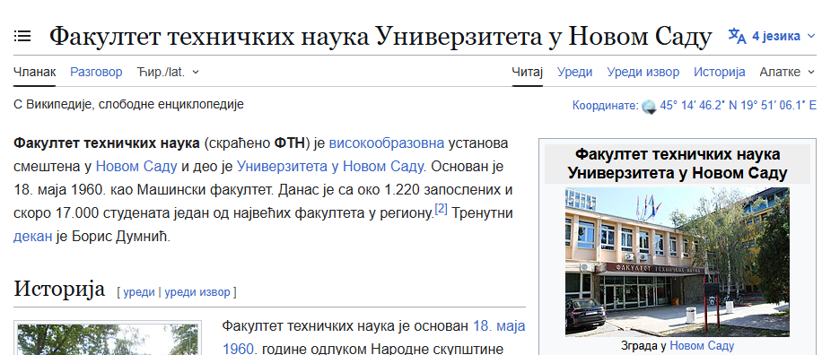
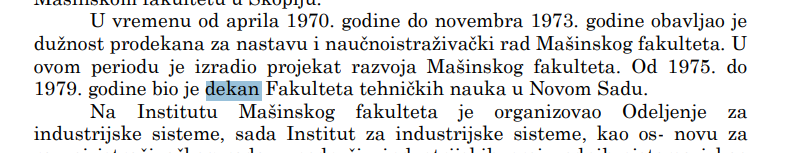
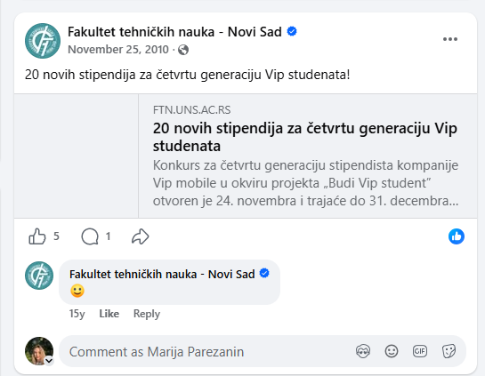
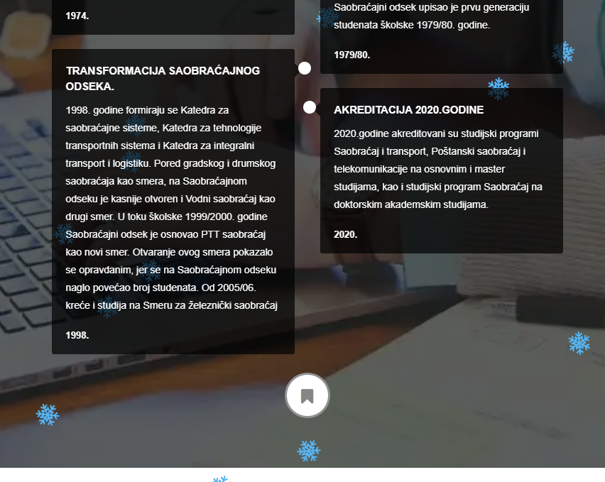
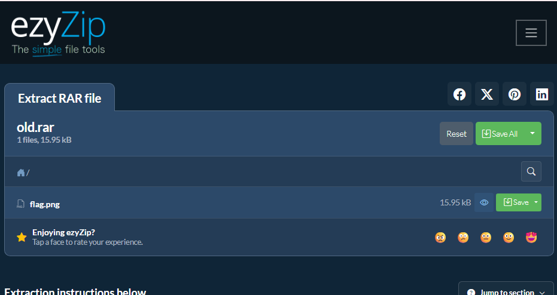

# Education Purposes Only

## Challenge Description

**Flag format:** UNS{}  
**Provided:** [`forgotten_password.txt`](forgotten_password.txt)
Locked ZIP  
**Hint:** Together with your friends, you browsed the web archive of the Faculty of Technical Sciences and came across some very old archive. You downloaded it to see what was inside, but it was locked. Along with it, you also found a file that you think can help you unlock the archive.

---

## Solution

### 1. Understanding the provided files

The forgotten password file contains 4 questions and the md5 hashed answers to them. These hashes are provided to help verify the answers I find. In the end should be concatenated to get the password to the RAR. 

---

### 2. Date when FTN was opened



A quick wikipedia search revealed the date to be 18/05/1960.

---

### 3. 1975 Dean

https://upload.wikimedia.org/wikipedia/commons/5/5a/Biografija_i_bibliografija_Dragutina_Zelenovi%C4%87a.pdf

A google search for 1975 dean led me to a link with Dragutin Zelenkovic's biography. Searching "dekan" in this document resulted in the following:




---

### 4. FTN website launch



I couldn't find this so I decided to run a script that checks. For constraints I took 2010 because that is the first mention of the website on the FTN Facebook page. For the start date I took the launch of facebook - 2004. 

The script is `date_finder.py`, and the output was this:
Match found: 18/05/2005

---

### 5. Saobracaj i telekomunikacije

https://saobracaj.ftn.uns.ac.rs/

They have their own website with a winter theme. The webiste has a history section that revealed the year to be 1999



### 6. Putting it together 

`18/05/1960Dragutin18/05/20051999`

I don't have 7zip installed so I used the ezyzip website. 




---

## Flag

The flag is an image that reads:

```text
UNS{V3RY_OLD_4RCH1V3}
```

---

## Tools Used

- Google Search
- ezyzip
