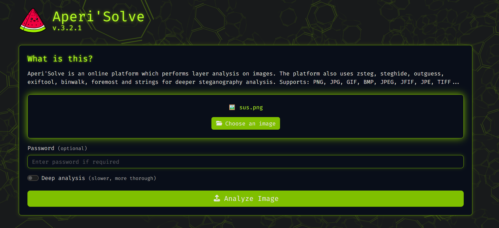
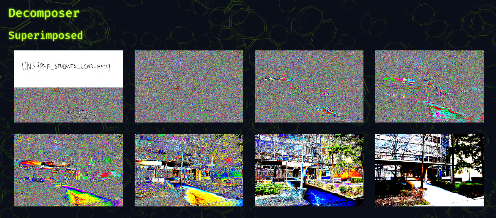
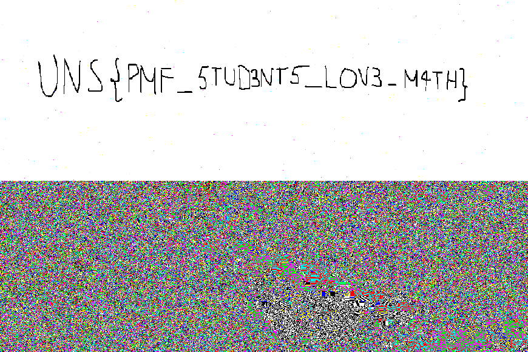

# Pixel Perfect

## Challenge Description

**Flag format:** UNS{}  
**Provided:** [`sus.png`](sus.png)  
**Hint:** Your college mate likes to take photos in his spare time. He recently sent you a picture of him and said he had something very important to tell you. Since then, there is no trace of him. Maybe you should take a closer look at the picture?  

---

## Solution

### 1. Uploading image to Aperi'Solve



---

### 2. Reading bit slicing results





---

## Flag

```text
UNS{PMF_5TUD3NT5_LOV3_M4TH}
```

---

## Tools Used

- Aperi'Solve