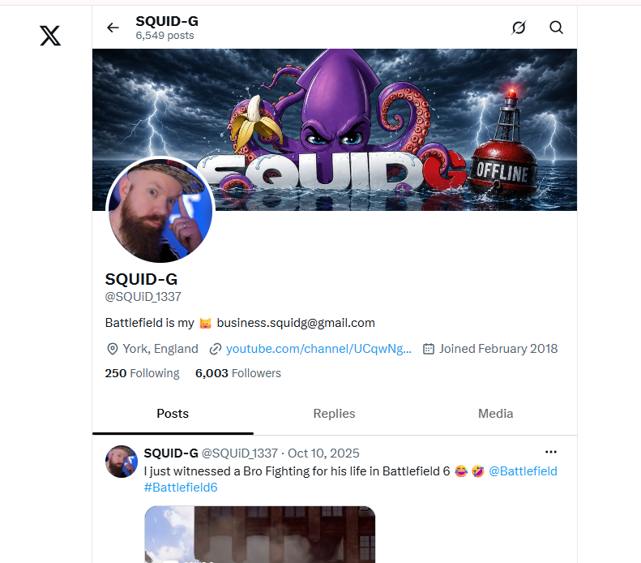
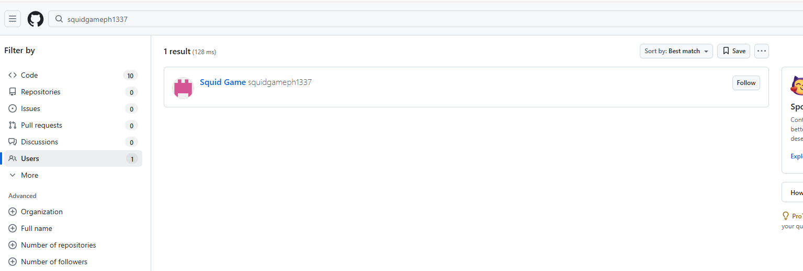
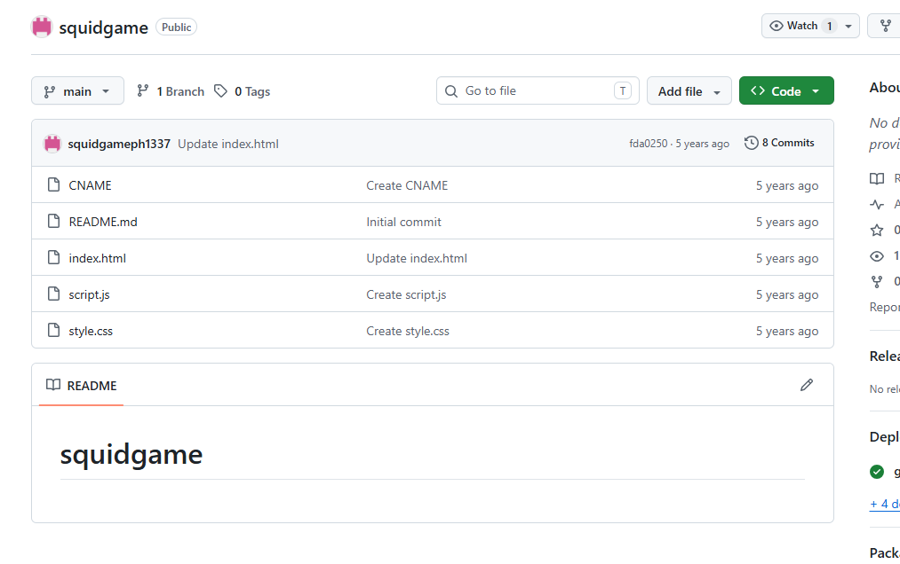
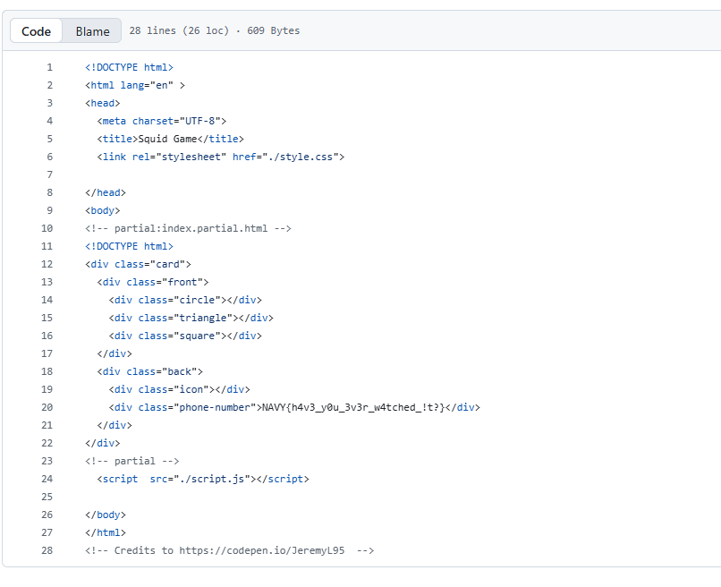

# Squid Game invitation

## Challenge Description

**Flag format:** NAVY{} 
**Provided:** [`image.jpg`](image.jpg)

---

## Solution

### 1. Gmail from the image


The image includes the following text:
`squidgameph1337@gmail.com`

I googled it with just the username, all i got was some guys twitter page. 



Becuase the username isnt a name and surname, it didnt make sense to look on places like Linkedin or Facebook. So i searched it on github

It yielded one user:



---

### 2. Inspecting the repository



There was only one repository, I started to look the files from top to bottom and in the first one (index.html) I found this:



---

## Flag


```text
NAVY{h4v3_y0u_3v3r_w4tched_!t?}
```

---

## Tools Used

- Google Search
