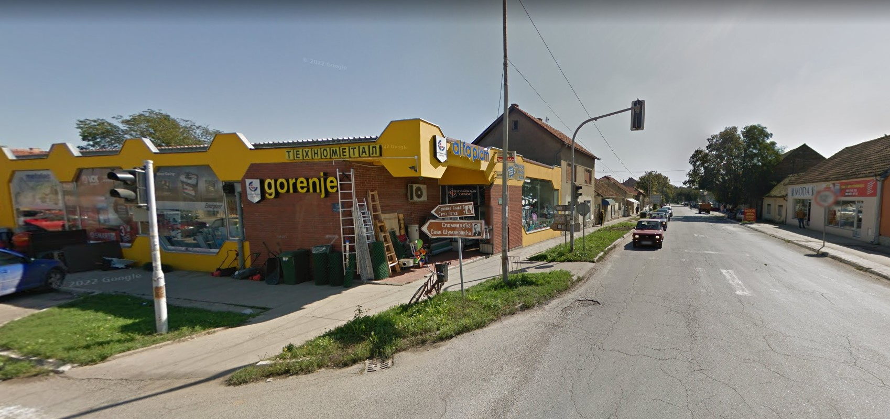
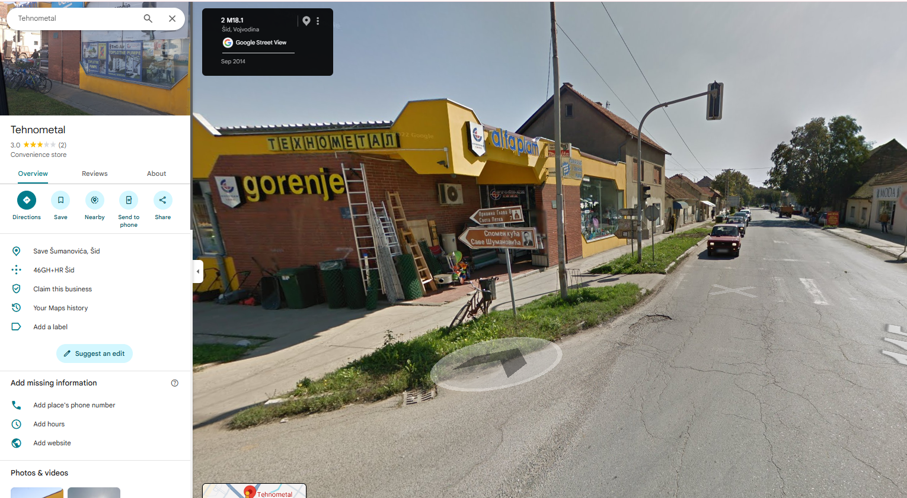

# Maps OSINT 1

## Challenge Description

**Flag format:** UNS{XX.XXXXXXX,XX.XXXXXXX}
**Provided:** [`image.jpg`](image.jpg)  

---

## Solution

### 1. Gathering clues from the image




There is a 2022 Google watermark which confirms this is google street view.  
There is cyrilic text `Tehnometal` displayed which reveals this is a Balkan area.
There are two road signs, one to `Spomen kuca Save Sumanovica' which narrows down the city. 

Googling the house reveals that it is in Šid.

---

### 2. Google maps



I looked up Tehnometal in sid, and found the exact cross section. I went back from street view, right clicked, and got the coords. 

---

## Flag


```text
45.126339, 19.229251
```

---

## Tools Used

- Google Search
- Google Street View