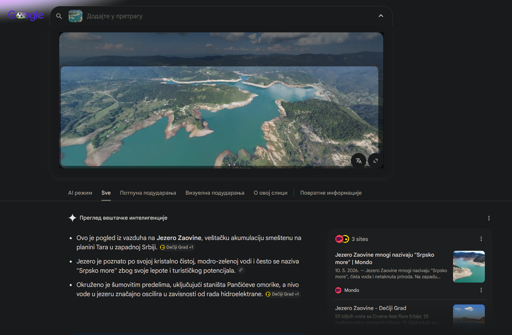

# Maps OSINT 2

## Challenge Description

**Flag format:** UNS{XX.XXXXXXX,XX.XXXXXXX}  
**Provided:** [`image.jpg`](image.jpg)  
**Hint:** Your friend received a very strange email. Since he knows you understand computers, he sent you the email's content and asked you to check if that email has any meaning or it's just another spam?  

---

## Solution

### 1. Reverse image search using Google



Found out that it's and image of Zaovinsko jezero. By Google watermark at the bottom of the image as well as high elevation view, it's most likely someone's private 360 image uploaded to Google Streets View.

---

### 2. Trying few 360 image points above Zaovinsko jezero


---

### 3. Finding the correct one


Finding the same image at 43.8706053405058, 19.385583738674853.

---

## Flag

```text
UNS{43.8706053,19.3855837}
```

---

## Tools Used

- Google Search
- Google Street View
