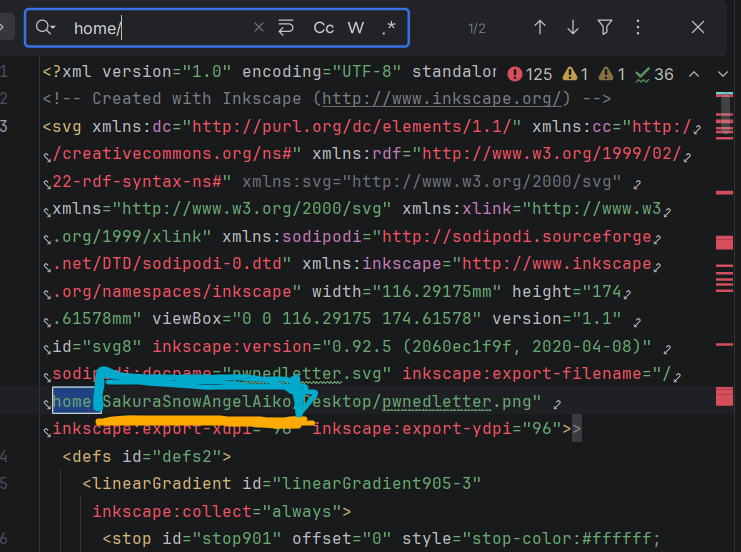

# Tip off

## Challenge Description

**Answers needed:** attacker's username  
**Provided:** [`sakurapwnedletter.svg`](sakurapwnedletter.svg)  
**Hint:** The  Dojo recently found themselves the victim of a cyber attack. It seems that there is no major damage, and there does not appear to be any other significant indicators of compromise on any of our systems. However during forensic analysis our admins found an image left behind by the cybercriminals. Perhaps it contains some clues that could allow us to determine who the attackers were? 

---

## Solution

### 1. Inspected SVG content

In SVG `inkscape:export-filename` leaked absolute path from attacker's machine revealing his username.

---

## Flag

**username:** `SakuraSnowAngelAiko`

---

## Tools Used

- Text File Viewer