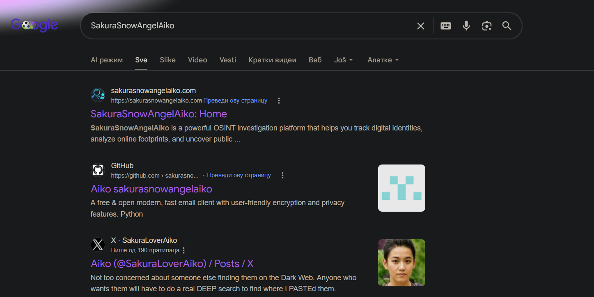
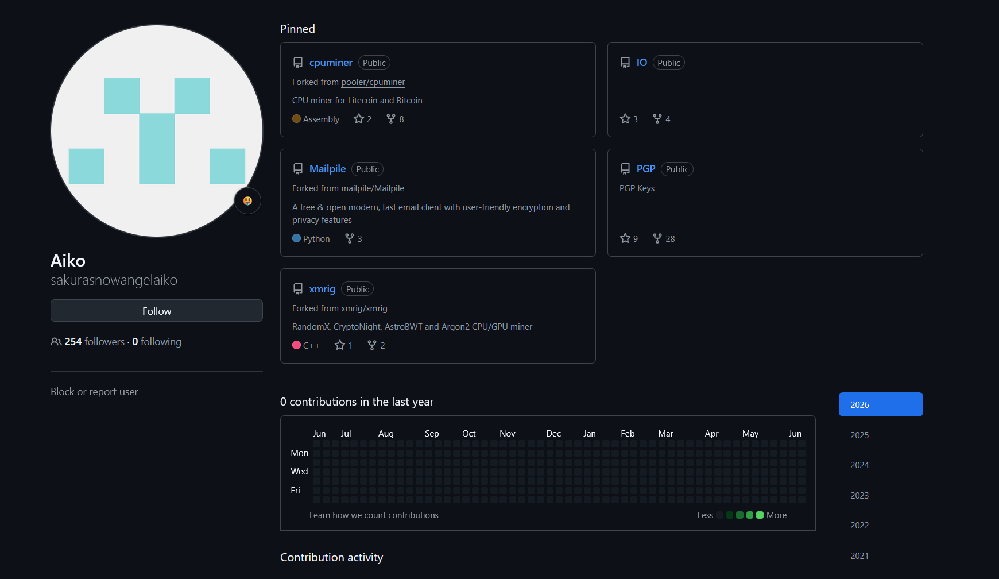
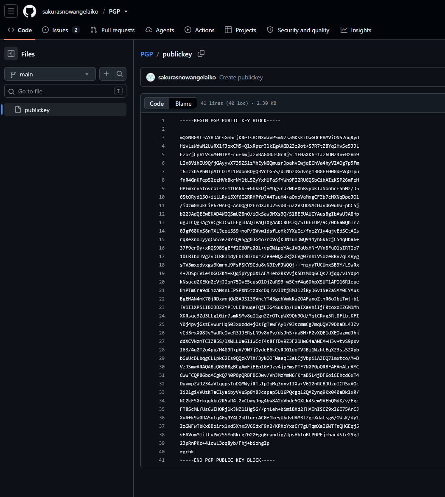
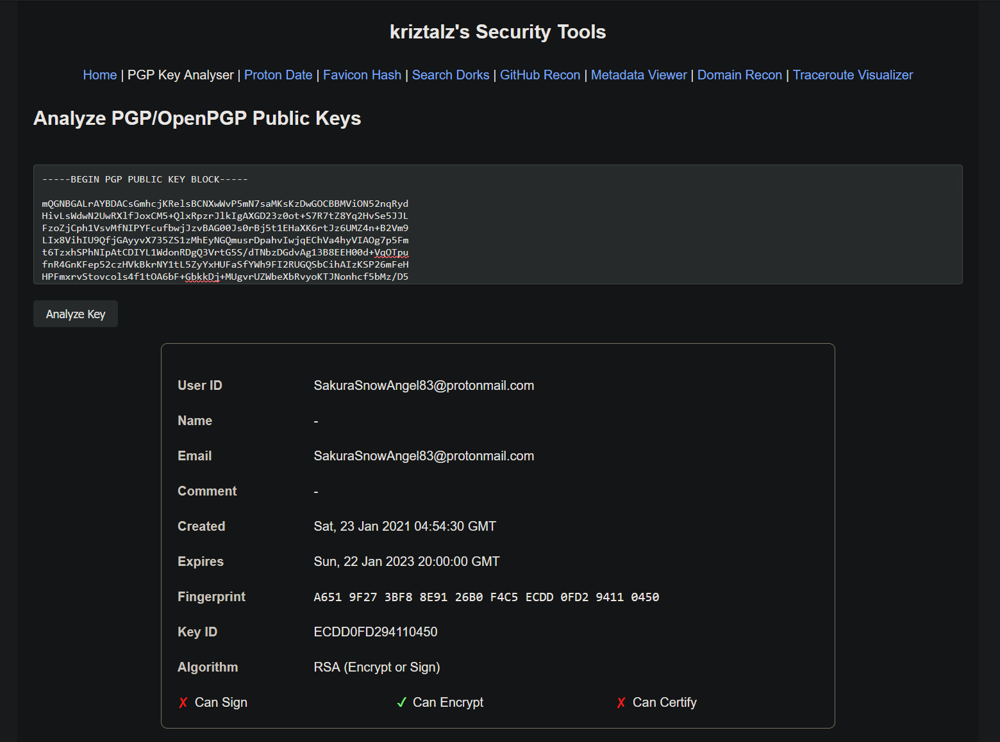
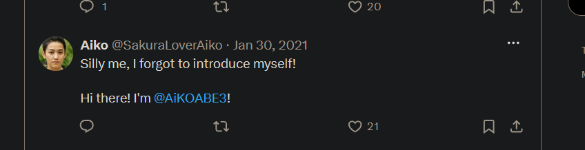

# Reconnaissance

## Challenge Description

**Answers needed:** 
* attacker's email 
* attacker's full real name 
**Provided:** `SakuraSnowAngelAiko` username from previous step  
**Hint:** It appears that our attacker made a fatal mistake in their operational security. They seem to have reused their username across other social media platforms as well. This
should make it far easier for us to gather additional information on them by locating their other social media accounts.

---

## Solution

### 1. Google Search the username

---

### 2. Finding email on the Contact Us page on attackers website

It turns out this isn't the email that passes CTF check.

---

### 3. Finding PGP keys on the attackers GitHub

---

### 3. Analyzing PGP key to get the email

https://kriztalz.sh/pgp-key-analyser/

---

### 4. Finding full name on the attackers Twitter page

---

## Flag

**email:** `SakuraSnowAngel83@protonmail.com`  
**full name:** `Aiko Abe`

---

## Tools Used

- Google Search
- GitHub
- Twitter
- kriztalz's Security Tools (Analyze PGP/OpenPGP Public Keys)