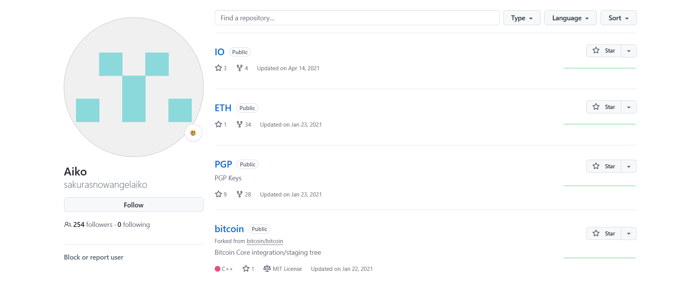
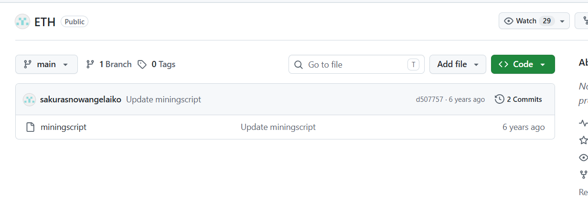
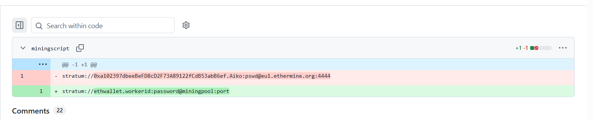
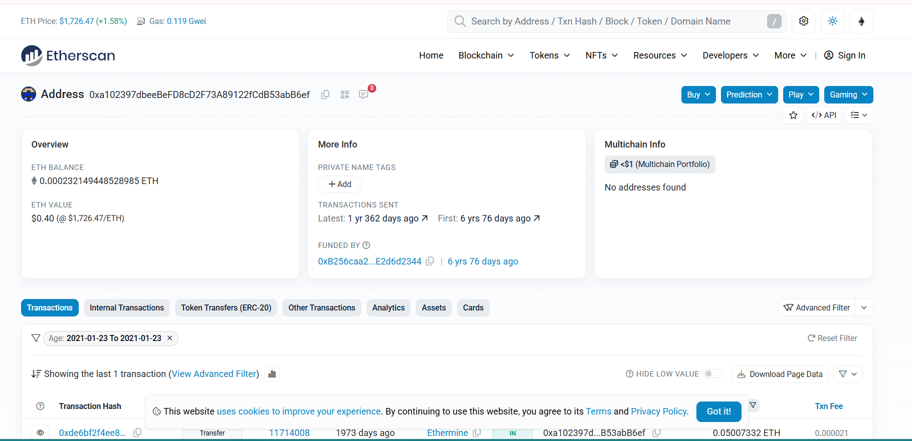
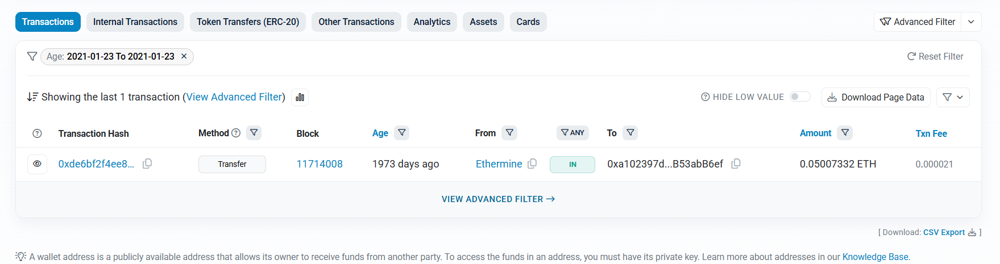
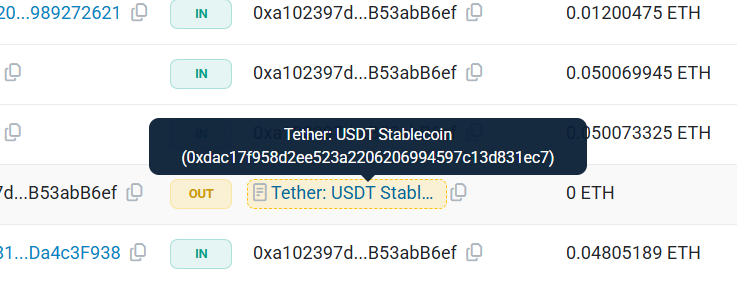

# Unveil

## Challenge Description

**Answers needed:**

* What cryptocurrency does the attacker own a cryptocurrency wallet for?
* What is the attacker's cryptocurrency wallet address?
* What mining pool did the attacker receive payments from on January 23, 2021 UTC?
* What other cryptocurrency did the attacker exchange with using their cryptocurrency wallet?
**Provided:** `SakuraSnowAngelAiko` GitHub username from previous step  
**Hint:** As we were investigating into their Github account we observed indicators that the account owner had already begun editing and deleting information in order to throw us off their trail. It is likely that they were removing this information because it contained some sort of data that would add to our investigation.

---

## Solution

### 1. Go to their github and look at the repositories

There are two repos that seem related to crypto, ETH which stands for etherium and bitcoin. The bitcoin repository is just a fork from bitcoin/bitcoin so its discarded.
This lead to the first conclusion, the cryptocurrency is `Ethereum`

---

### 2. Examining the ETH repository

There is only one file and two commits.

In the last commit we can see that even though it was replaced with placeholder values, the real wallet data was commited to GitHub in the previous commit.
In this line the wallet id is revealed to be: `0xa102397dbeeBeFD8cD2F73A89122fCdB53abB6ef`

---

### 3. Finding the wallet

I took the wallet id from the git file and googled it. The top result was Etherscan which is a site to view e wallets and transactions.

---

### 3. Locating the transaction

There is a list of transaction, that can be filtered to the exact date specified in the task.
Here we find out that the transaction was from `Ethermine`

---

### 4. Analyzing values

The transaction were in etherium and Tether, leading to the last answer `Tether`

---

## Tools Used

- Google Search
- GitHub
- etherscan.io