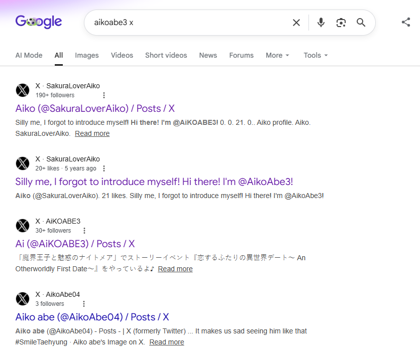
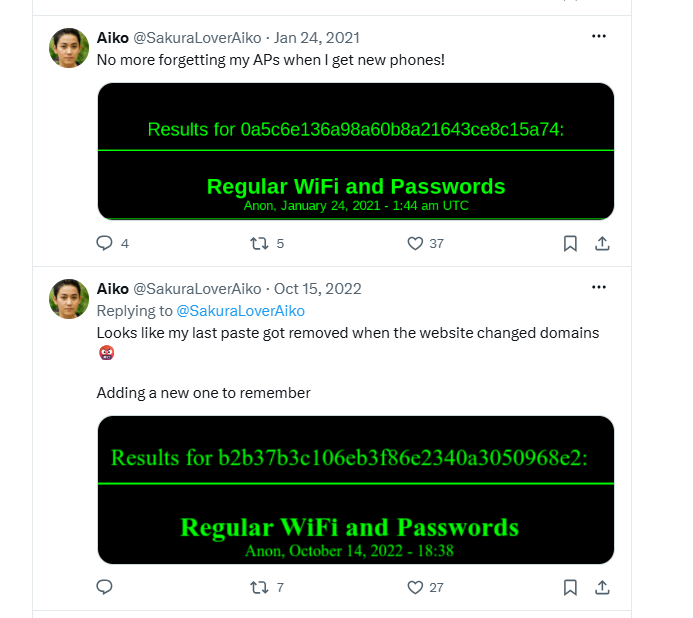
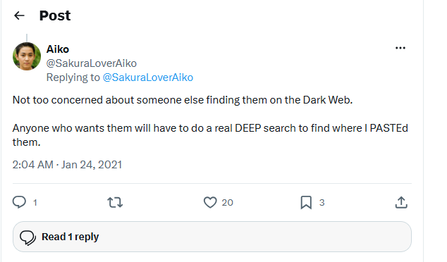
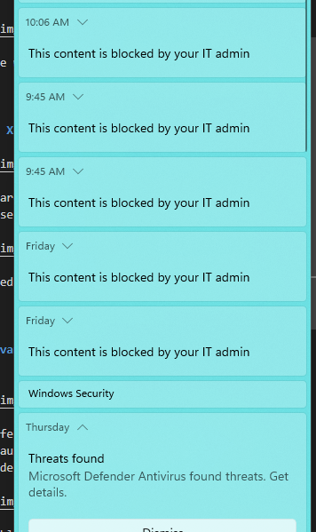
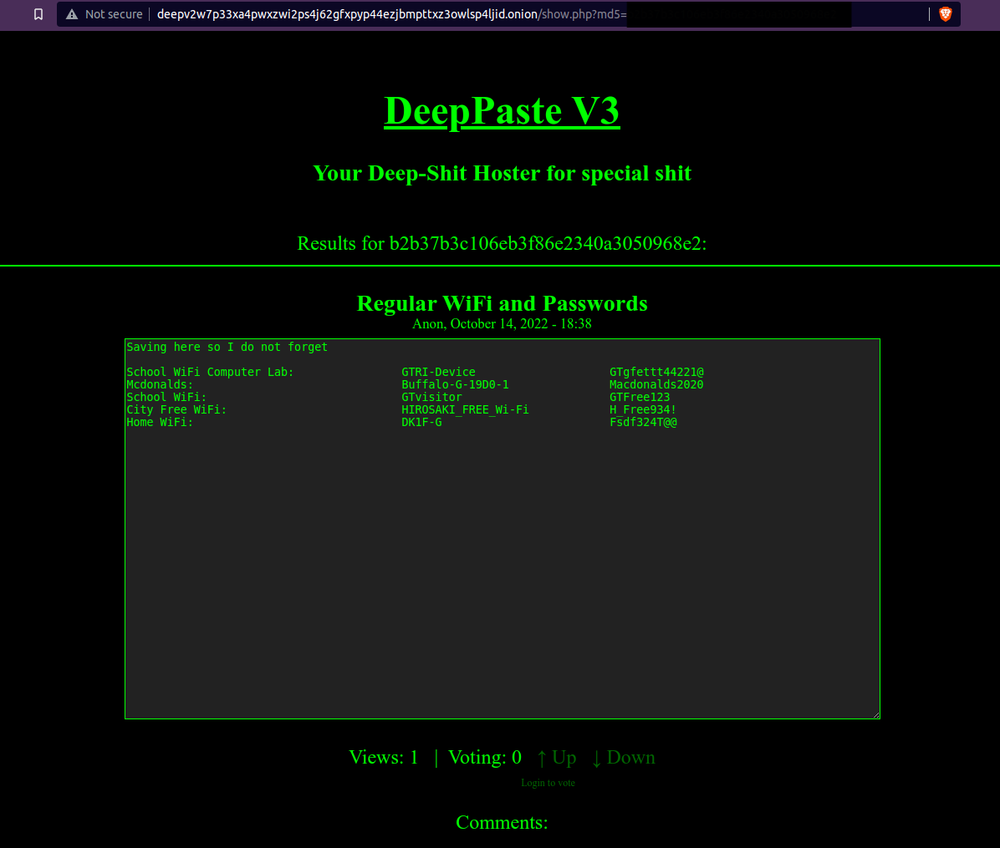
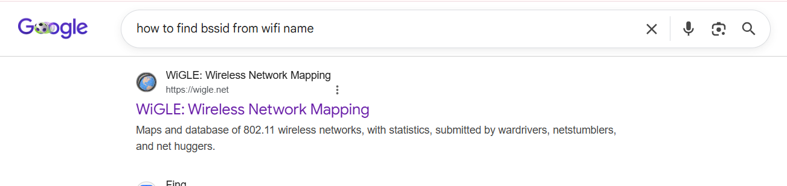
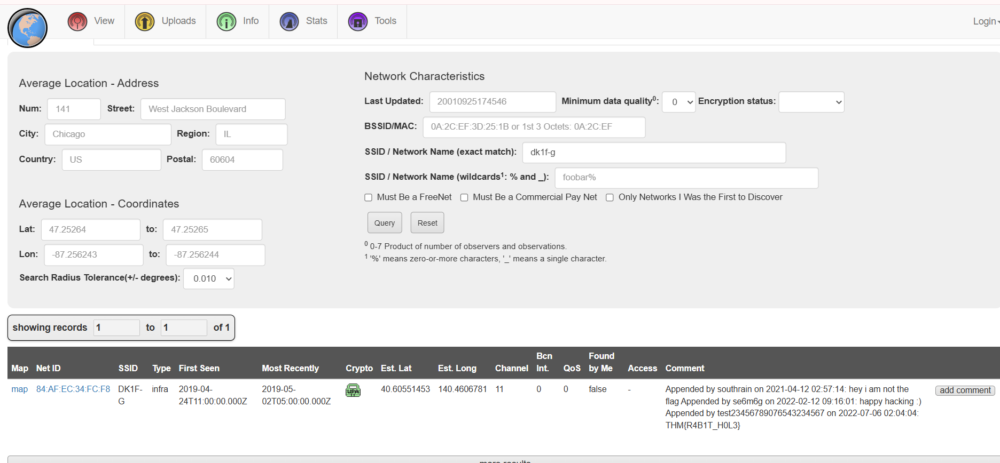

# Taunt

## Challenge Description

**Answers needed:** 
* What is the attacker's current Twitter handle?
* What is the BSSID for the attacker's Home WiFi?

**Provided:** img1 from images. 
**Hint:** Although many users share their username across different platforms, it isn't uncommon for users to also have alternative accounts that they keep entirely separate, such as for investigations, trolling, or just as a way to separate their personal and public lives. These alternative accounts might contain information not seen in their other accounts, and should also be investigated thoroughly.

---

## Solution

### 1. Examine the provided image

On the image we can see the handle being `AikoAbe3`.

---

### 2. Find X profile

A google search led me to the X profile and the 8 posts the user made. 

This revealed the username being `SakuraLoverAiko`.

---

### 3. Relevant posts

Two post reference wifi, one is described to be expired because the website changed domains. The attacker made a reply to their own post: 

What is highlighted is DEEP + PASTE, and dark web is mentioned. When i googled dark web deep paste I found out that this refers to sites that are platforms for anonymously sharing text that require special encryption software (like the Tor browser) to access. 

---

### 3. Browser issue

I ran into an issue when trying to install the tor browser here: https://www.torproject.org/
Due to this I wasnt able to access the lookup site. I skipped it by finding the search result online in a published solution: https://raw.githubusercontent.com/OsintDojo/public/main/deeppaste.png

From here I see the wifi name is `DK1F-G`. I then googled how to get the bssid:

---

### 4. WiGLE - Wireless network mapping

I needed to make an account to use the search feature. From here I can see the network ID is `84:AF:EC:34:FC:F8`.

---

## Tools Used

- Google Search
- WiGLE
- X