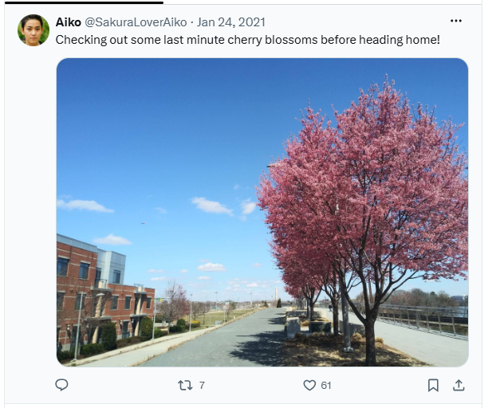
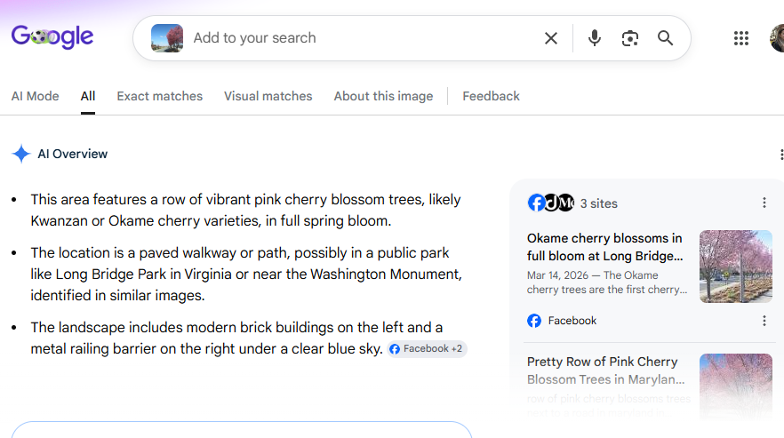
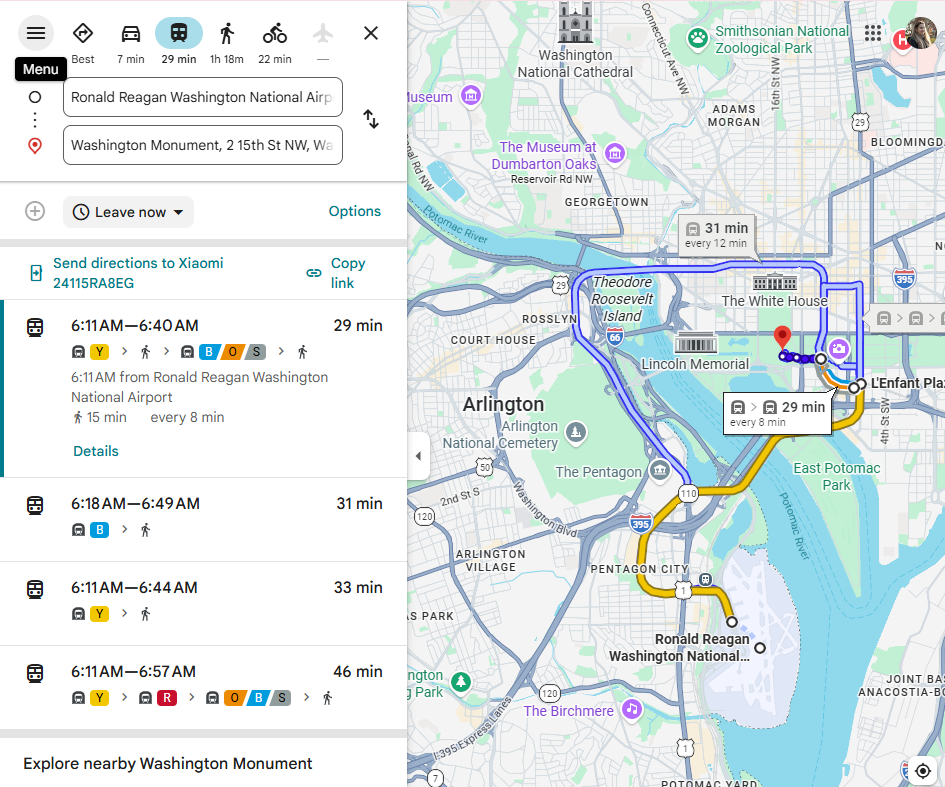
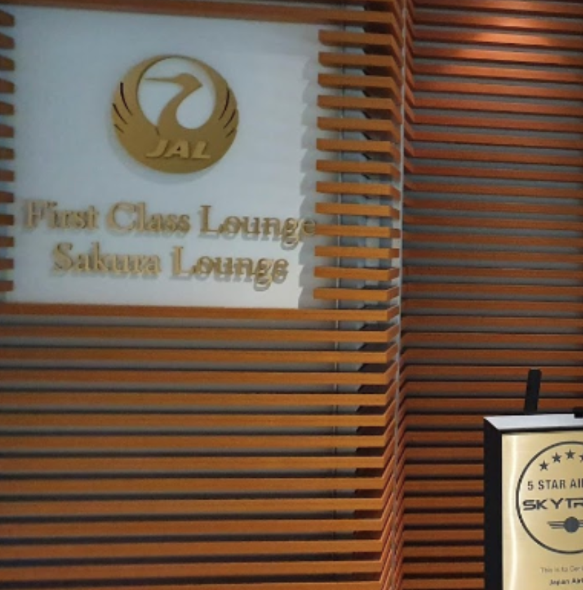
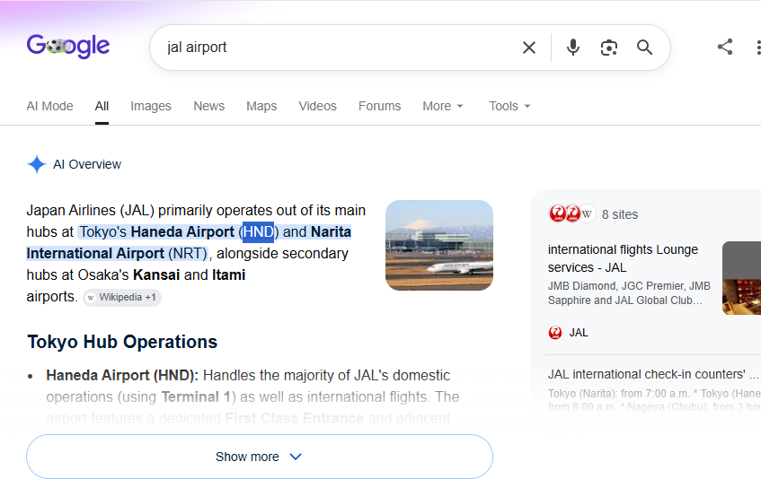
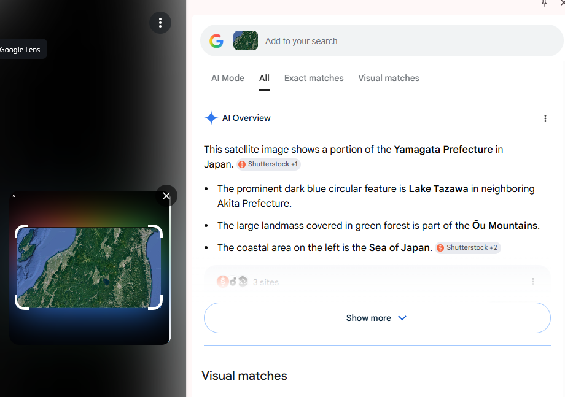
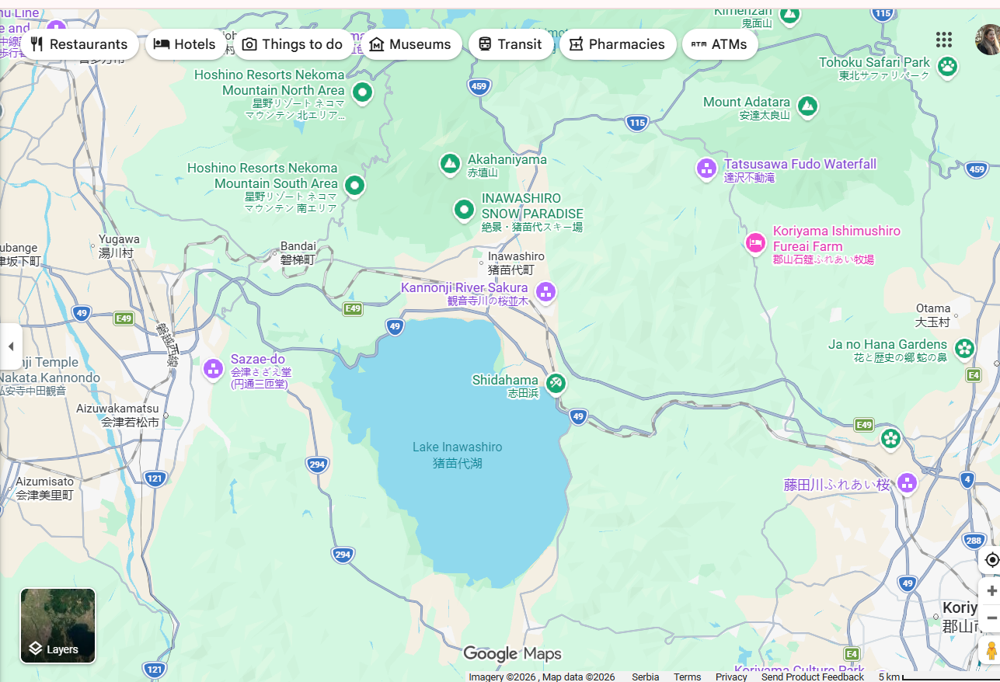
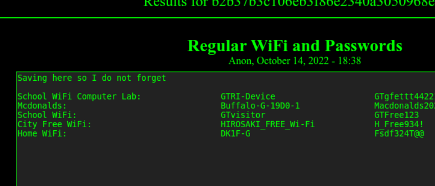

# Homebound

## Challenge Description

**Answers needed:** 
* What airport is closest to the location the attacker shared a photo from prior to getting on their flight?
* What airport did the attacker have their last layover in?
* What lake can be seen in the map shared by the attacker as they were on their final flight home?
* What city does the attacker likely consider "home"?
**Provided:** twitter account from previous step.
**Hint:** In OSINT, there is oftentimes no "smoking gun" that points to a clear and definitive answer. Instead, an OSINT analyst must learn to synthesize multiple pieces of intelligence in order to make a conclusion of what is likely, unlikely, or possible. By leveraging all available data, an analyst can make more informed decisions and perhaps even minimize the size of data gaps. In order to answer the following questions, use the information collected from the attacker's Twitter account, as well as information obtained from previous parts of the investigation to track the attacker back to the place they call home.
---

## Solution

### 1. Examine attacker's twitter page

There are three posts with images that are referencing the trip home. When evaluated by the date posted and the captions the first image posted was the cherry blossom. 

---

### 2. Google image search

One of the results was Washington Monument, and when I looked at the image again i noticed that in the center of the image the monument can be seen.

---

### 3. Finding the airport

I went to directions from the washington monument, and when typing in airport it fetches the closest one which in this case is `Ronald Reagan Washington National Airport`. I looked up the airport to find out that their 3 letter acronym is `DCA`.

---

### 3. Layover

On the image I first focused on the logo that has the text `JAL`, I assumed this is an acronym for an airport simiar to the step before. Turns out JAL is an airline. However the search also revealed the two main airports it operates from and the first was the correct answer. 

---

### 4. Finding the Lake

A quick google lens search reveals that the lake featured is the Lake Tazawa. However, this was not the correct answer. It did confirm my assumption that it was japan so i decided to manually search it on maps.

From the direction of the island in the image it was easy to locate that the lake is `Lake Inawashiro`. 

---

### 4. Finding home

This was revealed in the previous task. Right above home wifi is city free wifi: `HIROSAKI_FREE_Wi-Fi`. Leading to the final answer for home being `Hirosaki`. 

