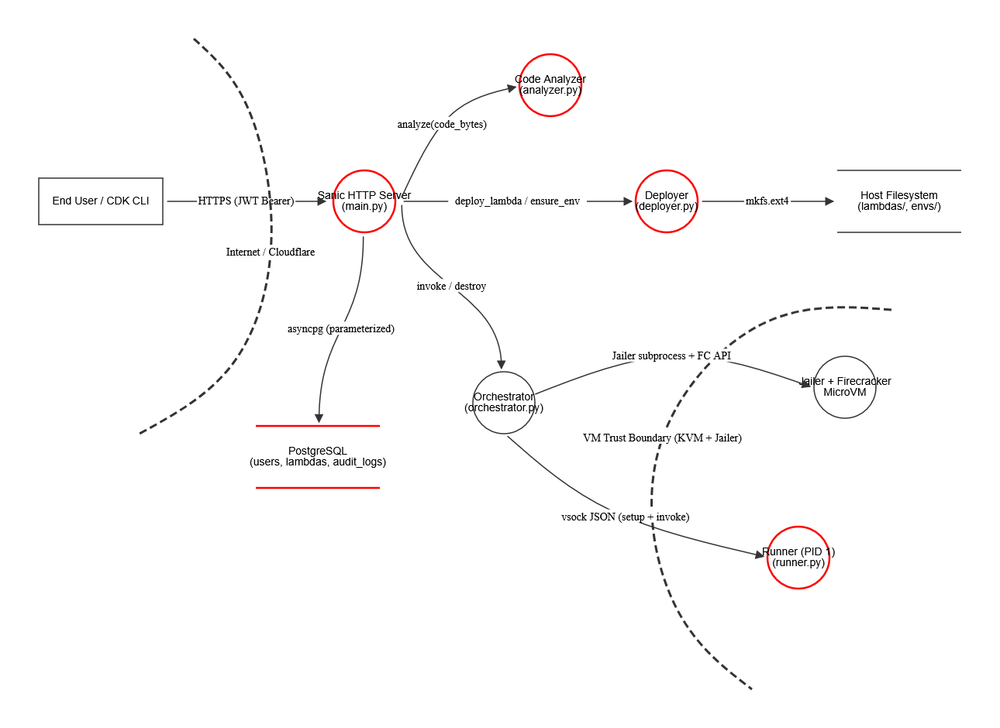

# Oblak —  Python Execution Platform

Oblak is a platform for running user-provided Python code inside lightweight, isolated Firecracker MicroVMs. Inspired by cloud services such as AWS Lambda and Google Cloud Functions, the platform provides mechanisms for deploying, invoking, listing, and destroying user functions through both a command-line interface and a web client using the REST API.

A central architectural decision is that **every function runs inside its own isolated virtual machine**, ensuring that user-provided code can't affect the host system or any other user's environment. The platform is designed with security as a first-class concern at every layer.

---

## Table of Contents

1. [Architecture Overview](#1-architecture-overview)
2. [Supporting Infrastructure](#2-supporting-infrastructure)
3. [Project Structure](#3-project-structure)
4. [Firecracker and MicroVM Foundations](#4-firecracker-and-microvm-foundations)
5. [Initialization and Checks](#5-initialization-and-checks)
6. [Guest MicroVM Filesystem Architecture](#7-guest-microvm-filesystem-architecture)
7. [The Host Orchestrator](#7-the-host-orchestrator)
8. [VM Lifecycle](#8-vm-lifecycle)
9.  [Networking Architecture](#9-networking-architecture)
10. [The Runner (`runner.py`)](#10-the-runner-runnerpy)
11. [The Code Analyzer (`analyzer.py`)](#11-the-code-analyzer-analyzerpy)
12. [The Deployment Pipeline](#12-the-deployment-pipeline)
13. [REST API Reference](#13-rest-api-reference)
14. [CDK Command-Line Interface](#14-cdk-command-line-interface)
15. [Database Schema](#15-database-schema)
16. [VM Configuration Reference](#16-vm-configuration-reference)
17. [Security Architecture Summary](#17-security-architecture-summary)
18. [Security Assessment Report](#18-security-assessment-report)

---

## 1. Architecture Overview

The platform is structured as a layered security stack. User-provided code is analyzed before acceptance, packaged into isolated disk images, and executed exclusively inside KVM-backed MicroVMs that are network-namespaced, chroot-jailed, and resource-capped via cgroups. The host orchestrator communicates with the running VM over a vsock channel that bypasses the network stack entirely.


```
┌─────────────────────────────────────────────────────────────────┐
│                        External Internet                        │
└──────────────────────────────┬──────────────────────────────────┘
                               │ Cloudflare Tunnel (encrypted)
┌──────────────────────────────▼──────────────────────────────────┐
│                     Oblak REST API (Sanic)                      │
│   POST /auth/login  │  POST /lambdas  │  POST /lambdas/*/invoke │
└──────────┬──────────────────┬─────────────────┬─────────────────┘
           │                  │                  │
      JWT Auth            Analyzer           Orchestrator
      (bcrypt)            (4-layer)          (main.py)
                              │                  │
                   ┌──────────▼──────┐    ┌──────▼──────────────┐
                   │  Code Analysis  │    │  VM Lifecycle Mgr   │
                   │  - File check   │    │  - Snapshot hydrate │
                   │  - YARA AV      │    │  - chroot/jailer    │
                   │  - Bandit/AST   │    │  - netns + veth     │
                   │  - Claude LLM   │    │  - cgroups          │
                   └─────────────────┘    └──────┬──────────────┘
                                                  │ vsock (AF_VSOCK)
                                   ┌──────────────▼───────────────┐
                                   │     Firecracker MicroVM      │
                                   │   (KVM-backed, Jailer-jailed)│
                                   │   ┌───────────────────────┐  │
                                   │   │   runner.py (PID 1)   │  │
                                   │   │   /var/task (ro)      │  │
                                   │   │   /env (ro)           │  │
                                   │   │   /tmp (tmpfs, rw)    │  │
                                   │   └───────────────────────┘  │
                                   └──────────────────────────────┘
```

---

## 2. Supporting Infrastructure

The platform relies on two background services managed with Docker Compose:

**PostgreSQL** acts as the persistent store for users, lambda metadata, and a complete audit log. An initialization script automatically structures the database schema on first boot.

**Cloudflare Tunnel** acts as the network gatekeeper, exposing Oblak's control REST API securely to the internet without requiring open or forwarded ports on the host machine. It routes external traffic through an encrypted tunnel directly to the platform's internal API gateway, eliminating an entire class of host-level network exposure.

---

## 3. Project Structure

```
├── cdk-cli/                        # Command-line client
│   ├── oblak.py                    # CDK CLI script
│   ├── oblak.cmd                   # Entry point wrapper (oblak <command>)
│   └── requirements.txt
└── oblak/                          # Server and orchestrator
    ├── firecracker/
    │   ├── rootfs/
    │   │   ├── Dockerfile          # Builds rootfs.ext4
    │   │   ├── env_builder.sh      # Baked into rootfs; runs in env-builder VMs
    │   │   └── runner.py           # Baked into rootfs; trusted runtime
    │   ├── README.md               # Firecracker setup instructions
    │   ├── setup.ps1               # Automated Firecracker setup (Windows)
    │   ├── setup.sh                # Automated Firecracker setup (Linux)
    │   ├── snapshot.ps1            # Take base VM snapshot (Windows)
    │   ├── snapshot.sh             # Take base VM snapshot (Linux)
    │   ├── test.ps1                # Test MicroVM boot (Windows)
    │   └── test.sh                 # Test MicroVM boot (Linux)
    ├── resources/
    │   ├── rootfs.ext4             # Base rootfs image
    │   ├── stub.ext4               # Stub drive image used in base snapshot
    │   ├── vmlinux                 # Firecracker CI kernel
    │   └── snapshot/
    │       ├── mem.snap            # Frozen VM memory state
    │       └── vmstate             # Firecracker VM state
    ├── envs/
    │   └── env_<hash>.ext4         # Per-requirements dependency layers
    ├── lambdas/
    │   └── <lambda_id>.ext4        # Deployed user scripts
    ├── config/
    │   ├── init.sql                # DB schema and seed data
    │   ├── vm.toml                 # VM resource configuration
    │   ├── antivirus/rules.yar     # YARA malware signatures
    │   └── prompts/llm_analyst.txt # Claude analysis system prompt
    ├── web_client/                 # Static frontend served by Sanic
    │   ├── index.html
    │   ├── script.js
    │   └── styles.css
    ├── analyzer.py                 # Code safety analysis
    ├── deployer.py                 # Lambda deployment and environment building
    ├── docker-compose.yml
    ├── main.py                     # Oblak entry point
    ├── orchestrator.py             # Orchestrator of MicroVMs lifecycle
    ├── vmlib.py                    # Shared Jailer/Firecracker and netns helpers
    └── requirements.txt
```

---

## 4. Firecracker and MicroVM Foundations

### What is Firecracker?

Firecracker is an open-source Virtual Machine Monitor (VMM) developed by Amazon Web Services for serverless computing platforms including AWS Lambda and AWS Fargate. It creates lightweight virtual machines — MicroVMs — that provide the security and isolation of traditional VMs while maintaining millisecond startup times and minimal resource overhead.

Unlike standard virtualization software such as VirtualBox or VMware, which simulate entire desktop computers with graphics cards, USB controllers, and audio devices, Firecracker strips away all non-essential hardware. It simulates only the bare minimum required to run Linux workloads: a virtualized CPU and memory, a minimal set of virtio devices, and nothing else.

### KVM — The Hardware Foundation

Firecracker leverages the Linux Kernel-based Virtual Machine (KVM) module, which transforms the host machine into a hypervisor. KVM forces the physical CPU to split its operation into two distinct modes: host mode for the main operating system and guest mode for virtual machines. When a MicroVM needs to execute instructions, KVM allows the physical hardware to run them directly at near-native speed while strictly trapping the virtual machine inside its assigned hardware boundary. 

### Jailer — The Security Wrapper

Because Oblak runs untrusted code, Firecracker processes are wrapped by Jailer. Jailer:

- Executes Firecracker inside a `chroot` jail, locking the process to `/srv/jailer/firecracker/<vm_id>/root/`
- Drops privileges to a dedicated unprivileged `firecracker-jailer` user and group
- Enforces cgroup resource limits (memory cap, CPU quota) at the kernel level
- Binds the VM to a specific network namespace for traffic isolation

Jailer is the secure, production-grade mechanism for running Firecracker and is required for any multi-tenant deployment.

---

## 5. Initialization and Checks

Three scripts handle the complete setup. All are available for both native Linux and Windows (via WSL2).

### Step 1: Setup and Installation (`setup.sh` / `setup.ps1`)

The setup script reads resource limits from `config/vm.toml` and performs all of the following:

**KVM Configuration**

Verifies that the CPU supports hardware virtualization (Intel VT-x or AMD-V), loads the `kvm_intel` or `kvm_amd` kernel module, creates a `kvm` group with appropriate device permissions (`/dev/kvm` at `crw-rw----`), and configures the `vhost_vsock` module for VM-to-host socket communication.

**Firecracker and Jailer Installation**

Downloads the latest release from GitHub, verifies the SHA-256 checksum, and installs the `firecracker` and `jailer` binaries to `/usr/local/bin/`.

**Kernel Download**

Downloads a pre-compiled, stripped-down Linux kernel (`vmlinux`) from the Firecracker CI S3 bucket. This kernel excludes desktop drivers (Bluetooth, audio, USB peripherals) for faster initialization and to save on RAM.

**Root Filesystem Build**

Uses Docker to build the base MicroVM filesystem from `firecracker/rootfs/Dockerfile`:

```dockerfile
FROM alpine:3.19

RUN apk add --no-cache python3 curl iproute2
RUN curl -LsSf https://astral.sh/uv/install.sh | UV_INSTALL_DIR=/usr/local/bin sh
RUN mkdir -p /var/runtime /var/task /env

COPY runner.py /var/runtime/runner.py
RUN sed -i 's/\r$//' /var/runtime/runner.py && chmod 544 /var/runtime/runner.py

COPY env_builder.sh /var/runtime/env_builder.sh
RUN sed -i 's/\r$//' /var/runtime/env_builder.sh && chmod 544 /var/runtime/env_builder.sh
```

The resulting filesystem is exported and packed into `resources/rootfs.ext4`, a single virtual disk file that acts as the read-only root drive for every MicroVM.

**Jailer User and Directory**

Creates the `firecracker-jailer` system user (no login shell, no home directory) and the `/srv/jailer` chroot base directory, both owned by this user.

**Network Verification**

Verifies that the host can create TAP devices (virtual Ethernet adapters) and that iptables NAT masquerading is available — both required for MicroVM internet access.

### Step 2: Stack Verification (`test.sh` / `test.ps1`)

Boots a test MicroVM with `init=/bin/sh`, drops into an interactive shell inside the VM, and allows manual verification that KVM, Jailer, networking, and the rootfs are all functional. Type `exit` to shut down.

### Step 3: Snapshot Generation (`snapshot.sh` / `snapshot.ps1`)

Cold-starting a virtual machine — loading the kernel, launching Python — normally takes several seconds. Oblak solves this with VM memory snapshots.

### What the Snapshot Script Does

1. **Rebuilds `rootfs.ext4`** using Docker to incorporate any changes to the Dockerfile or `runner.py`.

2. **Boots a hidden MicroVM** via the Firecracker API, configured with the kernel, the rootfs (read-only), and two stub placeholder drives for the `env` and `task` slots. The kernel boot argument is set to `init=/var/runtime/runner.py`, so the runner starts directly as PID 1.

3. **Waits for runner readiness** by polling vsock port 8080. When the runner responds with `OK`, the Python runtime is fully loaded in memory and listening for invocations.

4. **Pauses and snapshots the VM** via the Firecracker API (`PATCH /vm {"state": "Paused"}`), then calls `PUT /snapshot/create` to write two files:
   - `resources/snapshot/vmstate` — the VM's hardware configuration (vCPU count, network config, open ports, device state) at the exact moment of the pause.
   - `resources/snapshot/mem.snap` — a full copy of the VM's RAM, containing the completely loaded Python interpreter, imported libraries, and the runner waiting at `server.accept()`.

### How Snapshots Are Used at Runtime

When a function is invoked, the orchestrator does **not** boot a new VM. Instead it:

1. Hardlinks the `rootfs.ext4` hard drive images into the unique per-VM chroot resource folder.
2. Maps these newly linked images inside the chroot to substitute the generic template placeholder drives (stub drives) expected by the hypervisor.
3. Calls Firecracker's `/snapshot/load` API, which injects `mem.snap` directly into physical RAM and restores `vmstate`.
4. Resumes the VM (`PATCH /vm {"state": "Resumed"}`).

The VM wakes up at the exact instruction where it was frozen — with the runner already at `accept()`, ready to receive the invocation payload. This eliminates the entire cold-start boot sequence.

### Smart Environment Image Reuse via Dependency Hashing

Virtual machine snapshots (`mem.snap` and `vmstate`) are completely generic and shared across the entire platform; they only serve to instantly hydrate a clean, baseline Python memory state. What actually gets customized and reused based on the function's requirements is the environment disk image (`env.ext4`).

When a user deploys code with a `requirements.txt`, the platform:
1. Sorts the requirements lines alphabetically to ensure consistent hashing.
2. Computes a SHA-256 hash of the sorted text.
3. Truncates the hash to 16 hex characters as the environment identifier.
4. Checks if `envs/env_<hash>.ext4` already exists. If it does, it is immediately reused — no installation is needed.

Two completely different user functions with identical dependencies share the same environment image. The user's Python script is **intentionally excluded** from the image and is injected dynamically at the time of invocation, keeping the image generic and reusable.

---

## 6. Guest MicroVM Filesystem Architecture

The MicroVM guest filesystem is rigidly partitioned to prevent any mixing of platform code, user code, and dependencies.

```
/
├── usr/bin/python3             # Read-only system binaries
├── usr/lib/python3/            # Read-only standard library
├── bin/sbin/                   # Read-only system utilities (ip, mount, etc.)
├── var/
│   ├── runtime/
│   │   ├── runner.py           # BAKED IN — trusted, read-only, cannot be overwritten
│   │   └── env_builder.sh      # BAKED IN — used in env-build VMs only
│   └── task/                   # Mount point for user's uploaded scripts (read-only)
├── env/                        # Mount point for dependency layer (read-only)
├── proc/                       # Required by Python for process introspection
├── dev/                        # Device nodes
└── tmp/                        # THE ONLY WRITABLE DIRECTORY — tmpfs (RAM-backed)
```

### Security Properties of This Layout

**Immutable platform runtime.** `runner.py` is baked into `rootfs.ext4` at image build time and mounted read-only. User code cannot overwrite, modify, or replace the trusted runner under any circumstances.

**Isolated user workspace.** User scripts are mounted at `/var/task` as a read-only ext4 image. The script is visible to the runner but cannot be modified from within the VM.

**Ephemeral working directory.** The runner explicitly calls `os.chdir("/tmp")` before loading user code. Any file operations performed by user code land in `/tmp`, which is a `tmpfs` — a temporary filesystem backed entirely by RAM. When the VM is destroyed, `/tmp` vanishes with it, leaving no persistent artifacts on the host.

**Read permissions on system paths.** User code retains standard read access to system binaries and `/env`. This is safe because the underlying root drive is mounted read-only; user code has no mechanism to inject persistent malware or alter platform state, even with read visibility into the filesystem.

---

## 7. The Host Orchestrator

The host orchestrator (`orchestrator.py`) is the central brain of the platform. It lives on the host machine, entirely outside of any virtual environment, and manages the complete lifecycle of every execution sandbox.

### Core Responsibilities

| Responsibility | Mechanism |
|---|---|
| Check warm VM state | In-memory `_warm` dict keyed by `lambda_id` |
| Snapshot hydration | Firecracker `/snapshot/load` API |
| Filesystem sandbox | Unix `chroot` via Jailer |
| Network isolation | Linux network namespaces (`ip netns`) |
| Resource capping | Linux cgroups v2 (`memory.max`, `cpu.max`) |
| Internet routing | Virtual Ethernet pairs (veth) + TAP devices + NAT |
| Function invocation | Virtual sockets (`AF_VSOCK`) |
| Idle cleanup | Per-VM `threading.Timer` |

### In-Memory State

```python
_warm: dict[str, _VM]       # lambda_id → running VM instance
_available_slots: list[int] # pool of available network slot indices
_lock: threading.Lock       # protects all shared state
```

The `_VM` dataclass holds the Firecracker process handle, the active vsock connection, the assigned network slot, the chroot path, and the idle timer.

### Public API

```python
startup()                                            # Enable ip_forward, install iptables rules
shutdown()                                           # Destroy all VMs, remove iptables rules
invoke(lambda_id, script, input_str, env_hash) -> dict  # Cold or warm start, returns result
destroy(lambda_id)                                   # Destroy warm VM (does not delete files)
```

---

## 8. VM Lifecycle

### Cold Start

A cold start occurs when no warm VM exists for a given `lambda_id`.

1. **Slot allocation** — an integer slot index `N` is popped from `_available_slots` under the global lock.
2. **Chroot preparation** — a directory is created at `/srv/jailer/firecracker/<vm_id>/root/resources/`. The rootfs, stub drives, snapshot files, lambda image, and (if applicable) the env image are hard-linked or copied into this directory, then chowned to the `firecracker-jailer` uid/gid.
3. **Network namespace creation** — `ip netns add vm{N}` creates a private network bubble. Inside it, a `tap0` TAP device and a `veth-n{N}` veth endpoint are created and assigned dedicated /30 subnet IPs.
4. **Jailer launch** — Firecracker is started under Jailer with `--netns /var/run/netns/vm{N}`, `--cgroup memory.max=<limit>`, and `--cgroup cpu.max=<quota> <period>`. The process is locked into the chroot.
5. **Snapshot load** — the orchestrator calls Firecracker's REST API over the Unix socket to load the base snapshot and patch the `task` and `env` drive paths to the actual lambda and environment images.
6. **VM resume** — `PATCH /vm {"state": "Resumed"}` wakes the VM. The runner is instantly at `accept()`.
7. **vsock connection** — the orchestrator connects to `tmp/v.sock` inside the chroot via `AF_UNIX → CONNECT 8080\n` (the Firecracker vsock proxy protocol).
8. **Setup message** — a JSON setup payload is sent, instructing the runner to mount the task and env drives and configure `eth0` with the slot's guest IP and gateway.
9. **Invocation** — the function payload is sent and the result is received.
10. **Warm registration** — the VM is stored in `_warm[lambda_id]` and an idle timer is started.

### Warm Start

When a warm VM already exists for a `lambda_id`, the cold start is skipped entirely:

1. The idle timer is restarted.
2. The invocation payload is sent directly over the existing vsock connection.
3. The result is received.
4. The idle timer is reset.
5. `/tmp` contents from prior invocations of the same function are still present (warm instance state persists within a VM lifetime).

### Idle Timeout

When a VM's idle timer fires (default 300 seconds since the last invocation):

1. The VM is removed from `_warm`.
2. The Firecracker process is killed and waited.
3. The vsock connection is closed.
4. The network namespace and veth pair are torn down.
5. The chroot directory is recursively deleted.
6. The slot index is returned to `_available_slots`.

The `rootfs.ext4`, `env_<hash>.ext4`, and `<lambda_id>.ext4` files on disk are **not** deleted; they are retained for future cold starts.

### Handler Timeout

If a function's `main()` does not return within `handler_timeout_seconds` (default 30 seconds), the orchestrator's socket timeout fires, the VM is fully destroyed (same cleanup as idle timeout), and a timeout error is returned to the caller.

---

## 9. Networking Architecture

### The Problem: Complete Isolation by Default

Each VM is placed inside a Linux network namespace — a completely independent instance of the network stack with its own routing tables, firewall rules, and virtual devices. A VM in namespace `vm1` cannot see, sniff, or interfere with traffic in `vm2` or on the host's primary network card.

### The Solution: A Two-Hop Relay

To give user code safe access to the public internet while maintaining isolation, the orchestrator builds a two-segment relay for each VM slot:

**Segment 1 — VM ↔ Namespace (TAP device)**

Inside the network namespace, a TAP device (`tap0`) is created. TAP devices mimic physical Ethernet ports at the link layer. Firecracker connects the guest's `eth0` to this TAP device. The host-side gateway IP is assigned to `tap0`, and the guest IP is assigned to the MicroVM's `eth0`.

**Segment 2 — Namespace ↔ Host (veth pair)**

A virtual Ethernet pair (`veth-h{N}` / `veth-n{N}`) bridges the namespace to the host's root network stack. One end (`veth-n{N}`) is moved inside the namespace; the other (`veth-h{N}`) remains on the host. The default route inside the namespace points through the veth pair to the host.

**NAT Masquerade**

An iptables `MASQUERADE` rule on the host translates outbound packets from the MicroVM's private IP range (`172.16.0.0/12`) to the host's public IP. Global rules installed once at orchestrator startup:

```
nat  POSTROUTING: -s 172.16.0.0/12 ! -d 172.16.0.0/12 -j MASQUERADE
filter FORWARD:   -s 172.16.0.0/12 -j ACCEPT
filter FORWARD:   -d 172.16.0.0/12 -j ACCEPT
```

### IP Allocation per Slot

Each slot `N` consumes two dedicated `/30` subnets:

```
VM subnet:   172.16.{N*4>>8}.{(N*4)&0xff}/30   — tap0 (host) ↔ eth0 (guest)
Veth subnet: 172.17.{N*4>>8}.{(N*4)&0xff}/30   — veth-h{N} (host) ↔ veth-n{N} (ns)
```

### Outbound Packet Flow

```
User code → eth0 (guest) → tap0 (namespace) → veth-n{N} → veth-h{N} (host) → NAT → physical NIC → internet
```

### vsock — The Control Channel

All orchestrator-to-runner communication (setup messages, invocation payloads, results) travels over `AF_VSOCK` — a socket family designed exclusively for hypervisor-mediated VM-to-host communication. This channel:

- Bypasses the entire network firewall stack (iptables, routing, NAT)
- Lives entirely in memory, managed by the Firecracker hypervisor
- Is inaccessible to any other process on the host or any other VM
- Uses a 4-byte big-endian length prefix followed by raw JSON bytes for framing

---

## 10. The Runner (`runner.py`)

The runner is a trusted Python script baked into `rootfs.ext4` at `/var/runtime/runner.py`. It starts directly as PID 1 when the VM boots (via the kernel `init=` argument) and handles all invocations for the lifetime of the VM.

### Startup Sequence

```python
def main():
    _setup_mounts()   # mount tmpfs at /tmp, proc at /proc
    server = socket.socket(socket.AF_VSOCK, socket.SOCK_STREAM)
    server.bind((socket.VMADDR_CID_ANY, 8080))
    server.listen(1)
    while True:
        conn, _ = server.accept()
        ...
```

### Message Protocol

All messages are framed with a 4-byte big-endian length prefix followed by JSON bytes:

```python
def _send_msg(conn, obj):
    data = json.dumps(obj).encode()
    conn.sendall(len(data).to_bytes(4, "big") + data)

def _recv_msg(conn):
    length = int.from_bytes(_recv_exact(conn, 4), "big")
    return json.loads(_recv_exact(conn, length))
```

### Setup Message (cold start only)

```json
{
    "type": "setup",
    "task_dev": "/dev/vdc",
    "env_dev": "/dev/vdb",
    "network": {
        "guest_ip": "172.16.x.y",
        "prefix": 30,
        "gateway": "172.16.x.z"
    }
}
```

The runner mounts the task and env ext4 images, flushes the snapshot's stale IP configuration from `eth0`, and assigns the slot-specific guest IP. Returns `{"status": "ok"}`.

### Invocation Message

```json
{
    "script": "handler.py",
    "input": "some string input"
}
```

```json
{
    "output": "return value of main()",
    "stderr": "any stderr output",
    "exit_code": 0
}
```

### Handler Execution

```python
def _handle(payload):
    script = payload.get("script", "")
    input_str = payload.get("input", "")
    with _capture_stderr() as stderr_buf:
        try:
            os.chdir("/tmp")                           # isolate file operations
            mod = _load_module(script)                 # dynamic import from /var/task/
            if not hasattr(mod, "main"):
                raise AttributeError(...)
            output = str(mod.main(input_str))
        except BaseException:
            exit_code = 1
            stderr_buf.write(traceback.format_exc())
    return {"output": output, "stderr": stderr_buf.getvalue(), "exit_code": exit_code}
```

`_capture_stderr()` uses a pipe and `os.dup2` to capture any C-level or subprocess stderr that bypasses Python's `sys.stderr`. This ensures that error output from compiled extensions is also captured and returned to the caller.

### Lambda Contract

User scripts must define a top-level `main` function with exactly one positional argument:

```python
def main(input: str) -> str:
    # input is always a string; parse as JSON if needed
    return "result string"
```

---

## 11. The Code Analyzer (`analyzer.py`)

Before any user code is stored or executed, it passes through a four-layer analysis pipeline. The pipeline is fail-fast: if any layer returns a hard failure, subsequent layers are skipped and the upload is rejected.

### Layer 1: File Validation

The first check ensures the uploaded bytes are a structurally valid Python file meeting the platform's function contract.

- Rejects empty files and files containing null bytes.
- Rejects non-UTF-8 content.
- Parses the source with `ast.parse()` and rejects any file with a syntax error.
- For the handler file specifically, enforces the contract: a `main` function must exist at the module level and must accept exactly one positional argument.

```python
# Contract enforcement via AST inspection
for node in tree.body:
    if isinstance(node, ast.FunctionDef) and node.name == "main":
        main_func = node
        break

total_args = len(main_func.args.args) + len(main_func.args.posonlyargs)
if total_args != 1 or main_func.args.vararg or main_func.args.kwarg:
    return CheckResult(status="fail", ...)
```

### Layer 2: Antivirus (YARA)

If the `yara-python` package is available, the source bytes are scanned against a custom YARA ruleset located at `config/antivirus/rules.yar`. YARA allows writing pattern-matching rules for known malware families and suspicious byte sequences.

- Rules are compiled once and cached (thread-safe, double-checked locking).
- A match with `severity: CRITICAL` in rule metadata returns a `fail` status and blocks the upload.
- Lower-severity matches return a `warn` status, which marks the report as suspicious but does not block.
- If `yara-python` is not installed, the layer is skipped (returns `skip` status, not `fail`).

**Shortcoming:** YARA is signature-based and only catches known patterns. Novel or obfuscated malicious code with no matching signature will pass this layer. YARA coverage depends entirely on the quality and currency of `rules.yar`.

### Layer 3: Static Analysis (AST + Bandit)

Two sub-passes run over the Python AST and source text.

**Custom AST Scanner**

Walks the full AST and flags:

- Imports of inherently dangerous modules:

```python
_DANGEROUS_IMPORTS = {
    "pickle", "marshal", "shelve",   # arbitrary code execution via deserialization
    "pty",                           # terminal hijacking
    "socket",                        # raw network access
}
```

- Calls to dangerous built-ins and standard library functions:

```python
_DANGEROUS_CALLS = {
    (None, "eval"),   (None, "exec"),   (None, "compile"),  (None, "__import__"),
    ("os", "system"), ("os", "popen"),  ("os", "execv"),    ("os", "execve"),
    ("subprocess", "call"), ("subprocess", "run"), ("subprocess", "Popen"),
    ("ctypes", "CDLL"), ...
}
```

- Dunder attribute access indicative of sandbox escape attempts:

```python
if node.attr in ("__globals__", "__builtins__", "__class__", "__subclasses__", "__code__"):
    findings.append(f"Line {node.lineno}: access to '{node.attr}' (sandbox escape attempt)")
```

**Bandit**

If the `bandit` package is available, the source is written to a temporary file and scanned with Bandit's full rule set. Bandit issues are labeled with severity (`LOW`/`MEDIUM`/`HIGH`) and confidence level. Findings are merged with the AST scan results.

A `HIGH` severity finding or more than 3 total findings triggers a `fail` status. Lower volumes trigger `warn`. If Bandit is not installed, the AST scan alone runs.

**Shortcoming:** Static analysis is inherently limited. It cannot detect logic-based attacks (e.g., a function that behaves maliciously only on specific inputs), runtime-generated code via string manipulation without `eval`, or attacks that exploit Python's import system in non-obvious ways. It also cannot detect algorithmic complexity attacks (intentional infinite loops, memory exhaustion via legitimate operations), though these are caught at execution time by cgroup limits and the handler timeout.

### Layer 4: LLM Analysis (Claude)

If the `anthropic` package is installed and an `ANTHROPIC_API_KEY` is configured, the source code is sent to Claude Haiku for semantic review against a system prompt from `config/prompts/llm_analyst.txt`.

Claude returns a structured JSON verdict:

```json
{
    "verdict": "safe" | "malicious" | "suspicious",
    "recommendation": "allow" | "block" | "review",
    "confidence": "high" | "medium" | "low",
    "findings": [
        {"severity": "HIGH", "description": "..."}
    ]
}
```

A `malicious` verdict or `block` recommendation results in `fail`. A `suspicious` verdict results in `warn`. Uses `claude-haiku-4-5` for cost-efficient analysis at deployment time.

**Shortcoming:** LLM analysis is probabilistic, not deterministic. It may produce false positives (blocking legitimate code) or false negatives (approving genuinely malicious code that is cleverly written or obfuscated). The LLM cannot execute the code or reason about runtime behavior. It is one defense layer among four, not a guarantee.

**Shortcoming:** If the Anthropic API is unavailable, unreachable, or the API key is not configured, this layer is silently skipped. A deployment pipeline that depends on this layer for security should treat `skip` as a warning condition, not a pass.

### Aggregation Logic

```python
def _aggregate(checks):
    if any failed:
        return safe=False, confidence="high", summary="Rejected: failed checks..."
    if required check errored:
        return safe=False, confidence="low", summary="Rejected: analysis errors..."
    if any warned:
        return safe=True, confidence="medium", summary="Suspicious patterns, review recommended."
    else:
        return safe=True, confidence="high", summary="No issues detected."
```

The file validation and static analysis checks are designated as **required**: an unexpected error in either (not a rejection, but an internal analysis failure) also blocks the upload.

### Report Structure

Every analysis returns a dict with the following shape:

```python
{
    "safe": bool,
    "confidence": "high" | "medium" | "low",
    "summary": "...",
    "checks": [
        {
            "name": "File validation",
            "status": "pass" | "warn" | "fail" | "error" | "skip",
            "description": "...",
            "details": ["Line 5: call to 'eval()' (dangerous builtin)"]
        },
        ...
    ],
    "metadata": {
        "size_bytes": 1024,
        "sha256": "abc123...",
        "elapsed_seconds": 0.412
    }
}
```

The SHA-256 hash and analysis results are stored in the audit log alongside every deployment attempt, whether accepted or rejected.

### Standalone CLI Mode

The analyzer can be run directly against local files:

```bash
python analyzer.py handler.py          # analyze a single file
python analyzer.py ./my_project/       # scan all .py files in a directory
python analyzer.py                     # scan the current directory
```

---

## 12. The Deployment Pipeline

The complete flow from a user uploading code to it being ready for invocation:

```
User (CDK CLI / Web UI)
        │
        │  POST /lambdas  (multipart: files[], requirements, name)
        ▼
┌─────────────────────────────────────────────────────────────────┐
│  main.py — deploy_lambda()                                      │
│                                                                 │
│  1. JWT authentication check                                    │
│  2. Validate at least one file was uploaded                     │
│                                                                 │
│  3. ── ANALYSIS PHASE ──────────────────────────────────────    │
│     For each uploaded file:                                     │
│       a. analyzer.analyze(file_bytes, is_handler_file=(i==0))   │
│       b. Stream {"status": "starting code analysis"} to client  │
│       c. If report["safe"] == False:                            │
│            audit log: deploy_rejected                           │
│            stream {"status": "error", "message": report}        │
│            return (reject upload)                               │
│                                                                 │
│  4. ── ENVIRONMENT PHASE ───────────────────────────────────    │
│     a. Stream {"status": "checking environment"}                │
│     b. deployer.env_needs_build(requirements) → bool            │
│     c. If build needed: stream {"status": "building env"}       │
│     d. deployer.ensure_env(requirements) → env_hash             │
│        - Sort requirements, SHA256 → hash                       │
│        - If envs/env_<hash>.ext4 exists: return immediately     │
│        - Else: boot env-builder VM, run uv pip install, save    │
│     e. Stream {"status": "environment ready"}                   │
│                                                                 │
│  5. ── PACKAGING PHASE ─────────────────────────────────────    │
│     a. Stream {"status": "storing files"}                       │
│     b. Write uploaded files to a temporary directory            │
│     c. deployer.deploy_lambda(lambda_id, tmp_dir)               │
│        - mkfs.ext4 -d <tmp_dir> lambdas/<lambda_id>.ext4        │
│        - chown to firecracker-jailer uid/gid                    │
│                                                                 │
│  6. ── DATABASE PHASE ──────────────────────────────────────    │
│     a. INSERT INTO lambdas (id, owner_id, name, script, env)    │
│     b. audit log: deploy (with analysis results)                │
│     c. Stream {"status": "done", "lambda_id": "<uuid>"}         │
└─────────────────────────────────────────────────────────────────┘
        │
        │  POST /lambdas/<id>/invoke  {"input": "..."}
        ▼
┌─────────────────────────────────────────────────────────────────┐
│  main.py — invoke_lambda()                                      │
│                                                                 │
│  1. Lookup lambda in DB (verify not deleted)                    │
│  2. orchestrator.invoke(lambda_id, script, input, env_hash)     │
│     a. Check _warm dict for existing VM                         │
│     b. Cold start if needed (see Section 8)                     │
│     c. Send invocation payload over vsock                       │
│     d. Receive {"output": ..., "stderr": ..., "exit_code": ...} │
│     e. Reset idle timer                                         │
│  3. audit log: invoke (exit_code, stderr snippet)               │
│  4. Return JSON result                                          │
└─────────────────────────────────────────────────────────────────┘
```

### Environment Builder VM

1. Creates `req.ext4` containing the original `requirements.txt`.
2. Creates a blank `env.ext4` of `env_size_mib` bytes.
3. Creates a dedicated network namespace with a TAP device and veth pair, assigning IPs from the `172.18.x.x/30` (tap) and `172.19.x.x/30` (veth) subnet ranges. A NAT MASQUERADE rule is installed inside the namespace so the VM can reach the internet.
4. Boots a Firecracker VM with `init=/var/runtime/env_builder.sh`.
5. `env_builder.sh` (running as PID 1) mounts the req and out drives, configures the network, runs `uv pip install --no-cache --system --target /env -r /var/task/requirements.txt`, unmounts `/env`, and calls `reboot -f`.
6. The orchestrator waits for the Firecracker process to exit (up to 600 seconds).
7. `env.ext4` is copied to `envs/env_<hash>.ext4`.
8. The TAP device, iptables rule, and temporary directory are cleaned up.

---

## 13. REST API Reference

All endpoints except `/auth/login` and `POST /lambdas/<id>/invoke` require a valid JWT Bearer token.

### Authentication

```
POST /auth/login
Content-Type: application/json
{"username": "alice", "password": "secret"}

→ 200 {"token": "<jwt>", "expires_at": "2026-06-18T12:00:00+00:00"}
→ 401 {"error": "invalid credentials"}
```

Passwords are hashed with bcrypt. JWTs are signed with HS256 using `JWT_SECRET` from the environment and expire after `JWT_EXPIRES_HOURS` (default 24 hours).

### Deploy Lambda

```
POST /lambdas
Authorization: Bearer <token>
Content-Type: multipart/form-data

files[]:       handler.py (required, first file is the handler)
files[]:       utils.py   (optional additional files)
requirements:  requirements.txt (optional)
name:          "my-function" (optional, auto-generated if absent)

→ 200 application/x-ndjson (streaming)
{"status": "starting code analysis"}
{"status": "checking environment"}
{"status": "building environment"}
{"status": "environment ready"}
{"status": "storing files"}
{"status": "done", "lambda_id": "550e8400-e29b-41d4-a716-446655440000"}

→ 200 {"status": "error", "message": "code analysis failed\n{report}"}
```

### List Lambdas

```
GET /lambdas
Authorization: Bearer <token>

→ 200 [{"id": "<uuid>", "name": "my-function"}, ...]
```

Only returns lambdas owned by the authenticated user that have not been soft-deleted.

### Invoke Lambda

```
POST /lambdas/<lambda_id>/invoke
Content-Type: application/json
{"input": "hello world"}

→ 200 {"output": "HELLO WORLD", "stderr": "", "exit_code": 0}
→ 404 {"error": "not found"}
→ 500 {"error": "VM connection lost during invoke: ..."}
```

Note: invocation does **not** require authentication. Lambda IDs are UUIDs and serve as the access credential for invocation.

### Destroy Lambda

```
DELETE /lambdas/<lambda_id>
Authorization: Bearer <token>

→ 200 {"status": "destroyed"}
→ 404 {"error": "not found"}
```

Destroys the warm VM if running, soft-deletes the database record (sets `deleted_at`). Lambda files remain on disk.

### Client IP Detection

The server extracts the real client IP from the `CF-Connecting-IP` header (set by Cloudflare Tunnel) and falls back to the direct connection IP. This IP is recorded in every audit log entry.

---

## 14. CDK Command-Line Interface

The CDK CLI (`cdk-cli/oblak.py`) is a Python package that exposes an `oblak` console entry point.

Credentials are stored in `.oblak_credentials` (JSON) in the CLI's directory:

```json
{
    "token": "<jwt>",
    "expires_at": "<iso timestamp>"
}
```

### `oblak login`

Prompts for username and password interactively. Use `-u <username>` and `-p <password>` to skip prompts. Stores the received JWT in `.oblak_credentials`.

### `oblak deploy <file> [files...] [-r <requirements>] [-n <name>]`

- The first positional argument is the main handler file (must contain a `main` function).
- Additional positional arguments are helper modules placed in `/var/task/` alongside the handler.
- `-r` specifies the path to `requirements.txt`.
- `-n` specifies the lambda name (auto-generated if omitted).
- With no arguments, runs in interactive mode.
- Streams and prints deployment progress from the server in real time.
- Prints the `lambda_id` on completion.

### `oblak list`

Prints a formatted table of the authenticated user's lambdas with their names and IDs.

### `oblak invoke [lambda_id] [-i <input>] [-if <input_file>] [-o <output_file>]`

- `-i` and `-if` are mutually exclusive.
- Input defaults to an empty string if neither is provided.
- Output is printed to stdout unless `-o` specifies an output file path.

### `oblak destroy <lambda_id>`

Sends a DELETE request and prints confirmation.

---

## 15. Database Schema

```sql
CREATE TABLE users (
    id            UUID PRIMARY KEY DEFAULT gen_random_uuid(),
    username      TEXT UNIQUE NOT NULL,
    password_hash TEXT NOT NULL,
    created_at    TIMESTAMP DEFAULT NOW()
);

CREATE TABLE lambdas (
    id              UUID PRIMARY KEY DEFAULT gen_random_uuid(),
    owner_id        UUID REFERENCES users(id) ON DELETE CASCADE,
    name            TEXT NOT NULL,
    script_filename TEXT NOT NULL,
    env_hash        TEXT,                 -- NULL if no requirements
    deleted_at      TIMESTAMP,            -- soft delete
    created_at      TIMESTAMP DEFAULT NOW()
);

CREATE TABLE audit_logs (
    id         UUID PRIMARY KEY DEFAULT gen_random_uuid(),
    user_id    UUID REFERENCES users(id) ON DELETE SET NULL,
    lambda_id  UUID REFERENCES lambdas(id) ON DELETE SET NULL,
    action     TEXT NOT NULL,             -- "deploy", "deploy_rejected", "invoke", "destroy"
    ip_address TEXT NOT NULL,
    detail     JSONB,                     -- analysis reports, exit codes, error snippets
    created_at TIMESTAMP DEFAULT NOW()
);
```

The `audit_logs` table records every significant platform event with full context, enabling forensic analysis of any security incident. Analysis reports (including per-check findings) are stored in the `detail` JSONB column for every deployment attempt.

---

## 16. VM Configuration Reference

All runtime parameters are read from `config/vm.toml`:

```toml
[vm]
vcpu_count              = 1       # vCPUs per MicroVM
memory_mib              = 128     # RAM per MicroVM (MiB)
max_ip_slots            = 2048    # maximum concurrently running VMs
lambda_size_mib         = 10      # size of each lambda ext4 image
idle_timeout_seconds    = 300     # VM destroyed after N seconds of inactivity
handler_timeout_seconds = 30      # max execution time before VM is killed
cpu_period_us           = 100000  # cgroup cpu.max period (microseconds)
cpu_quota_fraction      = 1.0     # fraction of one vCPU allowed per period
                                  # quota_us = vcpu_count * period_us * fraction
                                  # 1 * 100000 * 1.0 = 100000 → exactly 1 vCPU

env_vcpu_count          = 4       # vCPUs for env-builder VMs
env_memory_mib          = 512     # RAM for env-builder VMs (MiB)
env_size_mib            = 1024    # size of each env ext4 image
env_build_timeout_seconds = 600   # max time for pip install before VM is killed
max_env_build_slots     = 4       # max concurrent env builds

[rootfs]
disk_size_mib           = 512     # size of rootfs.ext4
```

The `cpu_quota_fraction * vcpu_count * cpu_period_us` product defines the cgroup `cpu.max` quota. With `cpu_quota_fraction = 1.0` and `vcpu_count = 1`, each VM is hard-capped at exactly one full CPU core, regardless of host load.

---

## 17. Security Architecture Summary

The following table summarizes every implemented security mechanism, what threat it mitigates, and its layer:

| Mechanism | Threat Mitigated | Layer |
|---|---|---|
| **Code analysis (4-layer)** | Malicious code upload, known malware | Pre-deploy |
| **File validation (AST parse)** | Non-Python uploads, contract violations | Pre-deploy |
| **YARA antivirus** | Known malware signatures | Pre-deploy |
| **AST + Bandit static scan** | Dangerous builtins, shell injection, sandbox escapes | Pre-deploy |
| **LLM (Claude) semantic review** | Logic-level threats, obfuscated malice | Pre-deploy |
| **bcrypt password hashing** | Credential theft from DB breach | Authentication |
| **JWT with expiry** | Replay attacks, stale session tokens | Authentication |
| **Cloudflare Tunnel** | Host port exposure | Network perimeter |
| **KVM hardware isolation** | Guest-to-host escape, instruction injection | Hypervisor |
| **Firecracker minimal device model** | Attack surface reduction (no USB, PCI, BIOS) | Hypervisor |
| **Jailer privilege drop** | Firecracker process running as root | Process isolation |
| **Unix chroot** | Filesystem exploration from compromised VM | Filesystem |
| **Read-only rootfs** | Persistence of malware on disk | Filesystem |
| **Read-only /var/task** | Modification of user scripts by user code | Filesystem |
| **Read-only /env** | Modification of installed packages | Filesystem |
| **tmpfs /tmp (RAM-only)** | Persistence of artifacts across invocations | Filesystem |
| **Baked-in runner.py** | Replacement of trusted runtime by user code | Filesystem |
| **cgroups memory.max** | Memory exhaustion / OOM attacks | Resource |
| **cgroups cpu.max** | CPU starvation, infinite loops (host impact) | Resource |
| **handler_timeout** | Infinite loops within a single invocation | Resource |
| **idle_timeout** | Zombie VMs consuming slots and memory | Resource |
| **Network namespaces (ip netns)** | VM-to-VM traffic interception | Network |
| **Per-slot /30 subnets** | IP collision, cross-VM routing | Network |
| **iptables FORWARD rules** | Restrict inter-VM routing | Network |
| **NAT MASQUERADE (no inbound)** | Inbound connections to guest IPs | Network |
| **vsock for control channel** | Control traffic interception via network | Network |
| **Dependency hashing (SHA-256)** | Substitution of shared env layers | Integrity |
| **Hard-link instead of copy** | Data race on rootfs during VM startup | Integrity |
| **Soft deletes in DB** | Lambda audit trail integrity | Audit |
| **Full audit log (JSONB detail)** | Forensic traceability of all actions | Audit |
| **Cloudflare CF-Connecting-IP** | IP spoofing in audit logs | Audit |

### Known Limitations and Shortcomings

- **YARA is signature-based.** Novel or obfuscated malware with no matching rule will pass the antivirus layer. The `rules.yar` file must be actively maintained.
- **Static analysis cannot detect all threats.** Logic bombs, runtime-generated code, and algorithmic complexity attacks (intentional slowness without builtins) bypass the AST and Bandit scanners. The cgroup and timeout enforcement are the last line of defense against these.
- **LLM analysis is probabilistic.** Claude Haiku may produce false negatives (missing genuinely malicious code) or false positives (blocking legitimate code). It is one layer in a defense-in-depth stack, not a definitive verdict.
- **LLM analysis silently skips.** If the Anthropic API key is absent or the API is unreachable, this layer produces a `skip` result, not a failure. Operators should monitor for elevated skip rates.
- **Invocation is unauthenticated by UUID.** Lambda IDs are UUIDs (122 bits of entropy), which makes guessing impractical but not impossible. There is no per-invocation authentication, rate limiting, or IP allowlisting at the platform level.

## 18. Security Assessment Report

### 18.1. Executive Summary

The assessment identified a limited set of realistic security issues that primarily affect deployment isolation, static-analysis robustness, rate limiting, information disclosure through error handling, upload validation, and analyzer decision logic.

| Severity | Count |
|----------|-------|
| Critical | 0 |
| High | 5 |
| Medium | 4 |
| Low | 2 |
| Informational | 2 |

---

### 18.2. STRIDE Threat Modeling

#### 18.2.1 Spoofing

| ID | Component | Threat |
|----|-----------|--------|
| S-1 | CDK CLI | Credential file replay through theft of locally stored credentials |
| S-2 | Vsock | Potential vsock impersonation if an attacker gains access to the internal communication channel |

#### 18.2.2 Tampering

| ID | Component | Threat |
|----|-----------|--------|
| T-1 | Deployer | Malicious `requirements.txt` execution during environment building |
| T-2 | Analyzer | Static-analysis bypass through aliased imports |
| T-3 | Runner | Module re-import path traversal (theoretical) |

#### 18.2.3 Repudiation

| ID | Component | Threat |
|----|-----------|--------|
| R-1 | Audit Logging | Anonymous invocations are not attributed to a specific actor |
| R-2 | Audit Logging | Audit logs lack tamper-evident protections |
| R-3 | CDK CLI | Password exposure through command-line arguments |

#### 18.2.4 Information Disclosure

| ID | Component | Threat |
|----|-----------|--------|
| I-1 | Deployer | Internal Firecracker logs returned to clients |
| I-2 | HTTP Layer | Missing security headers and Content Security Policy |

#### 18.2.5 Denial of Service

| ID | Component | Threat |
|----|-----------|--------|
| D-1 | HTTP Server | Missing rate limiting on authentication and invocation endpoints |
| D-2 | Storage | Long-term accumulation of soft-deleted disk images |

#### 18.2.6 Elevation of Privilege

| ID | Component | Threat |
|----|-----------|--------|
| E-1 | Analyzer | Warning aggregation logic permits suspicious code to be treated as deployable |

---

### 18.3. Identified Threats and Mitigations

#### THREAT-01 — Static Analysis Bypass via Aliased Imports

**Severity:** High  
**STRIDE:** T-2

The static-analysis pipeline can be bypassed using alternative import patterns and indirect function resolution techniques.

**Observed Implementation:** The static-analysis pipeline primarily focuses on direct references and may not fully resolve aliases or dynamic import chains.

**Mitigation:** Expand AST analysis to track aliases, indirect imports, and dynamic module resolution paths.

---

#### THREAT-02 — Missing Rate Limiting

**Severity:** High  
**STRIDE:** D-1

Authentication and invocation endpoints do not enforce request throttling, increasing exposure to brute-force and resource-consumption attacks.

**Observed Implementation:** No centralized rate-limiting mechanism is applied to sensitive endpoints.

**Mitigation:** Introduce per-user and per-IP rate limiting with configurable thresholds and monitoring.

---

#### THREAT-03 — Internal Error Information Disclosure

**Severity:** High  
**STRIDE:** I-1

Internal deployment and environment-building diagnostic information could expose infrastructure details if returned directly to users.

**Observed Implementation:** Environment build errors are no longer returned to clients. Detailed build information is stored internally through audit logging.

**Mitigation:** Continue sanitizing client-facing responses and keep detailed diagnostic information restricted to server-side audit records.

---

#### THREAT-04 — Missing Invocation Attribution

**Severity:** Medium  
**STRIDE:** R-1

Invocation audit records do not always contain a user identity, reducing forensic traceability.

**Mitigation:** Associate invocation records with an owner or authenticated actor whenever possible.

---

#### THREAT-05 — Analyzer Warning Aggregation Logic

**Severity:** Medium  
**STRIDE:** E-1

Suspicious findings can still result in deployable code if no rule reaches a failure state.

**Mitigation:** Revisit aggregation logic and define escalation thresholds for warning-heavy results.

---

#### THREAT-06 — Missing Security Headers

**Severity:** Medium  
**STRIDE:** I-2

The web interface does not currently enforce common browser-side security protections.

**Mitigation:** Add a Content Security Policy, HSTS, and related security headers.

---

#### THREAT-07 — Soft-Delete Disk Accumulation

**Severity:** Medium  
**STRIDE:** D-2

Disk images associated with deleted functions are intentionally retained. Over time this may increase storage consumption.

**Mitigation:** Introduce an archival lifecycle policy where inactive images are retained temporarily and removed after a defined retention period.

---

#### THREAT-08 — Password Exposure Through CLI Arguments

**Severity:** Low  
**STRIDE:** R-3

Passwords supplied through command-line arguments may be visible in shell history or process listings.

**Observed Implementation:** This behavior exists as a convenience feature.

**Mitigation:** Prefer interactive password entry and clearly document the associated trade-off.

---

#### THREAT-09 — Module Re-Import Path Traversal

**Severity:** Low  
**STRIDE:** T-3

A theoretical path traversal scenario could exist if trusted deployment metadata becomes compromised.

**Mitigation:** Validate filenames during deployment and prior to module loading.

---

#### THREAT-10 — Credential File Replay

**Severity:** High  
**STRIDE:** S-1

A stolen local credential file can allow an attacker to impersonate a valid user account.

**Observed Implementation:** The CDK CLI stores credentials in a plaintext JSON file containing a long-lived JWT token. If the file is compromised, the attacker can reuse the token to authenticate as the original user.

**Mitigation:** Protect the credential file with restrictive filesystem permissions, reduce token lifetime, and consider encrypted credential storage or refresh-token based authentication.

#### THREAT-11 — Vsock Impersonation

**Severity:** Medium  
**STRIDE:** S-2

The vsock communication channel does not provide built-in authentication, allowing a process with access to the communication endpoint to potentially issue unauthorized commands.

**Observed Implementation:** Vsock handshake validation does not authenticate the communicating party. Any process able to access the vsock endpoint inside the isolated environment could attempt to send setup or invocation requests.

**Mitigation:** Network namespace isolation and restrictive chroot filesystem permissions limit access to the vsock endpoint.

#### THREAT-12 — Malicious requirements.txt Execution

**Severity:** High  
**STRIDE:** T-1

User-controlled dependency installation may execute arbitrary package installation logic during environment creation.

**Observed Implementation:** The deployer installs user-provided dependencies using `uv pip install`. A compromised dependency or package containing custom build hooks could execute code during the environment build process.

**Mitigation:** Run environment builders inside isolated Jailer-protected Firecracker VMs and consider dependency allowlisting or package verification.

#### THREAT-13 — Audit Log Integrity

**Severity:** Medium  
**STRIDE:** R-2

Audit records can potentially be modified or removed, reducing confidence in forensic investigations.

**Observed Implementation:** Audit records are stored as mutable PostgreSQL rows without append-only guarantees, signing, or external log shipping.

**Mitigation:** Forward audit events to append-only storage or an external logging system and apply additional integrity controls.

### 18.4. Static Analysis Review

Code was review using out own [analyser.py](oblak/analyzer.py) tool, which implements a four-layer analysis pipeline:

1. **File Validation** — Ensures the uploaded file is a valid Python source file and adheres to the expected function contract.

2. **YARA Antivirus** — Scans the source against a curated set of YARA rules for known malware patterns.

3. **AST + Bandit Static Analysis** — Performs static analysis.

4. **LLM (Claude) Semantic Review** — Optionally sends the source to an LLM for semantic analysis and threat detection.

> Note: The LLM layer is not included in this report because of the costs

Results can be found in [doc/analyzer_report.txt](doc/analyzer_report.txt).

---

### 18.5. Threat Dragon Diagram Representation



[Threat Dragon format (json)](doc/threatmodel.json)

---

## Remediation Priority Matrix

| Priority | ID | Action |
|----------|----|--------|
| P1 | T-2 | Strengthen alias and dynamic-import detection |
| P1 | D-1 | Introduce endpoint rate limiting |
| P1 | T-1 | Restrict dependency installation and strengthen environment build validation |
| P2 | R-1 | Improve invocation attribution |
| P2 | E-2 | Revise analyzer aggregation logic |
| P2 | I-2 | Add Content Security Policy, HSTS, and related security headers |
| P2 | D-3 | Introduce archival lifecycle management for retained disk images |
| P2 | S-1 | Improve credential storage and token lifecycle management |
| P2 | R-2 | Introduce append-only audit logging and integrity protection |
| P3 | R-3 | Encourage secure CLI credential handling practices |
| P3 | T-3 | Add filename validation safeguards before module loading |
| P3 | S-2 | Further harden vsock endpoint access controls |

---